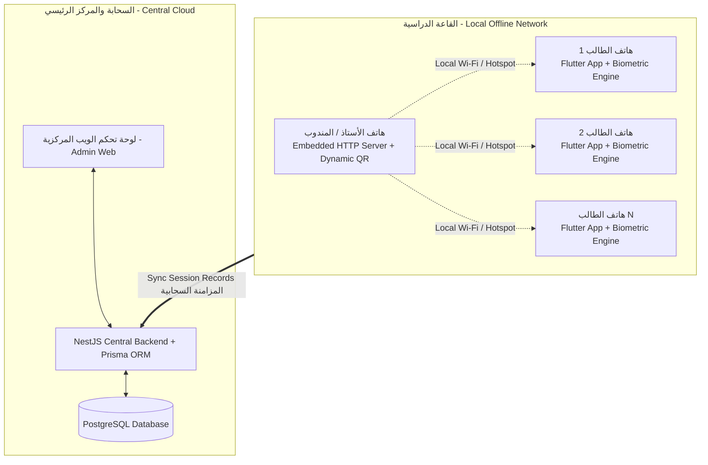

# 🎓 نظام الحضور والغياب الذكي للجامعات

# University Attendance & Verification System

[](#-معمارية-النظام)
[](#-المكونات-الرئيسية)
[](#-المكونات-الرئيسية)
[](#-المكونات-الرئيسية)
[](#-محرك-التحقق-الحيوي)
[](#-الخادم-المحلي-والحضور-دون-إنترنت)

---

## 📖 نبذة عن المشروع (Project Overview)

**نظام الحضور والغياب الذكي للجامعات** هو منظومة برمجية متكاملة مصممة لأتمتة وضبط عمليات تسجيل وتدقيق حضور الطلاب في المحاضرات النظرية والمعامل التطبيقية.
يتميز النظام بقدرته الفريدة على **العمل دون الحاجة لاتصال بالإنترنت داخل القاعات الدراسية** عبر خادم محلي مدمج في أجهزة المندوبين/الأساتذة، مع التحقق الحيوي المزدوج (بصمة الوجه وقزحية العين) ورموز الاستجابة السريعة الديناميكية (Dynamic QR)، ولوحة تحكم مركزية سحابية لإدارة الجامعة وإصدار التقارير الأكاديمية.

---

## 🏛️ معمارية النظام (System Architecture)



---

## 🚀 المكونات والركائز الخمس (Core System Pillars)

### 1. ⚙️ الخادم المركزي وقاعدة البيانات (`backend/`)

- مبني باستخدام **NestJS** و **Prisma ORM** و **PostgreSQL**.
- معمارية **Modular Architecture** نظيفة وقوية مع تغطية شاملة للهيكل الأكاديمي (الكليات، الأقسام، المستويات، المقررات، الشعب، الأساتذة، الطلاب، القيد، والتوثيق).
- إدارة التوكنات الآمنة (JWT)، تشفير البيانات، وسجلات التدقيق الأمني (Audit Logs).

### 2. 📱 تطبيق الهاتف المحمول متعدد الأدوار (`mobile_app/`)

- مبني بتقنية **Flutter (Dart)** بنظام تصميم **Material 3** مع دعم كامل للغة العربية والاتجاه **RTL**.
- يخدم 4 أدوار متخصصة في تطبيق واحد آمن:
  1. **الطالب (Student):** استعراض الجدول، نسبة الحضور، مسح رمز الـ QR والتحقق الحيوي، وتقديم الأعذار الطبية.
  2. **مندوب الشعبة (Delegate):** بدء جلسة الحضور المحلية، بث الـ QR الديناميكي، ورصد الحالات الاستثنائية.
  3. **أستاذ المقرر النظري (Theoretical Teacher):** إدارة المحاضرات، اعتماد الأعذار، وتفويض المناديب.
  4. **أستاذ المعمل العملي (Practical Teacher):** إدارة التجارب وجلسات المختبر ورصد الحضور العملي.

### 3. 🌐 لوحة تحكم الويب المركزية (`admin_web/`)

- لوحة إدارة تفاعلية متجاوبة مبنية بـ **Flutter Web**.
- إدارة الهيكل الأكاديمي الشامل (الأقسام، الفصول، المقررات، الشعب، الطلاب، والأساتذة).
- استيراد جماعي للطلاب عبر Excel/CSV، وإدارة أكواد التفعيل وتعيينات المناديب.
- مراقبة حية للجلسات الأكاديمية (Live Sessions Monitor) وتصدير التقارير الإحصائية المتقدمة (PDF / Excel).

### 4. 🧬 محرك البصمة والتحقق الحيوي (`mobile_app/lib/biometric/`)

- معالجة صور الوجه وقزحية العين واستخراج المتجهات الرياضية المشفرة (512-dim Feature Vectors).
- حظر حفظ الصور الخام لضمان الخصوصية والامتثال الأمني.
- فحص الحيوية ومقاومة التزوير (Anti-Spoofing & Passive Liveness Detection).
- دقة متناهية مع نسبة قبول خاطئ FAR < 0.001% وزمن استجابة أقل من 500 ميلي ثانية.

### 5. 📡 الخادم المحلي وحضور القاعة دون إنترنت (`mobile_app/lib/local_server/`)

- خادم HTTP محلي مدمج وخفيف الوزن (Embedded Server) يعمل داخل هاتف المضيف.
- توليد رمز QR ديناميكي يتغير كل 5 ثوانٍ مع Nonce و TOTP لمنع تصوير الشاشة وتمرير الرمز.
- طابور معالجة تسلسلي (FIFO Queue) مع حماية الـ Idempotency لمنع تكرار التحضير.
- تحمل ضغط متزامن لأكثر من 50 طالباً في القاعة في غضون ثوانٍ معدودة.

---

## 👥 فريق العمل وتوزيع المسؤوليات (Team Structure)

| م   | العضو                             | الدور والمسؤولية                                     | مساحة العمل                    | حزمة التشغيل والتسليم                          |
| :-- | :-------------------------------- | :--------------------------------------------------- | :----------------------------- | :--------------------------------------------- |
| 👑  | **قائد المشروع (Project Leader)** | إدارة المشروع، المعمارية، الباك إند، المراجعة والدمج | `backend/` + Root              | `team_package/`                                |
| 1   | **أواب النزيلي**                  | مطور تطبيق الهاتف المحمول (Flutter Mobile)           | `mobile_app/lib/`              | `team_delivery/01_OWAB_MOBILE/`                |
| 2   | **محمد العواضي**                  | خبير محرك البصمة والتحقق الحيوي                      | `mobile_app/lib/biometric/`    | `team_delivery/02_MOHAMMED_ALAWADI_BIOMETRIC/` |
| 3   | **محمد العيدروس**                 | خبير الخادم المحلي والـ QR والطوابير                 | `mobile_app/lib/local_server/` | `team_delivery/03_MOHAMMED_ALAYDAROUS_LOCAL/`  |
| 4   | **مشعل الحاج**                    | مطور لوحة التحكم المركزية للويب                      | `admin_web/lib/`               | `team_delivery/04_MISHAL_ADMIN_WEB/`           |

---

## 🔄 دورة التطوير ونظام البرومبتات الثلاثي (3-Prompt Pipeline)

يلتزم كافة أعضاء الفريق بدورة تطوير هندسية منضبطة وموثقة لكل مهمة برمجية:

```
[ 01_EXECUTE.md ] ──> (Antigravity IDE) ──> إنشاء وبناء الكود
         │
[ 02_TEST.md ]    ──> (Antigravity IDE) ──> فحص واختبار الكود (Unit & Linter)
         │
[ 03_CLOUD_REVIEW.md ] ──> (ChatGPT Cloud AI) ──> المراجعة الخارجية واعتماد [PASS]
         │
[ reviews/ ]      ──> توثيق التقرير والانتقال للمهمة التالية
```

---

## 📁 هيكل المستودع (Repository Structure)

```text
UniversityAttendanceSystem/
├── backend/                       # NestJS Central Backend + Prisma ORM + PostgreSQL
├── mobile_app/                    # Multi-Role Flutter Mobile Application
├── admin_web/                     # Flutter Web Central Administration Dashboard
├── team_package/                  # Shared Specifications, APIs, Security & Design System
│   ├── api_contract/              # Endpoints specifications & payloads
│   ├── database/                  # Database data dictionary & schema
│   ├── docs/                      # Project constitution, architecture & coding rules
│   ├── local_protocol/            # Offline classroom protocols & dynamic QR specs
│   ├── security/                  # Cryptography, tokens & device security policies
│   └── prompts/                   # Shared prompts & UI/UX design tokens
├── team_delivery/                 # Independent Member Workspaces & Foundation Steps
│   ├── 01_OWAB_MOBILE/            # 14 Pipeline Tasks + 7 Foundation Steps
│   ├── 02_MOHAMMED_ALAWADI_BIOMETRIC/ # 17 Pipeline Tasks + 7 Foundation Steps
│   ├── 03_MOHAMMED_ALAYDAROUS_LOCAL/   # 18 Pipeline Tasks + 7 Foundation Steps
│   └── 04_MISHAL_ADMIN_WEB/       # 28 Pipeline Tasks + 7 Foundation Steps
└── integration/                   # Integration reports & Notion operational guides
    └── integration_reports/notion_pages/ # Ready-to-use Notion pages for all members
```

---

## 📋 أدلة Notion التشغيلية الجاهزة (Notion Ready Guides)

تتوفر 4 أدلة تشغيلية تفصيلية جاهزة للنسخ المباشر إلى منصة **Notion** داخل المجلد:
`integration/integration_reports/notion_pages/`

- 📘 `01_PAGE_OWAB_NOTION_GUIDE.md` (دليل أواب النزيلي)
- 📘 `02_PAGE_ALAWADI_NOTION_GUIDE.md` (دليل محمد العواضي)
- 📘 `03_PAGE_ALAYDAROUS_NOTION_GUIDE.md` (دليل محمد العيدروس)
- 📘 `04_PAGE_MISHAL_NOTION_GUIDE.md` (دليل مشعل الحاج)

---

## 🔒 معايير الأمان والجودة (Security & Quality Standards)

- **Zero Raw Image Storage:** لا يتم تخزين أي صورة بصمة على القرص كملف خام؛ يتم حفظ المتجهات الرياضية المشفرة فقط.
- **Dynamic Nonce & Anti-Replay:** رموز QR مشفرة ومؤقتة تتغير كل 5 ثوانٍ مع التحقق من التوقيت لمنع إعادة الاستخدام.
- **Strict Clean Architecture:** عزل تام للمسؤوليات (Separation of Concerns) مع حظر التداخل بين طبقات النظام.
- **RTL & Material 3:** التزام صارم بنظام التصميم وتوافق كامل مع الشاشات المتنوعة بدون استخدام أي رموز تعبيرية (Zero Emojis in production UI).

---

## 📄 الترخيص (License)

هذا المشروع مرخص ومملوك لفريق بزنز تكنولوجيا — جميع الحقوق محفوظة © 2026.
