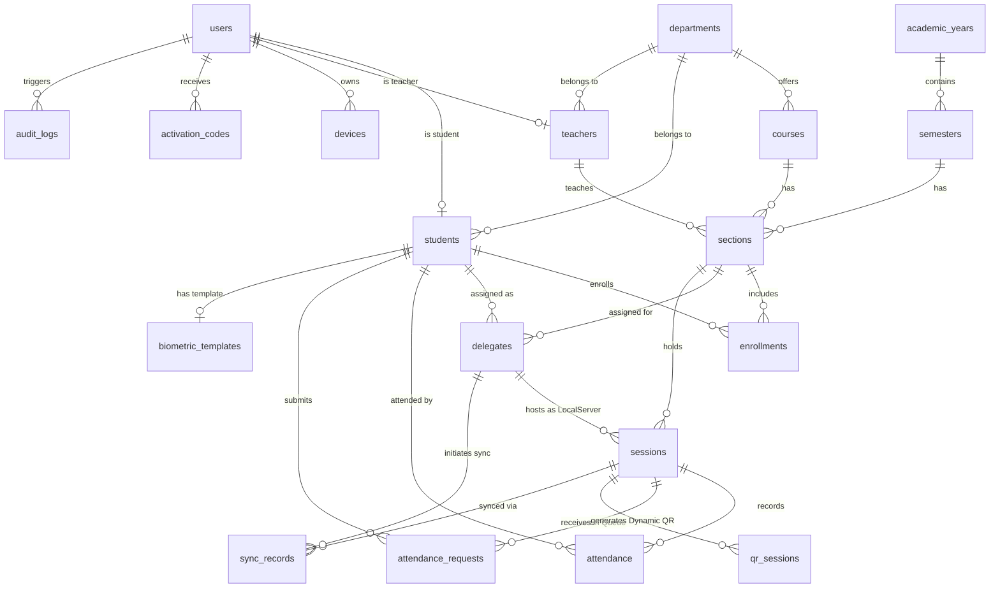

# توثيق مخطط العلاقات المنطقي (ERD Documentation) | database/erd/README.md
## نظام الحضور الجامعي الذكي (University Attendance System)

---

> [!IMPORTANT]
> **الالتزام الكامل بقاموس البيانات ودستور المشروع**
> 
> يوثق هذا المستند العلاقات والمسارات الهيكلية بين جداول قاعدة البيانات الـ 19 المعرفة في `database_dictionary.md`.
> يلتزم التوثيق بجميع القيود، التسميات، والمفاهيم الرسمية المعتمدة في `PROJECT_GLOSSARY.md` و `PROJECT_CONSTITUTION.md`.

---

## 1. أنواع العلاقات المعمارية بين الجداول (Relationship Types)

### 1.1 علاقات واحد إلى واحد (One-to-One - 1:1)
- **`users` ── `students`**: كل حساب طالب يربط بسجل طالب واحد فقط عبر `students.id = users.id`.
- **`users` ── `teachers`**: كل حساب أستاذ يربط بسجل أستاذ واحد فقط عبر `teachers.id = users.id`.
- **`students` ── `biometric_templates`**: كل طالب يمتلك قالب بصمة حيوية مشفر واحد فقط محلياً وفي النظام عبر `biometric_templates.student_id`.

---

### 1.2 علاقات واحد إلى متعدد (One-to-Many - 1:N)
- **`departments` ── `courses`**: القسم الأكاديمي الواحد يضم عدة مقررات دراسية.
- **`departments` ── `students`**: القسم الأكاديمي ينتمي إليه مجموعة من الطلاب.
- **`departments` ── `teachers`**: القسم الأكاديمي يضم مجموعة من أساتذة الكادر التدريسي.
- **`academic_years` ── `semesters`**: السنة الدراسية الواحدة تقسم إلى عدة فصول دراسية (`FIRST`, `SECOND`, `SUMMER`).
- **`semesters` ── `sections`**: الفصل الدراسي المفتوح يضم عدة شعب دراسية.
- **`courses` ── `sections`**: المقرر الدراسي الواحد يفتح منه عدة شعب عملية ونظرية.
- **`teachers` ── `sections`**: الأستاذ الواحد يشرف على شعبة دراسية واحدة أو أكثر.
- **`users` ── `devices`**: الحساب الواحد قد يربط بجهاز موثق (أو أجهزة ملغاة سابقة).
- **`users` ── `activation_codes`**: الحساب الواحد قد يولد له عدة رموز تفعيل عبر الزمن.
- **`students` ── `delegates`**: الطالب قد يكلف كمندوب لشعبة أو أكثر عبر التاريخ الدراسي.
- **`sections` ── `delegates`**: الشعبة الواحدة قد يعين لها مندوب أو أكثر.
- **`sections` ── `sessions`**: الشعبة الواحدة يفتح لها عدة جلسات حضور على مدار الفصل.
- **`delegates` ── `sessions`**: المندوب الواحد يستضيف عدة جلسات حضور كـ `LocalServer`.
- **`sessions` ── `attendance`**: جلسة الحضور الواحدة تحتوي على عدة سجلات حضور للطلاب.
- **`students` ── `attendance`**: الطالب الواحد ينشأ له عدة سجلات حضور عبر الجلسات المختلفة.
- **`sessions` ── `attendance_requests`**: الجلسة النشطة محلياً تستقبل عدة طلبات حضور في الطابور المحلي.
- **`students` ── `attendance_requests`**: الطالب الواحد يرسل طلبات حضور مختلفة للجلسات.
- **`sessions` ── `qr_sessions`**: الجلسة الواحدة ينشأ لها عدة رموز `Dynamic QR` متعاقبة ومتغيرة.
- **`sessions` ── `sync_records`**: الجلسة المغلقة ترتبط بسجل مزامنة واحد أو أكثر عند إعادة المحاولة.
- **`delegates` ── `sync_records`**: المندوب يرفع عدة سجلات مزامنة مركزياً.
- **`users` ── `audit_logs`**: المستخدم الواحد تسجل له عدة عمليات في سجل التدقيق الأمني.

---

### 1.3 علاقات متعدد إلى متعدد (Many-to-Many - N:M)
تتم معالجة العلاقات المتعددة وتفكيكها عبر جداول رابطة وسيطة (`Junction Tables`):

1. **`students` ↔ `sections` (تسجيل الطلاب بالمقررات):**
   - تُفكك بواسطة جدول **`enrollments`**.
   - يسمح للطالب بالتسجيل في عدة شعب، والشعبة تضم عدة طلاب.
2. **`students` ↔ `sessions` (حضور الطلاب بالجلسات):**
   - تُفكك بواسطة جدول **`attendance`**.
   - يسمح لعدة طلاب بالحضور في عدة جلسات مع ضمان قيد منع التكرار.

---

## 2. المسارات الأساسية لتدفق البيانات (Core System Pathways)

### 2.1 المسار الأكاديمي الهيكلي (Academic Structural Pathway)
يوضح التدرج الهيكلي من القسم الأكاديمي وصولاً إلى الشعبة الدراسية:
```
[departments] ──(1:N)──> [courses] ──(1:N)──> [sections]
                                                    ▲
[academic_years] ──(1:N)──> [semesters] ────────────┘
```

### 2.2 مسار تسجيل الطالب بالمادة (Student Enrollment Pathway)
يربط الطالب بالمقرر والشعبة الدراسية:
```
[students] ──(1:N)──> [enrollments] <──(N:1)── [sections] ──(N:1)──> [courses]
```

### 2.3 مسار توثيق وتفعيل الأجهزة (User Device Authentication Pathway)
يربط حساب المستخدم بجهازه الموثق عبر رمز التفعيل:
```
[users] ──(1:N)──> [devices] (حالة الجهاز: Device States)
   │
   └──(1:N)──> [activation_codes] (حالة الرمز: Code States)
```

### 2.4 مسار تفويض المندوب واستضافة الجلسة (Delegate & Session Pathway)
يربط المندوب بالجلسة المحلية التي يستضيفها كـ `LocalServer`:
```
[students] ──(1:N)──> [delegates] ──(1:N)──> [sessions] <──(N:1)── [sections]
```

### 2.5 مسار توليد واستقبال طلبات الحضور المحلية (Local Session & Request Pathway)
يربط الجلسة المفتوحة برمز الـ QR الديناميكي وطابور طلبات الحضور:
```
                                ┌──(1:N)──> [qr_sessions] (رمز Dynamic QR)
                                │
[sessions] (LocalServer/Queue) ─┼──(1:N)──> [attendance_requests] (RequestId & Nonce)
                                │
                                └──(1:N)──> [attendance] (سجل الحضور المعتمد)
```

### 2.6 مسار إثبات حضور الطالب بالجلسة (Student + Session Attendance Link)
يربط حضور الطالب بالجلسة مع ضمان قيد منع التكرار:
```
[students] ────┐
               ├──(1:N)──> [attendance] (حالة الحضور: Present/Absent/Late)
[sessions] ────┘
```

### 2.7 مسار التحقق الحيوي للطالب (Biometric Template Pathway)
يربط الطالب بنموذج بصمته المشفر محلياً:
```
[students] ──(1:1)──> [biometric_templates] (بيانات نموذج البصمة المشفرة)
```

### 2.8 مسار المزامنة من الهاتف للمركز (Sync Record Pathway)
يوثق عملية رفع حزمة الجلسة المغلقة من هاتف المندوب إلى الخادم المركزي NestJS:
```
[sessions] ──┐
             ├──(1:N)──> [sync_records] (حالة المزامنة: Sync States)
[delegates] ─┘
```

### 2.9 مسار التدقيق الأمني (Security Audit Log Pathway)
يوثق كافة العمليات الحساسة والتغييرات بالنظام:
```
[users] ──(1:N)──> [audit_logs] (العملية، الكيان المتأثر، البيانات المشفرة)
```

---

## 3. توثيق المفاتيح والقيود (Keys & Constraints Summary)

### 3.1 المفاتيح الأساسية (Primary Keys - PK)
- استخدام معرفات `UUID` فريدة لجميع الجداول التسعة عشر ضماناً لتفادي تضارب المعرفات أثناء العمل دون إنترنت (`Offline Capabilities`).
- جدول `attendance_requests` يستخدم `request_id` (UUID) كمفتاح أساسي لمنع تكرار المعاملات.

### 3.2 القيود الفريدة المركبة والاحادية (Unique Constraints)
- **`users`**: `username` فريد، `email` فريد.
- **`students`**: `student_number` فريد.
- **`teachers`**: `employee_number` فريد.
- **`departments`**: `code` فريد.
- **`academic_years`**: `year_name` فريد.
- **`courses`**: `course_code` فريد.
- **`devices`**: `device_identifier` فريد.
- **`biometric_templates`**: `student_id` فريد (قالب واحد لكل طالب)، `template_hash` فريد.
- **`attendance_requests`**: `request_id` فريد إجباري.
- **قيد منع تكرار الحضور بالجلسة (Composite Unique Constraint):**
  - `(session_id, student_id)` في جدول `attendance` محظور التكرار.
- **قيد منع تكرار التسجيل بالمادة (Composite Unique Constraint):**
  - `(student_id, section_id)` في جدول `enrollments` محظور التكرار.

---

## 4. مخطط العلاقات الصوري (Mermaid ERD Diagram)



---
