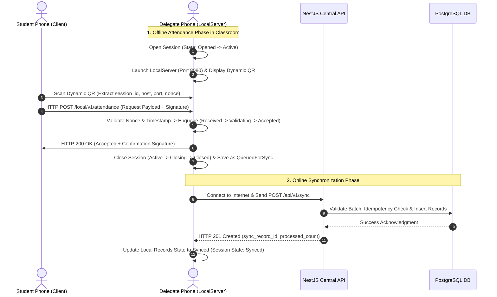

# وثيقة المعمارية الرسمية الشاملة للنظام | SYSTEM_ARCHITECTURE.md
## نظام الحضور الجامعي الذكي (University Attendance System)

---

> [!IMPORTANT]
> **المرجع المعماري الأعلى الموحد**
> 
> تفصّل هذه الوثيقة المعمارية الفنية الرسمية الكاملة لنظام الحضور الجامعي الذكي، وتجمع كافة الضوابط المعمارية المعرفية بدستور المشروع والوثائق الفنية المعتمدة.
> **قاعدة حظر التغيير:** يُمنع تعديل أو تخطي أي قرار معماري محدد بهذه الوثيقة دون موافقة صريحة ومكتوبة من قائد المشروع.

---

## 1. الأقسام الأربعة عشر للمعمارية الرسمية (14 Architectural Domains)

---

### 1.1 المعمارية العامة للمشروع (Overall Architecture)
- **البنية العامة:** معمارية هجينة موقوتة تتكون من:
  1. **الطرف المركزي الموصول (`Central Web & API Subsystem`):** خادم مركزي (`NestJS`) وقاعدة بيانات مركزية (`PostgreSQL`) ولوحة عمادة للمجالس والأدمن (`Flutter Web`).
  2. **الطرف المحلي المعزول (`Offline Local Attendance Subsystem`):** تطبيق هاتف موحد (`Flutter Mobile App`) يخدم الأدوار الأربعة (`STUDENT`, `DELEGATE`, `PRACTICAL_TEACHER`, `THEORETICAL_TEACHER`) مع خادم HTTP مدمج محلياً (**`LocalServer`**) يشتغل على هاتف المندوب أثناء الجلسة دون إنترنت.

---

### 1.2 المعمارية المركزية (Central Architecture)
- **المكونات:**
  - **الخادم المركزي:** أطار عمل **`NestJS`** المعتمد كمورد حصري لخدمات الـ REST API المركزية ببادئة الإصدار **`/api/v1/`**.
  - **قاعدة البيانات المركزية:** **`PostgreSQL`** تتكون من 19 جدولاً رسمياً ومفهرساً.
- **النطاق والمسؤولية:** إدارة الحسابات، الأجهزة، الهيكل الأكاديمي، استقبال المزامنة النهائية، واستخراج التقارير وسجلات التدقيق `audit_logs`.

---

### 1.3 معمارية تطبيق الموبايل (Mobile Architecture)
- **التقنية:** تطبيق هاتف موحد مبني بتقنية **`Flutter`**.
- **الأدوار المدمجة:** يدعم التطبيق التكيف الديناميكي لـ 4 أدوار رسمية:
  1. **`STUDENT`**: مسح الـ Dynamic QR وتسجيل الحضور.
  2. **`DELEGATE`**: استضافة الجلسة المحلية كـ `LocalServer` وإطلاق الرفع.
  3. **`PRACTICAL_TEACHER`**: الإشراف والتحضير اليدوي وتعيين المندوبين للعملي.
  4. **`THEORETICAL_TEACHER`**: الإشراف والتحضير اليدوي وتعيين المندوبين للنظري.
- **التخزين المحلي:** قاعدة بيانات SQLite مدمجة ومشفّرة بـ **`SQLCipher`** (**`AES-256`**).

---

### 1.4 معمارية لوحة العمادة (Admin Web Architecture)
- **التقنية:** تطبيق ويب تفاعلي مبني بـ **`Flutter Web`**.
- **المستهدف:** الإدارة العليا والعمادة (`ADMIN`).
- **المسؤوليات:** إدارة الكليات، الأقسام، السنوات الدراسية، الحسابات، الأجهزة، واستعراض تقارير التدقيق الشاملة عبر الـ REST API المركزية.

---

### 1.5 معمارية التحضير المحلي (Local Attendance Architecture)
- **المكونات التشغيلية:**
  - **`LocalServer`:** تطبيق خادم HTTP مدمج في تطبيق هاتف المندوب يشتغل محلياً على **`Port: 8080`**.
  - **`Clients`:** تطبيقات هواتف الطلاب الحاضرين في القاعة الدراسية.
- **آلية العمل:** إنشاء جلسة محلياً (`Created` ──> `Opened`)، تشغيل الـ `LocalServer` على الـ IPv4 المحلي، توليد الـ Dynamic QR، واستقبال طلبات الحضور المعنونة محلياً بـ `POST /local/v1/attendance` وإدراجها في طابور `FIFO Queue` للتخزين المحلي.

---

### 1.6 معمارية المزامنة (Synchronization Architecture)
- **البروتوكول:** بروتوكول المزامنة الموثوقة واستكمال البيانات الموثق في `SYNCHRONIZATION_PROTOCOL.md`.
- **المبدأ:** الحفظ المحلي أولاً حالة **`QueuedForSync`**، وعند توفر اتصال بالإنترنت بالخادم المركزي، يتم إطلاق `POST /api/v1/sync` لرفع السجلات في حزم (Batches) مع ضمان عدم ضياع أو تكرار البيانات (Idempotency).

---

### 1.7 معمارية الـ Dynamic QR (QR Architecture)
- **البروتوكول:** الموثق في `QR_SESSION_PROTOCOL.md`.
- **الخصائص:**
  - كائن JSON مشفر بتنسيق Base64 URL-Safe وموقع تشفيرياً بـ **`HMAC-SHA256`**.
  - بيتغير تلقائياً كل **5 إلى 10 ثوانٍ**.
  - **خلو مطلق من البيانات الشخصية الحساسة (PII)**.
  - يضم: `session_id`, `challenge` (Nonce), `issued_at`, `expires_at`, `host`, `port`, `session_token`, `signature`.

---

### 1.8 معمارية البصمة والتحقق الحيوي (Biometric Architecture)
- **البروتوكول:** الموثق في `BIOMETRIC_PROTOCOL.md`.
- **الواجهة:** مستقل تماماً عبر الواجهة المنطقية **`BiometricService`**.
- **العمليات الخمس:** `capture`, `qualityCheck`, `generateTemplate`, `compare`, `verify`.
- **القواعد:** عتبة قبول قابلة للتهيئة `configurable_threshold` مع **حظر تام للغياب التلقائي** وإحالة الحالات غير المؤكدة للمسار البديل الـ QR أو المراجعة اليدوية (`ManualReview`).

---

### 1.9 المعمارية الأمنية والتشفير (Security Architecture)
- **التشفير غير المتحرك:** **`AES-256-GCM`** للبصمات بـ `biometric_templates` و **`SQLCipher`** للقواعد المحلية.
- **التوقيع والتأمين:** **`HMAC-SHA256`** للمعاملات المحلية والـ QR، و **`Argon2id`** / **`bcrypt`** لكلمات المرور.
- **التشفير أثناء النقل:** **`TLS 1.3 / HTTPS`** قياسي حصرًا للـ REST API المركزية.
- **حفظ المفاتيح:** **Android KeyStore** / **iOS Keychain** للهواتف.

---

### 1.10 تدفق البيانات وتسلسل المعاملات (Data Flow)

---

### 1.11 حدود ومسؤوليات المكونات (Component Boundaries)

1. **تطبيق الموبايل (`Flutter Mobile App`):** مسؤول عن الواجهة المحلية، قراءة الـ QR، التفاعل مع المستشعر الحيوي، وتشغيل الـ `LocalServer` للمندوب.
2. **لوحة العمادة (`Flutter Web`):** مسؤولة عن العرض والتحكم الإداري العالي دون تنفيذ أعمال التحضير الميداني.
3. **الخادم المركزي (`NestJS`):** مسؤول عن توثيق JWT، حوكمة البيانات، فحص الصلاحيات RBAC، استقبال المزامنة، وتغليب التعديل اليدوي للأستاذ.
4. **قاعدة البيانات المركزية (`PostgreSQL`):** المستودع النهائي المعتمد الموثق لكافة سجلات النظام.

---

### 1.12 حدود وشروط الاتصالات الشبكية (Communication Boundaries)

| المكون المصدر (From) | المكون الهدف (To) | بروتوكول الاتصال (Protocol) | حالة الاتصال (Mode) | الحالة التشويرية والملاحظات |
| :--- | :--- | :--- | :--- | :--- |
| **Flutter Mobile App** | **NestJS Central API** | `HTTP / REST API` | **Online Only** | اتصالات مشفرة بـ TLS 1.3 / HTTPS |
| **Flutter Web Admin** | **NestJS Central API** | `HTTP / REST API` | **Online Only** | اتصالات مشفرة بـ TLS 1.3 / HTTPS |
| **Student App (Client)**| **Delegate LocalServer**| `HTTP / Local API` | **Offline Allowed**| اتصال محلي عبر Wi-Fi/Hotspot (Port 8080) |
| **NestJS Central API** | **PostgreSQL Central DB**| `TCP / PostgreSQL` | **Internal Network**| اتصال محلي مأمن بـ VPC / SSL |
| **Student / Delegate** | **PostgreSQL Central DB**| **ممنوع بتاتاً (FORBIDDEN)**| **N/A** | **يُمنع التوصيل المباشر نهائياً بـ PostgreSQL** |
| **Admin Web App** | **PostgreSQL Central DB**| **ممنوع بتاتاً (FORBIDDEN)**| **N/A** | **يُمنع التوصيل المباشر نهائياً بـ PostgreSQL** |

---

### 1.13 العمليات في حالة توفر الاتصال بالإنترنت (Online Operations)
1. تسجيل الدخول وتوثيق الحسابات وتجديد التوكينات (`/api/v1/auth/login`).
2. ربط الأجهزة وتفعيل الرموز (`/api/v1/devices/bind`).
3. التهيئة الأولية وتنزيل جداول المواد والشعب المسجلة.
4. تنفيذ المزامنة المركزية لحزم الحضور المغلقة (`/api/v1/sync`).
5. قراءة واستخراج التقارير وإدارة النظام وسجلات التدقيق.

---

### 1.14 العمليات في حالة انقطاع الاتصال بالإنترنت (Offline Operations)
1. إنشاء وإطلاق جلسة الحضور المحلية بواسطة المندوب.
2. تشغيل الـ `LocalServer` واستخراج الـ IP والمنفذ المحلي.
3. توليد وعرض رمز الـ Dynamic QR المتغير كل 5-10 ثوانٍ.
4. استلام وقبول طلبات الحضور من الطلاب عبر الـ Wi-Fi/Hotspot المحلي.
5. التحقق الحيوي المباشر عبر `BiometricService`.
6. التحضير اليدوي المبرر من التدريسي المشرف على القاعة.
7. حفظ بيانات وتفاصيل الجلسة محلياً بـ SQLite المشفّرة في حالة `QueuedForSync`.

---

## 2. الإجابات الشارحة الصريحة على أسئلة المعمارية المحددة

1. **من يتصل بمن؟**
   - هاتف الطالب يتصل بـ `LocalServer` هاتف المندوب محلياً بالقاعة، وتطبيق المندوب/الأستاذ/الأدمن يتصل بـ `NestJS Central API` عند توفر الإنترنت.
2. **كيف يتصل؟**
   - محلياً عبر شبكة Wi-Fi/Hotspot بـ HTTP على Port 8080، ومكانيًا مركزياً عبر HTTPS / TLS 1.3 على مسار `/api/v1/`.
3. **من لا يجوز له الاتصال بمن؟**
   - **يُمنع حظرًا قاطعًا** اتصال هواتف الطلاب أو المندوبين أو لوحة العمادة مباشرة بقاعدة بيانات `PostgreSQL` المركزية دون المرور بـ `NestJS`.
4. **أين توجد قاعدة البيانات المركزية؟**
   - في الخادم المركزي (Cloud/On-Premises) وتدار بـ `PostgreSQL`.
5. **أين توجد البيانات المحلية؟**
   - مخزنة محلياً في كل هاتف ذكي بدخل قاعدة بيانات مدمجة SQLite مشفرة بـ `SQLCipher`.
6. **متى يعمل Local Server؟**
   - يشتغل حكراً على هاتف المندوب أثناء فترة الجلسة المفتوحة داخل القاعة (`Opened` ──> `Active`) ويتوقف فور الإغلاق (`Closed`).
7. **كيف تنتقل بيانات الحضور؟**
   - تخرج من هاتف الطالب إلى `LocalServer` هاتف المندوب محلياً، وتُحفظ كـ `QueuedForSync` بـ SQLite، ثم ترفع كحزمة بـ `POST /api/v1/sync` إلى `NestJS` ومثاليتها في `PostgreSQL`.
8. **كيف تتم المزامنة؟**
   - تتم بعد إغلاق الجلسة عند توفر الإنترنت برفع الدفعة بـ Idempotency يضمن عدم التكرار أو الفقدان مع تسوية النزاعات بتغليب التحضير اليدوي للأستاذ.

---