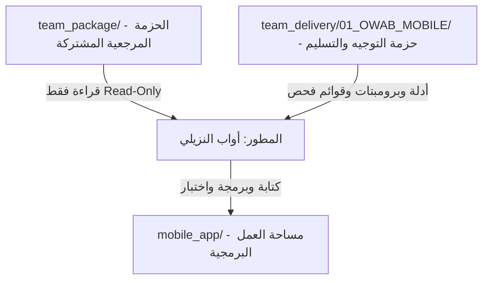
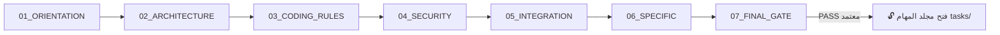
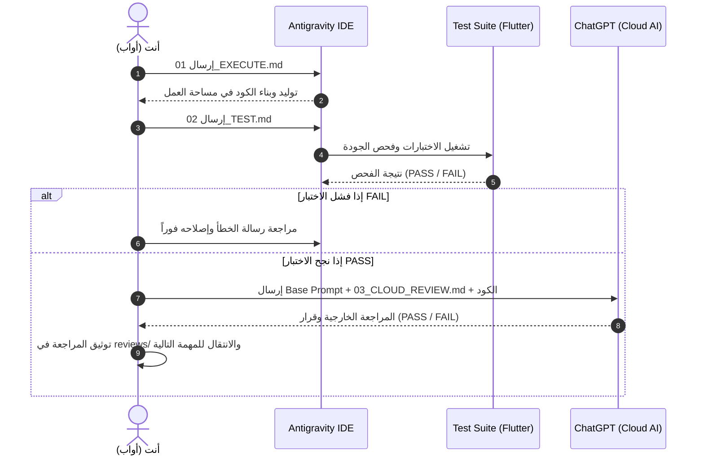

# 📘 الدليل التشغيلي الشامل والمفصل لمنصة Notion
## 👤 العضو: أواب النزيلي (Flutter Mobile Developer (تطبيق الهاتف المحمول متعدد الأدوار))
### 📦 حزمة التسليم: `01_OWAB_MOBILE`
### 🏢 مساحة العمل البرمجية: `mobile_app/`

---

> [!IMPORTANT]
> **مرحباً بك يا أواب في الفريق الهندسي لمشروع نظام الحضور والغياب الذكي.**
> هذا الدليل تم إعداده خصيصاً لك من أجلك؛ ليشرح لك مسارك البرمجي والتشغيلي خطوة بخطوة ومن الصفر المطلق حتى تسليم عملك بنجاح.
> انسخ هذه الصفحة كاملة إلى صفحتك الخاصة في **Notion** لتكون مرجعك اليومي الدائم في كل لحظة.

---

## 📑 فهرس المحتويات
1. [المعمارية العامة والطبقات الثلاث في جهازك](#-القسم-الأول-المعمارية-العامة-والطبقات-الثلاث-في-جهازك)
2. [الملفات الـ 13 الرئيسية في حزمة تسليمك (شرح تفصيلي)](#-القسم-الثاني-الملفات-الـ-13-الرئيسية-في-حزمتك-شرح-شامل)
3. [مجلدات الحزمة المرجعية المشتركة team_package](#-القسم-الثالث-مجلدات-الحزمة-المرجعية-المشتركة-team_package)
4. [مرحلة التأسيس المشترك COMMON_FOUNDATION (الخطوات الـ 7 الإلزامية)](#-القسم-الرابع-مرحلة-التأسيس-المشترك-common_foundation-الـ-7-خطوات)
5. [دورة العمل القياسية للمهمة (3-Prompt Pipeline Loop)](#-القسم-الخامس-دورة-العمل-القياسية-لكل-مهمة-نظام-البرومبتات-الثلاثي)
6. [المهام البرمجية التنفيذية tasks (14 مهمة تفصيلية)](#-القسم-السادس-المهام-البرمجية-التنفيذية-tasks-شرح-الـ-14-مهمة)
7. [التوثيق السحابي والمراجعة وإجراءات التسليم النهائي](#-القسم-السابع-التوثيق-السحابي-والمراجعة-والتسليم-النهائي)

---

## 🏛️ القسم الأول: المعمارية العامة والطبقات الثلاث في جهازك

عندما تفتح مساحة العمل الخاصة بك على حاسوبك، ستجد ثلاثة مستويات رئيسية يجب أن تفهم الفرق بينها تماماً:

### 1. الحزمة المرجعية المشتركة (`team_package/`)
- **ما هي؟** هي الدستور والمكتبة العامة للمشروع، تحتوي على مواصفات الـ API، قاموس قاعدة البيانات، المعايير الأمنية، ونظام التصميم المشترك.
- **ماذا تفعل فيها؟** **قراءة فقط (Read-Only)**. لا تعدل ولا تحذف أي ملف بداخلها إطلاقاً.

### 2. حزمة توجيهك وتسليمك (`team_delivery/01_OWAB_MOBILE/`)
- **ما هي؟** هي دليلك الإرشادي الخاص الذي أعده لك قائد المشروع، تحتوي على أدلة الاستخدام، برومبتات التأسيس، برومبتات المهام، ومجلدات التسليم والمراجعة.
- **ماذا تفعل فيها؟** تقرأ أدلتها، تنسخ منها البرومبتات لـ Antigravity و ChatGPT، وتوثق فيها تقارير مراجعاتك وتقارير التسليم.

### 3. مساحة عملك البرمجية الفعلية (`mobile_app/`)
- **ما هي؟** المجلد الذي يحتوي على كود Dart و Flutter الحقيقي والاختبارات التابعة له.
- **ماذا تفعل فيها؟** هذا هو المكان الوحيد الذي يقوم فيه Antigravity بكتابة الأكواد، إنشاء الملفات، وبناء الواجهات والاختبارات.

### 🛡️ مصفوفة الصلاحيات وحدود المجلدات الخاصة بك:
- 🟢 **المجلدات المسموح لك العمل والتعديل فيها حصراً:**
  - `mobile_app/lib/app/`
  - `mobile_app/lib/core/`
  - `mobile_app/lib/authentication/`
  - `mobile_app/lib/student/`
  - `mobile_app/lib/delegate/`
  - `mobile_app/lib/practical_teacher/`
  - `mobile_app/lib/theoretical_teacher/`
  - `mobile_app/lib/shared/`
  - `mobile_app/test/student/`
  - `mobile_app/test/delegate/`
  - `mobile_app/test/teacher/`
  - `mobile_app/test/core/`

- 🔴 **المجلدات المحظورة والممنوع لمسها تماماً (منطقة حمراء):**
  - `mobile_app/lib/biometric/ (ملك محمد العواضي)`
  - `mobile_app/lib/local_server/ (ملك محمد العيدروس)`
  - `mobile_app/lib/local_network/ (ملك محمد العيدروس)`
  - `mobile_app/lib/qr_session/ (ملك محمد العيدروس)`
  - `mobile_app/lib/attendance_queue/ (ملك محمد العيدروس)`
  - `admin_web/ (ملك مشعل الحاج)`
  - `backend/ (ملك قائد المشروع)`
  - `team_package/ (مرجع للقراءة فقط)`

---

## 📂 القسم الثاني: الملفات الـ 13 الرئيسية في حزمتك (شرح شامل)

داخل المجلد الرئيسي لحزمتك `team_delivery/01_OWAB_MOBILE/`، توجد 13 وثيقة أساسية مرتبة بالأولوية. فيما يلي شرح كل ملف بالتفصيل الممل:

| الرقم | اسم الملف | الاسم بالعربي | الغرض والوظيفة | متى تفتحه؟ | كيف تستخدمه؟ | الوجهة (AI أم قراءة؟) | التكرار |
|:---|:---|:---|:---|:---|:---|:---|:---|
| **01** | `README_FOR_MEMBER.md` | دليل المطور الشامل والمسار الكامل (19 خطوة) | هو خريطة الطريق الكبرى للمطور؛ يشرح كل مرحلة من لحظة استلام المشروع حتى التسليم النهائي في 19 خطوة مرتبة ومنطقية. | أول ملف يفتحه المطور في بداية عمله ويظل يرجع إليه كمرجع رئيسي طوال فترة المشروع. | يقرأه بتركيز شديد ويفهم المسار العام والترتيب المنطقي للعمل. | قراءة للمطور فقط (Read-Only) — لا يُرسل للذكاء الاصطناعي. | يُقرأ في اليوم الأول ويرجع إليه عند بدء كل مرحلة جديدة. |
| **02** | `QUICK_START.md` | دليل البدء السريع المباشر | يلخص خطوات التشغيل السريعة اليومية (فتح البيئة، اختيار المهمة، تشغيل البرومبتات الثلاثية، وتوثيق النتائج). | عند بدء يوم عمل جديد أو عند الرغبة في تذكر خطوات العمل الروتينية بسرعة ودون إطالة. | اتباع الخطوات الست اليومية المحددة فيه. | قراءة للمطور فقط (Read-Only). | يُقرأ يومياً عند بدء جلسة التطوير. |
| **03** | `WHAT_TO_READ_FIRST.md` | الترتيب الإلزامي لقراءة وثائق المشروع | يحدد للمطور بدقة أي الوثائق من `team_package` يقرأها أولاً، وأيها يقرأها ثانياً، ليمنع التشتت والضياع بين الملفات. | قبل البدء في أي عمل عملي، وأثناء مرحلة التأسيس الأولى. | فتح الروابط والملفات المذكورة فيه بالترتيب المحدد وقراءتها بعناية. | قراءة للمطور فقط (Read-Only). | يُقرأ مرة واحدة في بداية المشروع. |
| **04** | `WHAT_TO_COPY.md` | قواعد النسخ وتجهيز مساحة العمل | يوضح للعضو ما هي الملفات المسموح بنسخها إلى مساحة عمله، وما هي الملفات المحظور نسخها تماماً لمنع كسر المشروع وتلف التبعيات. | لحظة استلام الحزمة من قائد المشروع وقبل فتح أي برنامج تطوير. | مطابقة المجلدات المنسوخة مع القوائم المسموحة والممنوعة الواردة بالملف. | قراءة للمطور فقط (Read-Only). | يُقرأ ويُطبق مرة واحدة عند استلام المشروع. |
| **05** | `WORKSPACE_SETUP.md` | دليل تهيئة بيئة العمل في Antigravity IDE | يشرح كيفية فتح المجلد الصحيح داخل برنامج Antigravity وضبط إعدادات مساحة العمل وتشغيل البيئة بنجاح. | عند تثبيت وتشغيل بيئة التطوير Antigravity IDE. | تطبيق خطوات فتح مجلد المشروع وضبط المسارات وتبعيات Flutter. | قراءة للمطور وتطبيق في بيئة التطوير. | يُطبق في اليوم الأول أو عند إعادة تهيئة البيئة. |
| **06** | `FOLDER_OWNERSHIP.md` | مصفوفة ملكية المجلدات والحدود المسموحة | يحدد المجلدات التي يملكها العضو وله حق التعديل فيها باللون الأخضر، والمجلدات المحرمة عليه لمسها باللون الأحمر. | قبل تعديل أو إنشاء أي ملف في المشروع. | التأكد من أن المسار المستهدف يقع داخل حدوده المصرح بها حصراً وتجنب المسارات المشتركة أو مسارات الزملاء. | قراءة للمطور فقط (Read-Only). | مرجع دائم يُراجع باستمرار قبل أي عملية تعديل. |
| **07** | `ANTIGRAVITY_USAGE.md` | دليل استخدام وتوجيه Antigravity IDE | يشرح كيف تتعامل مع Antigravity IDE، كيف ترسل له برومبت التنفيذ وبرومبت الاختبار، وكيف تراقب مخرجات الكود. | عند تنفيذ أي مهمة برمجية أو فحص كود. | نسخ محتوى `01_EXECUTE.md` ثم `02_TEST.md` ولصقها في محادثة Antigravity ومتابعة النتائج. | دليل إرشادي للمطور لكيفية التعامل مع Antigravity. | يُستخدم مع كل مهمة برمجية. |
| **08** | `CLOUD_REVIEW_USAGE.md` | دليل المراجعة السحابية الخارجية عبر ChatGPT | يشرح بالتفصيل كيف تفتح محادثة في ChatGPT، كيف ترسل البرومبت الأساسي وبرومبت المهمة، وكيف تطلب تقييم PASS/FAIL. | بعد الانتهاء من فحص الكود واجتياز `02_TEST.md` بنجاح داخل Antigravity. | فتح نافذة ChatGPT، إرسال `TEAM_CLOUD_BASE_PROMPT.md` متبوعاً بـ `03_CLOUD_REVIEW.md` والكود المكتوب. | دليل إرشادي للمطور لكيفية استخدام ChatGPT. | يُستخدم مع كل مهمة برمجية بعد اجتياز الاختبار الداخلي. |
| **09** | `WORKFLOW.md` | دورة العمل القياسية للمهمة (4 خطوات) | يشرح دورة حياة المهمة الدائرية: (1. التنفيذ Execute ➔ 2. الاختبار Test ➔ 3. المراجعة Cloud Review ➔ 4. الانتقال/التسليم). | مرجع سريع لحفظ نظام العمل ومنع القفز العشوائي بين المهام. | الالتزام بالترتيب التسلسلي الصارم للمهام دون أي استثناء. | قراءة للمطور فقط (Read-Only). | حفظ واستيعاب دائم في الذهن. |
| **10** | `STOP_AND_FAIL_RULES.md` | قواعد التوقف ومعالجة الأخطاء (الطوارئ) | يوضح ماذا تفعل إذا فشل الاختبار (Test FAIL) أو رفضت المراجعة الكود (Review FAIL)، وكيف تعالج المشكلة جراحياً. | عند ظهور أي خطأ أو فشل في الاختبار أو المراجعة السحابية. | تطبيق قاعدة التوقف الفوري، استخراج رسالة الخطأ بدقة، وإعطائها لـ Antigravity لإصلاحها دون تخمين. | قراءة وتطبيق للمطور (دليل طوارئ). | يُفتح فور حدوث أي مشكلة أو خطأ برمجية. |
| **11** | `DELIVERY_VALIDATION.md` | معايير التحقق والجاهزية للتسليم | يحدد الشروط والمعايير الصارمة التي يجب استيفاؤها في كل مرحلة لكي تُعتبر جاهزة للتسليم لقائد المشروع. | قبل الانتقال من مرحلة لأخرى وقبل تسليم العمل النهائي. | مراجعة بنود الجاهزية والتأكد من مطابقة جميع الشروط والاختبارات. | قراءة للمطور وقائمة فحص ذاتي دقيقة. | يُراجع عند نهاية كل مرحلة وقبل إرسال أي Handoff. |
| **12** | `CHECKLIST.md` | قائمة التحقق اليومية للمطور | قائمة فحص سريعة (Checklist) يقوم المطور بالتأشير عليها يومياً للتأكد من إنجاز المهام وعدم نسيان أي خطوة. | في نهاية كل جلسة عمل أو بعد إكمال كل مهمة برمجية. | قراءة البنود ومطابقتها مع ما تم إنجازه وتوثيقه فعلياً. | أداة فحص يومية للمطور. | يُستخدم يومياً. |
| **13** | `FILE_INVENTORY.md` | الفهرس والجرد الكامل لملفات الحزمة | جدول شامل يسرد كل ملف ومجلد داخل حزمة المطور بالاسم والمسار لضمان عدم فقدان أي ملف أو برومبت. | للبحث عن أي ملف أو التأكد من سلامة اكتمال حزمة التسليم. | البحث في الجدول عن مسار الملف المطلوب ومطابقته على القرص. | فهرس مرجعي للمطور (Read-Only). | مرجع دائم عند البحث والاستفسار. |

---

## 📚 القسم الثالث: مجلدات الحزمة المرجعية المشتركة `team_package`

تتكون الحزمة المشتركة من 8 مجلدات مرجعية رئيسية. إليك بيان كل مجلد ودوره المباشر في عملك:

### 1. `team_package/docs/` (مجلد الدستور والقوانين والمعمارية)
- 🎯 **الهدف والمحتوى:** يحتوي على دستور المشروع `PROJECT_CONSTITUTION.md` وقواعد الكود ومعمارية النظام وأدوار الفريق.
- 🔒 **طبيعة الصلاحية:** قراءة فقط لجميع الأعضاء (Read-Only).
- 💡 **كيف تستفيد منه كـ (أواب):** يُقرأ في مرحلة التأسيس الأولى لفهم القوانين العامة وحظر تعديل العقود أو تجاوز الصلاحيات.

### 2. `team_package/api_contract/` (مجلد عقود واجهات برمجة التطبيقات (API Contract))
- 🎯 **الهدف والمحتوى:** يحتوي على `API_SPECIFICATION.md` وفيه تفاصيل كل رابط Endpoint، البيانات المطلوبة (Request)، وشكل الاستجابة (Response).
- 🔒 **طبيعة الصلاحية:** قراءة فقط (Read-Only) — يمنع تعديل أي حرف فيه.
- 💡 **كيف تستفيد منه كـ (أواب):** يرجع إليه المطور لمعرفة أسماء ونوع الحقول الدقيقة المتوقعة من الخادم المركزي.

### 3. `team_package/database/` (مجلد قاموس قاعدة البيانات والمخططات)
- 🎯 **الهدف والمحتوى:** يحتوي على `database_dictionary.md` وفيه أسماء الجداول والحقول وأنواعها والقيود والعلاقات.
- 🔒 **طبيعة الصلاحية:** قراءة فقط (Read-Only).
- 💡 **كيف تستفيد منه كـ (أواب):** مرجع لتطابق أسماء المتغيرات والحقول (مثل snake_case في قاعدة البيانات و camelCase في Dart).

### 4. `team_package/local_protocol/` (مجلد بروتوكولات القاعة والشبكة المحلية)
- 🎯 **الهدف والمحتوى:** يحتوي على بروتوكول الخادم المحلي المدمج، بروتوكول QR الديناميكي مع Nonce، وبروتوكول التحقق الحيوي.
- 🔒 **طبيعة الصلاحية:** قراءة فقط (Read-Only).
- 💡 **كيف تستفيد منه كـ (أواب):** المرجع الفني الدقيق لتبادل البيانات دون إنترنت عبر شبكة القاعة المحلية.

### 5. `team_package/security/` (مجلد المواصفات والمعايير الأمنية)
- 🎯 **الهدف والمحتوى:** يحتوي على قواعد تشفير التوكنات، حماية الأجهزة، تأمين القوالب الحيوية، وعزل الشبكة المحلية.
- 🔒 **طبيعة الصلاحية:** قراءة فقط (Read-Only).
- 💡 **كيف تستفيد منه كـ (أواب):** يضمن التزام المطور بأعلى معايير الأمان وحظر تخزين التوكنات كنص عادي أو إهمال التشفير.

### 6. `team_package/integration/` (مجلد قوالب التسليم والدمج الرسمي)
- 🎯 **الهدف والمحتوى:** يحتوي على `HANDOFF_TEMPLATE.md` وهو القالب الرسمي الذي يملؤه المطور عند تسليم أي مرحلة للقائد.
- 🔒 **طبيعة الصلاحية:** قراءة ونسخ القالب (Template).
- 💡 **كيف تستفيد منه كـ (أواب):** يستخدمه المطور عند نهاية كل مرحلة لتعبئة تقرير التسليم في مجلد `handoff/`.

### 7. `team_package/prompts/shared/` (مجلد البرومبتات ونظام التصميم المشترك)
- 🎯 **الهدف والمحتوى:** يحتوي على `UI_UX_SYSTEM.md` (نظام التصميم الموحد)، `TEAM_AI_BASE_PROMPT.md`، و `TEAM_CLOUD_BASE_PROMPT.md`.
- 🔒 **طبيعة الصلاحية:** قراءة واستخدام مع الـ AI (Read-Only Reference).
- 💡 **كيف تستفيد منه كـ (أواب):** مرجع نظام التصميم الموحد ومصدر الـ Base Prompts التي تُرسل للـ AI في كل محادثة مراجعة.

### 8. `team_package/shared/` (مجلد الثوابت والنماذج البرمجية المشتركة)
- 🎯 **الهدف والمحتوى:** يحتوي على الرموز اللونية، الثوابت المعمارية، والموديلات المشتركة بين الأنظمة.
- 🔒 **طبيعة الصلاحية:** قراءة فقط (Read-Only).
- 💡 **كيف تستفيد منه كـ (أواب):** مرجع لقيم التصميم والثوابت الرسمية المعتمدة في المشروع.

---

## 🧱 القسم الرابع: مرحلة التأسيس المشترك `COMMON_FOUNDATION` (الـ 7 خطوات)

> [!WARNING]
> **قانون صارم لا يقبل الاستثناء:**
> ممنوع منعاً باتاً فتح مجلد المهام التنفيذية `tasks/` أو كتابة أي كود قبل اجتياز جميع خطوات التأسيس الـ 7 بالتسلسل والحصول على اعتماد `[PASS]` في الخطوة السابعة!

تجد هذه الخطوات داخل: `team_delivery/01_OWAB_MOBILE/COMMON_FOUNDATION/`

### تفاصيل خطوات التأسيس السبع:

---
### 🔹 الخطوة (01): `01_PROJECT_ORIENTATION` — التعريف الشامل بالنظام وأهدافه
- 🎯 **الهدف الأساسي:** فهم المشكلة الأكاديمية التي يحلها المشروع، مكونات النظام الخمسة (الباك إند، الهاتف، الويب، الخادم المحلي، والبصمة)، وتدفق الحضور الشامل.
- 🛠️ **ماذا يفعل برومبت التنفيذ `01_EXECUTE.md` في Antigravity؟** يقوم Antigravity باستعراض وثائق المشروع وشرح المعمارية العامة ومطابقة المتطلبات.
- 🧪 **ماذا يفعل برومبت الاختبار `02_TEST.md` في Antigravity؟** يقوم Antigravity باختبار استيعاب المطور لأهداف النظام والتأكد من إدراك التدفق العام.
- ☁️ **ماذا يفعل برومبت المراجعة `03_CLOUD_REVIEW.md` في ChatGPT؟** يراجع ChatGPT فهم المطور العام للنظام ويصدر قرار [PASS] للتأكد من وضوح الصورة قبل التعمق.
- 📋 **شرط العبور:** الحصول على تقييم `[PASS]` وتوثيق نتيجة المراجعة في `team_delivery/01_OWAB_MOBILE/reviews/`.

---
### 🔹 الخطوة (02): `02_ARCHITECTURE` — المعمارية وعزل الحدود ومصفوفة الملكية
- 🎯 **الهدف الأساسي:** ترسيخ مبدأ عزل المكونات (Modularity)، فهم مصفوفة ملكية المجلدات، وحظر تعديل ملفات الزملاء أو كسر المعمارية.
- 🛠️ **ماذا يفعل برومبت التنفيذ `01_EXECUTE.md` في Antigravity؟** يقوم Antigravity بفحص هيكل المجلدات وشرح الحدود المسموحة والممنوعة للعضو بدقة.
- 🧪 **ماذا يفعل برومبت الاختبار `02_TEST.md` في Antigravity؟** يفحص Antigravity التزام مساحة العمل بمصفوفة الملكية وعدم وجود تعديلات خارج الحدود.
- ☁️ **ماذا يفعل برومبت المراجعة `03_CLOUD_REVIEW.md` في ChatGPT؟** يراجع ChatGPT الحدود المعمارية ويصدر [PASS] لضمان عدم حدوث تداخلات بين المطورين.
- 📋 **شرط العبور:** الحصول على تقييم `[PASS]` وتوثيق نتيجة المراجعة في `team_delivery/01_OWAB_MOBILE/reviews/`.

---
### 🔹 الخطوة (03): `03_CODING_RULES` — قواعد الكود النظيف والتسميات والـ AI
- 🎯 **الهدف الأساسي:** إتقان تسميات لغة Dart و Flutter (فئات بـ UpperCamelCase، متغيرات بـ lowerCamelCase، ملفات بـ snake_case)، والتعامل مع الذكاء الاصطناعي كمنفذ منضبط.
- 🛠️ **ماذا يفعل برومبت التنفيذ `01_EXECUTE.md` في Antigravity؟** يقوم Antigravity بشرح وتطبيق معايير كتابة الكود النظيف وقواعد الـ Linter المعتمدة.
- 🧪 **ماذا يفعل برومبت الاختبار `02_TEST.md` في Antigravity؟** يشغل Antigravity فحص التحليل الساكن والتأكد من استيفاء معايير التسمية والهيكلة.
- ☁️ **ماذا يفعل برومبت المراجعة `03_CLOUD_REVIEW.md` في ChatGPT؟** يراجع ChatGPT قواعد الكود ويصدر [PASS] لضمان جودة الكود وسهولة صيانته.
- 📋 **شرط العبور:** الحصول على تقييم `[PASS]` وتوثيق نتيجة المراجعة في `team_delivery/01_OWAB_MOBILE/reviews/`.

---
### 🔹 الخطوة (04): `04_SECURITY` — المواصفات الأمنية وحماية البيانات الحساسة
- 🎯 **الهدف الأساسي:** ترسيخ مبادئ الأمان: التخزين المشفر للتوكنات، حظر تضمين كلمات السر في الكود (No Hardcoding)، تأمين البصمة الحيوية، وحماية الشبكة المحلية.
- 🛠️ **ماذا يفعل برومبت التنفيذ `01_EXECUTE.md` في Antigravity؟** يقوم Antigravity باستعراض سياسات الأمان والتشفير وإعداد بيئة التخزين الآمن.
- 🧪 **ماذا يفعل برومبت الاختبار `02_TEST.md` في Antigravity؟** يفحص Antigravity خلو المشروع من أي تسريبات أمنية أو متغيرات حساسة مكشوفة.
- ☁️ **ماذا يفعل برومبت المراجعة `03_CLOUD_REVIEW.md` في ChatGPT؟** يراجع ChatGPT الجوانب الأمنية ويصدر [PASS] لضمان سلامة بيانات الطلاب والأساتذة.
- 📋 **شرط العبور:** الحصول على تقييم `[PASS]` وتوثيق نتيجة المراجعة في `team_delivery/01_OWAB_MOBILE/reviews/`.

---
### 🔹 الخطوة (05): `05_INTEGRATION_RULES` — قواعد الدمج والتكامل وفحص الانحدار
- 🎯 **الهدف الأساسي:** تعلم كيفية إعداد تقارير التسليم الرسمية (Handoff)، وفهم كيف يقوم القائد بدمج الكود وإجراء فحص الانحدار (Regression Testing).
- 🛠️ **ماذا يفعل برومبت التنفيذ `01_EXECUTE.md` في Antigravity؟** يقوم Antigravity بشرح دورة حياة الدمج وكيفية تعبئة قوالب الـ Handoff بدقة.
- 🧪 **ماذا يفعل برومبت الاختبار `02_TEST.md` في Antigravity؟** يختبر Antigravity جاهزية المطور لاتباع بروتوكول التسليم وفحص سلامة التوثيق.
- ☁️ **ماذا يفعل برومبت المراجعة `03_CLOUD_REVIEW.md` في ChatGPT؟** يراجع ChatGPT استيعاب المطور لدورة التسليم ويصدر قرار [PASS].
- 📋 **شرط العبور:** الحصول على تقييم `[PASS]` وتوثيق نتيجة المراجعة في `team_delivery/01_OWAB_MOBILE/reviews/`.

---
### 🔹 الخطوة (06): `06_MEMBER_SPECIFIC_FOUNDATION` — التأسيس التخصصي ونظام التصميم (حسب مسؤولية العضو)
- 🎯 **الهدف الأساسي:** استيعاب المتطلبات الفنية الخاصة بالعضو بالتفصيل (مثل: M3 و RTL لأواب ومشعل، أو بروتوكول البصمة للعواضي، أو الخادم المحلي للعيدروس).
- 🛠️ **ماذا يفعل برومبت التنفيذ `01_EXECUTE.md` في Antigravity؟** يقوم Antigravity بتجهيز البنية التحتية التخصصية للعضو وتطبيق القواعد التقنية الخاصة به.
- 🧪 **ماذا يفعل برومبت الاختبار `02_TEST.md` في Antigravity؟** يشغل Antigravity فحصاً متخصصاً للتأكد من مطابقة المتطلبات الخاصة للموديل.
- ☁️ **ماذا يفعل برومبت المراجعة `03_CLOUD_REVIEW.md` في ChatGPT؟** يراجع ChatGPT التأسيس التخصصي ويصدر قرار [PASS].
- 📋 **شرط العبور:** الحصول على تقييم `[PASS]` وتوثيق نتيجة المراجعة في `team_delivery/01_OWAB_MOBILE/reviews/`.

---
### 🔹 الخطوة (07): `07_FOUNDATION_FINAL_GATE` — بوابة الاعتماد النهائي للتأسيس (Strict Gate)
- 🎯 **الهدف الأساسي:** التقييم الشامل والنهائي لكافة خطوات التأسيس الست السابقة، وإصدار إذن العبور الرسمي لفتح مجلد المهام التنفيذية `tasks/`.
- 🛠️ **ماذا يفعل برومبت التنفيذ `01_EXECUTE.md` في Antigravity؟** يقوم Antigravity بإجراء تدقيق شامل لكافة مخرجات التأسيس وإعداد التقرير النهائي.
- 🧪 **ماذا يفعل برومبت الاختبار `02_TEST.md` في Antigravity؟** يشغل Antigravity فحصاً تكاملياً شاملاً للتأسيس والتأكد من خلوه من أي ثغرات أو نواقص.
- ☁️ **ماذا يفعل برومبت المراجعة `03_CLOUD_REVIEW.md` في ChatGPT؟** يقوم ChatGPT بمراجعة صارمة ودقيقة ويصدر قرار [PASS] النهائي لفتح مهام العمل.
- 📋 **شرط العبور:** الحصول على تقييم `[PASS]` وتوثيق نتيجة المراجعة في `team_delivery/01_OWAB_MOBILE/reviews/`.

---

## 🔄 القسم الخامس: دورة العمل القياسية لكل مهمة (نظام البرومبتات الثلاثي)

لكل مهمة برمجية داخل `tasks/`، يوجد مجلد مستقل يحتوي حصراً على 3 ملفات برومبت. هذه هي الدورة التي ستكررها مع كل مهمة:

### خطوات تشغيل البرومبتات الثلاثية بدقة:
1. **الخطوة 1 — التنفيذ (`01_EXECUTE.md`):**
   - افتح نافذة محادثة Antigravity IDE.
   - انسخ محتوى ملف `01_EXECUTE.md` الخاص بالمهمة والصقه في المحادثة.
   - يقوم Antigravity بإنشاء وتعديل الأكواد المطلوبة في مسارها الصحيح داخل `mobile_app/`.
2. **الخطوة 2 — الاختبار الداخلي (`02_TEST.md`):**
   - بعد انتهاء التنفيذ، انسخ محتوى `02_TEST.md` والصقه في Antigravity.
   - يقوم Antigravity بتشغيل اختبارات الـ Unit Tests وفحص الـ Linter والتأكد من خلو الكود من أي عيوب.
   - يجب أن تحصل على نتيجة `TESTS PASSED`. إذا ظهر أي خطأ، اطلب من Antigravity إصلاحه حتى ينجح 100%.
3. **الخطوة 3 — المراجعة السحابية الخارجية (`03_CLOUD_REVIEW.md`):**
   - افتح متصفحك وادخل على **ChatGPT**.
   - أرسل أولاً ملف: `team_package/prompts/shared/TEAM_CLOUD_BASE_PROMPT.md`.
   - ثم أرسل محتوى `03_CLOUD_REVIEW.md` مرفقاً معه الكود الذي تم تنفيذه.
   - انتظر تقييم ChatGPT حتى يصدر قرار: `REVIEW STATUS: [PASS]`.
   - احفظ نص المراجعة في ملف داخل مجلد: `team_delivery/01_OWAB_MOBILE/reviews/`.

---

## 🚀 القسم السادس: المهام البرمجية التنفيذية `tasks/` (شرح الـ 14 مهمة)

فيما يلي الجدول والمخطط التفصيلي لجميع مهامك البرمجية داخل `team_delivery/01_OWAB_MOBILE/tasks/` بالترتيب الإلزامي:

---
### 📌 المهمة (01): `01_MOBILE_FOUNDATION`
#### 🏷️ البنية التحتية لتطبيق الهاتف وإعداد الواجهات
- 🎯 **الهدف البرمجي:** تأسيس مشروع Flutter، تطبيق Material 3، دعم اللغة العربية والاتجاه RTL بالكامل، شاشة البداية (Splash Screen)، وإعداد مزودي الحالة الأساسية.
- 📂 **مسار الملف المستهدف بالكتابة:** `mobile_app/lib/app/app.dart و mobile_app/lib/core/theme/`
- ⚡ **أمر التنفيذ (`01_EXECUTE.md`):** توليد ملفات الثيم الرسمي والألوان والخطوط والتهيئة الأساسية للتطبيق.
- 🧪 **أمر الفحص والاختبار (`02_TEST.md`):** التحقق من إقلاع التطبيق وثبات اتجاه RTL وتحميل الرموز بدون أخطاء.
- ☁️ **معايير المراجعة السحابية (`03_CLOUD_REVIEW.md`):** مراجعة مطابقة معايير Material 3 و الـ 5 Screen States و حظر الإيموجي.
- 🚦 **شرط النجاح والعبور:** نجاح الاختبار الداخلي 100% + اعتماد ChatGPT بعلامة `[PASS]` وتوثيق تقرير المراجعة.

---
### 📌 المهمة (02): `02_ROUTING_AND_NAVIGATION`
#### 🏷️ نظام التوجيه والملاحة والحراس (Navigation Guards)
- 🎯 **الهدف البرمجي:** بناء مسارات GoRouter مع حراس المصادقة (Auth Guard) وتوجيه المستخدم حسب دوره (طالب، مندوب، أستاذ نظري، أستاذ عملي).
- 📂 **مسار الملف المستهدف بالكتابة:** `mobile_app/lib/core/routing/app_router.dart`
- ⚡ **أمر التنفيذ (`01_EXECUTE.md`):** بناء خريطة التوجيه وحماية المسارات ومنع الوصول غير المصرح.
- 🧪 **أمر الفحص والاختبار (`02_TEST.md`):** اختبار انتقال المسارات وإعادة التوجيه إلى تسجيل الدخول عند عدم وجود توكن.
- ☁️ **معايير المراجعة السحابية (`03_CLOUD_REVIEW.md`):** مراجعة أمان التوجيه وتوافق تدفق الأدوار المختلفة.
- 🚦 **شرط النجاح والعبور:** نجاح الاختبار الداخلي 100% + اعتماد ChatGPT بعلامة `[PASS]` وتوثيق تقرير المراجعة.

---
### 📌 المهمة (03): `03_API_CLIENT_AND_AUTH`
#### 🏷️ عميل الاتصال وتوثيق الهاتف وتخزين التوكن
- 🎯 **الهدف البرمجي:** بناء عميل Dio/Http مع اعتراضات التوكن (Interceptors)، وتجديد التوكن التلقائي، والتخزين المشفر في FlutterSecureStorage.
- 📂 **مسار الملف المستهدف بالكتابة:** `mobile_app/lib/core/network/api_client.dart و mobile_app/lib/authentication/`
- ⚡ **أمر التنفيذ (`01_EXECUTE.md`):** إنشاء دوال تسجيل الدخول، وحفظ التوكن الآمن، ومعالجة أخطاء الشبكة.
- 🧪 **أمر الفحص والاختبار (`02_TEST.md`):** فحص إرسال الترويسات (Bearer Token) ومعالجة رمز 401 وتجديد الجلسة.
- ☁️ **معايير المراجعة السحابية (`03_CLOUD_REVIEW.md`):** مراجعة التشفير وعدم وجود تسريب للتوكنات في السجلات.
- 🚦 **شرط النجاح والعبور:** نجاح الاختبار الداخلي 100% + اعتماد ChatGPT بعلامة `[PASS]` وتوثيق تقرير المراجعة.

---
### 📌 المهمة (04): `04_STUDENT_DASHBOARD`
#### 🏷️ لوحة تحكم الطالب وإحصائيات الحضور
- 🎯 **الهدف البرمجي:** عرض الجدول الدراسي للطالب، نسبة الحضور العامة، تنبيهات الغياب، وبطاقة الجلسة النشطة حالياً في القاعة.
- 📂 **مسار الملف المستهدف بالكتابة:** `mobile_app/lib/student/dashboard/student_dashboard_screen.dart`
- ⚡ **أمر التنفيذ (`01_EXECUTE.md`):** بناء واجهة لوحة تحكم الطالب بالحالات الخمس (تحميل، فارغ، خطأ، إعادة، نجاح).
- 🧪 **أمر الفحص والاختبار (`02_TEST.md`):** فحص عرض البيانات وتحديث النسبة واختبار زر إعادة المحاولة.
- ☁️ **معايير المراجعة السحابية (`03_CLOUD_REVIEW.md`):** مراجعة الالتزام بتصميم M3 والألوان المعتمدة وتجربة المستخدم.
- 🚦 **شرط النجاح والعبور:** نجاح الاختبار الداخلي 100% + اعتماد ChatGPT بعلامة `[PASS]` وتوثيق تقرير المراجعة.

---
### 📌 المهمة (05): `05_STUDENT_ATTENDANCE_HISTORY`
#### 🏷️ سجل حضور الطالب وتفاصيل المواد
- 🎯 **الهدف البرمجي:** عرض تفاصيل حضور وغياب الطالب لكل مادة أكاديمية بشكل مفصل مع شارات الحالة (حاضر، غائب، معذور).
- 📂 **مسار الملف المستهدف بالكتابة:** `mobile_app/lib/student/attendance/student_attendance_history_screen.dart`
- ⚡ **أمر التنفيذ (`01_EXECUTE.md`):** بناء شاشات سجل الحضور والفلترة حسب المادة والفصل الدراسي.
- 🧪 **أمر الفحص والاختبار (`02_TEST.md`):** التحقق من الفلترة الدقيقة وحساب النسب بشكل صحيح.
- ☁️ **معايير المراجعة السحابية (`03_CLOUD_REVIEW.md`):** مراجعة دقة عرض الحالات والتصميم المتجاوب.
- 🚦 **شرط النجاح والعبور:** نجاح الاختبار الداخلي 100% + اعتماد ChatGPT بعلامة `[PASS]` وتوثيق تقرير المراجعة.

---
### 📌 المهمة (06): `06_STUDENT_JUSTIFICATION`
#### 🏷️ تقديم الأعذار والتقارير الطبية للطالب
- 🎯 **الهدف البرمجي:** نموذج رفع عذر الغياب مع إمكانية إرفاق التقرير الطبي ومتابعة حالة قبول أو رفض العذر.
- 📂 **مسار الملف المستهدف بالكتابة:** `mobile_app/lib/student/justification/justification_submission_screen.dart`
- ⚡ **أمر التنفيذ (`01_EXECUTE.md`):** بناء نموذج تقديم العذر مع التحقق من صحة المدخلات وإرفاق الصور.
- 🧪 **أمر الفحص والاختبار (`02_TEST.md`):** اختبار رفع البيانات ومعالجة الأخطاء والتحقق من قيود الحقول.
- ☁️ **معايير المراجعة السحابية (`03_CLOUD_REVIEW.md`):** مراجعة معايير الأمان ورفع الملفات وواجهة المستخدم.
- 🚦 **شرط النجاح والعبور:** نجاح الاختبار الداخلي 100% + اعتماد ChatGPT بعلامة `[PASS]` وتوثيق تقرير المراجعة.

---
### 📌 المهمة (07): `07_STUDENT_PROFILE`
#### 🏷️ الملف الشخصي للطالب وإعدادات الجهاز
- 🎯 **الهدف البرمجي:** عرض البيانات الأكاديمية للطالب، حالة ربط الجهاز، وإعدادات الإشعارات وتسجيل الخروج الآمن.
- 📂 **مسار الملف المستهدف بالكتابة:** `mobile_app/lib/student/profile/student_profile_screen.dart`
- ⚡ **أمر التنفيذ (`01_EXECUTE.md`):** بناء شاشة الملف الشخصي وتفريغ الذاكرة المؤقتة عند تسجيل الخروج.
- 🧪 **أمر الفحص والاختبار (`02_TEST.md`):** التحقق من مسح التوكن من التخزين الآمن عند الخروج.
- ☁️ **معايير المراجعة السحابية (`03_CLOUD_REVIEW.md`):** مراجعة الإغلاق الآمن للجلسة وحماية البيانات الشخصية.
- 🚦 **شرط النجاح والعبور:** نجاح الاختبار الداخلي 100% + اعتماد ChatGPT بعلامة `[PASS]` وتوثيق تقرير المراجعة.

---
### 📌 المهمة (08): `08_DELEGATE_DASHBOARD`
#### 🏷️ لوحة تحكم المندوب ومراقبة القاعة
- 🎯 **الهدف البرمجي:** لوحة المندوب لإدارة الشعبة، عرض بطاقة الجلسة النشطة، وبدء وإيقاف تسجيل الحضور.
- 📂 **مسار الملف المستهدف بالكتابة:** `mobile_app/lib/delegate/dashboard/delegate_dashboard_screen.dart`
- ⚡ **أمر التنفيذ (`01_EXECUTE.md`):** بناء واجهة لوحة المندوب مع التنبيهات المباشرة وحالة الجلسة.
- 🧪 **أمر الفحص والاختبار (`02_TEST.md`):** فحص تفاعل أزرار بدء الجلسة وعرض البيانات اللحظية.
- ☁️ **معايير المراجعة السحابية (`03_CLOUD_REVIEW.md`):** مراجعة تجربة مستخدم المندوب والتحقق من الصلاحيات.
- 🚦 **شرط النجاح والعبور:** نجاح الاختبار الداخلي 100% + اعتماد ChatGPT بعلامة `[PASS]` وتوثيق تقرير المراجعة.

---
### 📌 المهمة (09): `09_DELEGATE_SESSION_MANAGEMENT`
#### 🏷️ إدارة جلسة الحضور وعرض الـ QR للمندوب
- 🎯 **الهدف البرمجي:** شاشة عرض رمز الاستجابة السريعة الديناميكي المتغير وعداد التحديث التلقائي وقائمة الطلاب الحاضرين لحظياً.
- 📂 **مسار الملف المستهدف بالكتابة:** `mobile_app/lib/delegate/session/delegate_session_screen.dart`
- ⚡ **أمر التنفيذ (`01_EXECUTE.md`):** بناء واجهة عرض الـ QR وربطه ببيانات الجلسة واستقبال تأكيدات الحضور.
- 🧪 **أمر الفحص والاختبار (`02_TEST.md`):** اختبار تحديث عداد الحضور والتكامل مع واجهة العرض.
- ☁️ **معايير المراجعة السحابية (`03_CLOUD_REVIEW.md`):** مراجعة سلاسة التحديث وتجربة المستخدم في القاعة.
- 🚦 **شرط النجاح والعبور:** نجاح الاختبار الداخلي 100% + اعتماد ChatGPT بعلامة `[PASS]` وتوثيق تقرير المراجعة.

---
### 📌 المهمة (10): `10_DELEGATE_MANUAL_ATTENDANCE`
#### 🏷️ كشف الحضور اليدوي وحالات الطوارئ
- 🎯 **الهدف البرمجي:** قائمة كشف الحضور اليدوي لتمكين المندوب من تحضير الطلاب استثنائياً في حالات الطوارئ مع توثيق السبب.
- 📂 **مسار الملف المستهدف بالكتابة:** `mobile_app/lib/delegate/manual/delegate_manual_attendance_screen.dart`
- ⚡ **أمر التنفيذ (`01_EXECUTE.md`):** بناء كشف الأسماء مع إمكانية التبديل السريع وتدوين ملاحظة العذر اليدوي.
- 🧪 **أمر الفحص والاختبار (`02_TEST.md`):** اختبار إرسال التحضير اليدوي وتحديث الحالة فورياً.
- ☁️ **معايير المراجعة السحابية (`03_CLOUD_REVIEW.md`):** مراجعة تدقيق الحالات الاستثنائية وضوابط الحماية.
- 🚦 **شرط النجاح والعبور:** نجاح الاختبار الداخلي 100% + اعتماد ChatGPT بعلامة `[PASS]` وتوثيق تقرير المراجعة.

---
### 📌 المهمة (11): `11_TEACHER_DASHBOARD`
#### 🏷️ لوحة تحكم الأستاذ (نظري / عملي)
- 🎯 **الهدف البرمجي:** لوحة تحكم الأستاذ لعرض المقررات المكلف بها، مواعيد المحاضرات، ونسب الحضور الإجمالية لكل شعبة.
- 📂 **مسار الملف المستهدف بالكتابة:** `mobile_app/lib/theoretical_teacher/dashboard/ و mobile_app/lib/practical_teacher/dashboard/`
- ⚡ **أمر التنفيذ (`01_EXECUTE.md`):** بناء لوحة تحكم الأستاذ مع تصنيف المحاضرات النظرية والمعامل العملية.
- 🧪 **أمر الفحص والاختبار (`02_TEST.md`):** فحص عرض المقررات وحساب الإحصائيات بدقة.
- ☁️ **معايير المراجعة السحابية (`03_CLOUD_REVIEW.md`):** مراجعة تكامل الواجهات وسهولة الوصول للمحاضرات.
- 🚦 **شرط النجاح والعبور:** نجاح الاختبار الداخلي 100% + اعتماد ChatGPT بعلامة `[PASS]` وتوثيق تقرير المراجعة.

---
### 📌 المهمة (12): `12_TEACHER_SESSION_MANAGEMENT`
#### 🏷️ إدارة وتفويض الجلسات للأستاذ
- 🎯 **الهدف البرمجي:** تمكين الأستاذ من بدء جلسة الحضور بنفسه أو تفويض مندوب الشعبة لإدارتها داخل القاعة.
- 📂 **مسار الملف المستهدف بالكتابة:** `mobile_app/lib/shared/session/teacher_session_control_screen.dart`
- ⚡ **أمر التنفيذ (`01_EXECUTE.md`):** بناء واجهة التحكم في الجلسة وتفويض الصلاحيات للمندوب.
- 🧪 **أمر الفحص والاختبار (`02_TEST.md`):** اختبار إرسال أمر التفويض والتحقق من تغيير حالة الجلسة.
- ☁️ **معايير المراجعة السحابية (`03_CLOUD_REVIEW.md`):** مراجعة أمان التفويض وضوابط الجلسات الأكاديمية.
- 🚦 **شرط النجاح والعبور:** نجاح الاختبار الداخلي 100% + اعتماد ChatGPT بعلامة `[PASS]` وتوثيق تقرير المراجعة.

---
### 📌 المهمة (13): `13_TEACHER_REPORTS_AND_APPROVALS`
#### 🏷️ مراجعة الأعذار وتقارير الأستاذ
- 🎯 **الهدف البرمجي:** شاشة استعراض أعذار الطلاب المقدمة، واعتمادها أو رفضها مع كتابة الملاحظات، وعرض تقرير الحضور النهائي.
- 📂 **مسار الملف المستهدف بالكتابة:** `mobile_app/lib/shared/reports/teacher_reports_screen.dart`
- ⚡ **أمر التنفيذ (`01_EXECUTE.md`):** بناء واجهة مراجعة الأعذار وتصدير ملخصات الحضور.
- 🧪 **أمر الفحص والاختبار (`02_TEST.md`):** اختبار تنفيذ قرار القبول/الرفض وتحديث السجلات فوراً.
- ☁️ **معايير المراجعة السحابية (`03_CLOUD_REVIEW.md`):** مراجعة سلاسة اتخاذ القرار وعرض التقارير.
- 🚦 **شرط النجاح والعبور:** نجاح الاختبار الداخلي 100% + اعتماد ChatGPT بعلامة `[PASS]` وتوثيق تقرير المراجعة.

---
### 📌 المهمة (14): `14_HANDOFF`
#### 🏷️ المراجعة الشاملة والتسليم النهائي لتطبيق الهاتف
- 🎯 **الهدف البرمجي:** إجراء اختبار انحدار كامل لتطبيق الهاتف، التحقق من خلوه من أي أخطاء، ملء تقرير التسليم، وتسليم الكود للقائد.
- 📂 **مسار الملف المستهدف بالكتابة:** `team_delivery/01_OWAB_MOBILE/handoff/HANDOFF_REPORT.md`
- ⚡ **أمر التنفيذ (`01_EXECUTE.md`):** تشغيل الفحص الشامل للواجهات والتوجيه وعميل الشبكة وإعداد حزمة التسليم.
- 🧪 **أمر الفحص والاختبار (`02_TEST.md`):** تشغيل جميع اختبارات الوحدات لضمان نجاحها بنسبة 100%.
- ☁️ **معايير المراجعة السحابية (`03_CLOUD_REVIEW.md`):** مراجعة سحابية نهائية وحصول الحزمة على الاعتماد [PASS].
- 🚦 **شرط النجاح والعبور:** نجاح الاختبار الداخلي 100% + اعتماد ChatGPT بعلامة `[PASS]` وتوثيق تقرير المراجعة.

---

## 📦 القسم السابع: التوثيق السحابي والمراجعة والتسليم النهائي

### 📝 1. توثيق المراجعات في مجلد `reviews/`
لكل مهمة من مهام التأسيس والمهام التنفيذية، أنشئ ملف توثيق داخل مجلد `team_delivery/01_OWAB_MOBILE/reviews/` بالاسم:
`REVIEW_<TASK_NAME>.md`
وضع فيه:
- اسم المهمة والتاريخ.
- كود المخرجات.
- تقييم ChatGPT الكامل مع علامة `[PASS]`.

### 📋 2. تعبئة تقرير التسليم النهائي في `handoff/`
عند إكمال جميع المهام الـ 14 واجتياز كافة الاختبارات:
1. افتح الملف: `team_delivery/01_OWAB_MOBILE/handoff/HANDOFF_REPORT.md` (أو انسخ قالب `team_package/integration/HANDOFF_TEMPLATE.md`).
2. املأ جميع الحقول بالبيانات الحقيقية:
   - قائمة الملفات التي تم إنشاؤها وتعديلها.
   - نتائج أوامر الاختبارات (Test Runs).
   - توثيق خلو الكود من أي Linter Errors أو Warnings.
   - روابط أو نصوص اعتمادات المراجعة السحابية.
3. وقع التقرير باسمك وتاريخ اليوم.

### 🤝 3. ماذا تسلم لقائد المشروع؟
عندما تنتهي وتصبح جاهزاً، تسلم القائد:
1. **مجلد الكود الخاص بك:** `mobile_app/` كاملاً ومختبراً.
2. **مجلد المراجعات:** `team_delivery/01_OWAB_MOBILE/reviews/` محتوياً على كافة اعتمادات الـ PASS.
3. **تقرير التسليم النهائي:** `team_delivery/01_OWAB_MOBILE/handoff/HANDOFF_REPORT.md` مكتملاً وموقعاً.

يقوم قائد المشروع بفحص الكود، تشغيل فحص الانحدار الشامل (Regression Test)، ودمجه في الفرع الرئيسي للمشروع!

---

> [!TIP]
> **نصيحة ذهبية:**
> حافظ على هدوئك، ولا تستعجل بالقفز بين المهام. اتبع خطوة بخطوة، وعندما تواجه أي مشكلة غير واضحة، راجع ملف `10. STOP_AND_FAIL_RULES.md` واستعن بقائد فريقك فوراً. بالتوفيق يا بطل! 🌟
