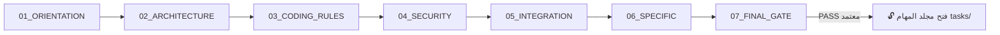
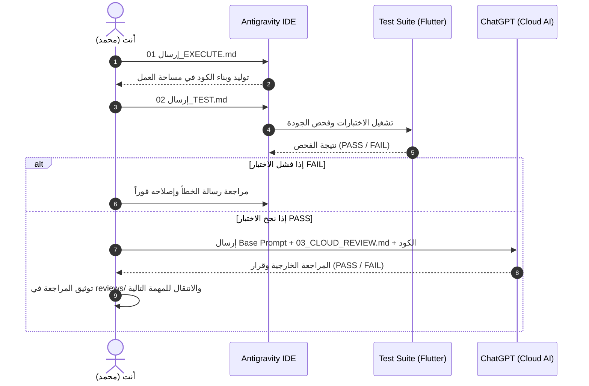

# 📘 الدليل التشغيلي الشامل والمفصل لمنصة Notion
## 👤 العضو: محمد العيدروس (Local Network, Embedded Server & QR Specialist (خبير الخادم المحلي والـ QR وإدارة الطوابير))
### 📦 حزمة التسليم: `03_MOHAMMED_ALAYDAROUS_LOCAL`
### 🏢 مساحة العمل البرمجية: `mobile_app/ (داخل مجلدات الخادم المحلي والـ QR)`

---

> [!IMPORTANT]
> **مرحباً بك يا محمد في الفريق الهندسي لمشروع نظام الحضور والغياب الذكي.**
> هذا الدليل تم إعداده خصيصاً لك من أجلك؛ ليشرح لك مسارك البرمجي والتشغيلي خطوة بخطوة ومن الصفر المطلق حتى تسليم عملك بنجاح.
> انسخ هذه الصفحة كاملة إلى صفحتك الخاصة في **Notion** لتكون مرجعك اليومي الدائم في كل لحظة.

---

## 📑 فهرس المحتويات
1. [المعمارية العامة والطبقات الثلاث في جهازك](#-القسم-الأول-المعمارية-العامة-والطبقات-الثلاث-في-جهازك)
2. [الملفات الـ 13 الرئيسية في حزمة تسليمك (شرح تفصيلي)](#-القسم-الثاني-الملفات-الـ-13-الرئيسية-في-حزمتك-شرح-شامل)
3. [مجلدات الحزمة المرجعية المشتركة team_package](#-القسم-الثالث-مجلدات-الحزمة-المرجعية-المشتركة-team_package)
4. [مرحلة التأسيس المشترك COMMON_FOUNDATION (الخطوات الـ 7 الإلزامية)](#-القسم-الرابع-مرحلة-التأسيس-المشترك-common_foundation-الـ-7-خطوات)
5. [دورة العمل القياسية للمهمة (3-Prompt Pipeline Loop)](#-القسم-الخامس-دورة-العمل-القياسية-لكل-مهمة-نظام-البرومبتات-الثلاثي)
6. [المهام البرمجية التنفيذية tasks (18 مهمة تفصيلية)](#-القسم-السادس-المهام-البرمجية-التنفيذية-tasks-شرح-الـ-18-مهمة)
7. [التوثيق السحابي والمراجعة وإجراءات التسليم النهائي](#-القسم-السابع-التوثيق-السحابي-والمراجعة-والتسليم-النهائي)

---

## 🏛️ القسم الأول: المعمارية العامة والطبقات الثلاث في جهازك

عندما تفتح مساحة العمل الخاصة بك على حاسوبك، ستجد ثلاثة مستويات رئيسية يجب أن تفهم الفرق بينها تماماً:

```mermaid
graph TD
    A[team_package/ - الحزمة المرجعية المشتركة] -->|قراءة فقط Read-Only| D[المطور: محمد العيدروس]
    B[team_delivery/03_MOHAMMED_ALAYDAROUS_LOCAL/ - حزمة التوجيه والتسليم] -->|أدلة وبرومبتات وقوائم فحص| D
    D -->|كتابة وبرمجة واختبار| C[mobile_app/ (داخل مجلدات الخادم المحلي والـ QR) - مساحة العمل البرمجية]
```

### 1. الحزمة المرجعية المشتركة (`team_package/`)
- **ما هي؟** هي الدستور والمكتبة العامة للمشروع، تحتوي على مواصفات الـ API، قاموس قاعدة البيانات، المعايير الأمنية، ونظام التصميم المشترك.
- **ماذا تفعل فيها؟** **قراءة فقط (Read-Only)**. لا تعدل ولا تحذف أي ملف بداخلها إطلاقاً.

### 2. حزمة توجيهك وتسليمك (`team_delivery/03_MOHAMMED_ALAYDAROUS_LOCAL/`)
- **ما هي؟** هي دليلك الإرشادي الخاص الذي أعده لك قائد المشروع، تحتوي على أدلة الاستخدام، برومبتات التأسيس، برومبتات المهام، ومجلدات التسليم والمراجعة.
- **ماذا تفعل فيها؟** تقرأ أدلتها، تنسخ منها البرومبتات لـ Antigravity و ChatGPT، وتوثق فيها تقارير مراجعاتك وتقارير التسليم.

### 3. مساحة عملك البرمجية الفعلية (`mobile_app/ (داخل مجلدات الخادم المحلي والـ QR)`)
- **ما هي؟** المجلد الذي يحتوي على كود Dart و Flutter الحقيقي والاختبارات التابعة له.
- **ماذا تفعل فيها؟** هذا هو المكان الوحيد الذي يقوم فيه Antigravity بكتابة الأكواد، إنشاء الملفات، وبناء الواجهات والاختبارات.

### 🛡️ مصفوفة الصلاحيات وحدود المجلدات الخاصة بك:
- 🟢 **المجلدات المسموح لك العمل والتعديل فيها حصراً:**
  - `mobile_app/lib/local_server/`
  - `mobile_app/lib/local_network/`
  - `mobile_app/lib/qr_session/`
  - `mobile_app/lib/attendance_queue/`
  - `mobile_app/test/local_server/`
  - `mobile_app/test/qr_session/`
  - `mobile_app/test/attendance_queue/`

- 🔴 **المجلدات المحظورة والممنوع لمسها تماماً (منطقة حمراء):**
  - `mobile_app/lib/app/ (ملك أواب)`
  - `mobile_app/lib/student/ (ملك أواب)`
  - `mobile_app/lib/delegate/ (ملك أواب)`
  - `mobile_app/lib/biometric/ (ملك محمد العواضي)`
  - `admin_web/ (ملك مشعل الحاج)`
  - `backend/ (ملك قائد المشروع)`
  - `team_package/ (مرجع للقراءة فقط)`

---

## 📂 القسم الثاني: الملفات الـ 13 الرئيسية في حزمتك (شرح شامل)

داخل المجلد الرئيسي لحزمتك `team_delivery/03_MOHAMMED_ALAYDAROUS_LOCAL/`، توجد 13 وثيقة أساسية مرتبة بالأولوية. فيما يلي شرح كل ملف بالتفصيل الممل:

| الرقم | اسم الملف | الاسم بالعربي | الغرض والوظيفة | متى تفتحه؟ | كيف تستخدمه؟ | الوجهة (AI أم قراءة؟) | التكرار |
|:---|:---|:---|:---|:---|:---|:---|:---|
| **01** | `README_FOR_MEMBER.md` | دليل المطور الشامل والمسار الكامل (19 خطوة) | هو خريطة الطريق الكبرى للمطور؛ يشرح كل مرحلة من لحظة استلام المشروع حتى التسليم النهائي في 19 خطوة مرتبة ومنطقية. | أول ملف يفتحه المطور في بداية عمله ويظل يرجع إليه كمرجع رئيسي طوال فترة المشروع. | يقرأه بتركيز شديد ويفهم المسار العام والترتيب المنطقي للعمل. | قراءة للمطور فقط (Read-Only) — لا يُرسل للذكاء الاصطناعي. | يُقرأ في اليوم الأول ويرجع إليه عند بدء كل مرحلة جديدة. |
| **02** | `QUICK_START.md` | دليل البدء السريع المباشر | يلخص خطوات التشغيل السريعة اليومية (فتح البيئة، اختيار المهمة، تشغيل البرومبتات الثلاثية، وتوثيق النتائج). | عند بدء يوم عمل جديد أو عند الرغبة في تذكر خطوات العمل الروتينية بسرعة ودون إطالة. | اتباع الخطوات الست اليومية المحددة فيه. | قراءة للمطور فقط (Read-Only). | يُقرأ يومياً عند بدء جلسة التطوير. |
| **03** | `WHAT_TO_READ_FIRST.md` | الترتيب الإلزامي لقراءة وثائق المشروع | يحدد للمطور بدقة أي الوثائق من `team_package` يقرأها أولاً، وأيها يقرأها ثانياً، ليمنع التشتت والضياع بين الملفات. | قبل البدء في أي عمل عملي، وأثناء مرحلة التأسيس الأولى. | فتح الروابط والملفات المذكورة فيه بالترتيب المحدد وقراءتها بعناية. | قراءة للمطور فقط (Read-Only). | يُقرأ مرة واحدة في بداية المشروع. |
| **04** | `WHAT_TO_COPY.md` | قواعد النسخ وتجهيز مساحة العمل | يوضح للعضو ما هي الملفات المسموح بنسخها إلى مساحة عمله، وما هي الملفات المحظور نسخها تماماً لمنع كسر المشروع وتلف التبعيات. | لحظة استلام الحزمة من قائد المشروع وقبل فتح أي برنامج تطوير. | مطابقة المجلدات المنسوخة مع القوائم المسموحة والممنوعة الواردة بالملف. | قراءة للمطور فقط (Read-Only). | يُقرأ ويُطبق مرة واحدة عند استلام المشروع. |
| **05** | `WORKSPACE_SETUP.md` | دليل تهيئة بيئة العمل في Antigravity IDE | يشرح كيفية فتح المجلد الصحيح داخل برنامج Antigravity وضبط إعدادات مساحة العمل وتشغيل البيئة بنجاح. | عند تثبيت وتشغيل بيئة التطوير Antigravity IDE. | تطبيق خطوات فتح مجلد المشروع وضبط المسارات وتبعيات Flutter. | قراءة للمطور وتطبيق في بيئة التطوير. | يُطبق في اليوم الأول أو عند إعادة تهيئة البيئة. |
| **06** | `FOLDER_OWNERSHIP.md` | مصفوفة ملكية المجلدات والحدود المسموحة | يحدد المجلدات التي يملكها العضو وله حق التعديل فيها باللون الأخضر، والمجلدات المحرمة عليه لمسها باللون الأحمر. | قبل تعديل أو إنشاء أي ملف في المشروع. | التأكد من أن المسار المستهدف يقع داخل حدوده المصرح بها حصراً وتجنب المسارات المشتركة أو مسارات الزملاء. | قراءة للمطور فقط (Read-Only). | مرجع دائم يُراجع باستمرار قبل أي عملية تعديل. |
| **07** | `ANTIGRAVITY_USAGE.md` | دليل استخدام وتوجيه Antigravity IDE | يشرح كيف تتعامل مع Antigravity IDE، كيف ترسل له برومبت التنفيذ وبرومبت الاختبار، وكيف تراقب مخرجات الكود. | عند تنفيذ أي مهمة برمجية أو فحص كود. | نسخ محتوى `01_EXECUTE.md` ثم `02_TEST.md` ولصقها في محادثة Antigravity ومتابعة النتائج. | دليل إرشادي للمطور لكيفية التعامل مع Antigravity. | يُستخدم مع كل مهمة برمجية. |
| **08** | `CLOUD_REVIEW_USAGE.md` | دليل المراجعة السحابية الخارجية عبر ChatGPT | يشرح بالتفصيل كيف تفتح محادثة في ChatGPT، كيف ترسل البرومبت الأساسي وبرومبت المهمة، وكيف تطلب تقييم PASS/FAIL. | بعد الانتهاء من فحص الكود واجتياز `02_TEST.md` بنجاح داخل Antigravity. | فتح نافذة ChatGPT، إرسال `TEAM_CLOUD_BASE_PROMPT.md` متبوعاً بـ `03_CLOUD_REVIEW.md` والكود المكتوب. | دليل إرشادي للمطور لكيفية استخدام ChatGPT. | يُستخدم مع كل مهمة برمجية بعد اجتياز الاختبار الداخلي. |
| **09** | `WORKFLOW.md` | دورة العمل القياسية للمهمة (4 خطوات) | يشرح دورة حياة المهمة الدائرية: (1. التنفيذ Execute ➔ 2. الاختبار Test ➔ 3. المراجعة Cloud Review ➔ 4. الانتقال/التسليم). | مرجع سريع لحفظ نظام العمل ومنع القفز العشوائي بين المهام. | الالتزام بالترتيب التسلسلي الصارم للمهام دون أي استثناء. | قراءة للمطور فقط (Read-Only). | حفظ واستيعاب دائم في الذهن. |
| **10** | `STOP_AND_FAIL_RULES.md` | قواعد التوقف ومعالجة الأخطاء (الطوارئ) | يوضح ماذا تفعل إذا فشل الاختبار (Test FAIL) أو رفضت المراجعة الكود (Review FAIL)، وكيف تعالج المشكلة جراحياً. | عند ظهور أي خطأ أو فشل في الاختبار أو المراجعة السحابية. | تطبيق قاعدة التوقف الفوري، استخراج رسالة الخطأ بدقة، وإعطائها لـ Antigravity لإصلاحها دون تخمين. | قراءة وتطبيق للمطور (دليل طوارئ). | يُفتح فور حدوث أي مشكلة أو خطأ برمجية. |
| **11** | `DELIVERY_VALIDATION.md` | معايير التحقق والجاهزية للتسليم | يحدد الشروط والمعايير الصارمة التي يجب استيفاؤها في كل مرحلة لكي تُعتبر جاهزة للتسليم لقائد المشروع. | قبل الانتقال من مرحلة لأخرى وقبل تسليم العمل النهائي. | مراجعة بنود الجاهزية والتأكد من مطابقة جميع الشروط والاختبارات. | قراءة للمطور وقائمة فحص ذاتي دقيقة. | يُراجع عند نهاية كل مرحلة وقبل إرسال أي Handoff. |
| **12** | `CHECKLIST.md` | قائمة التحقق اليومية للمطور | قائمة فحص سريعة (Checklist) يقوم المطور بالتأشير عليها يومياً للتأكد من إنجاز المهام وعدم نسيان أي خطوة. | في نهاية كل جلسة عمل أو بعد إكمال كل مهمة برمجية. | قراءة البنود ومطابقتها مع ما تم إنجازه وتوثيقه فعلياً. | أداة فحص يومية للمطور. | يُستخدم يومياً. |
| **13** | `FILE_INVENTORY.md` | الفهرس والجرد الكامل لملفات الحزمة | جدول شامل يسرد كل ملف ومجلد داخل حزمة المطور بالاسم والمسار لضمان عدم فقدان أي ملف أو برومبت. | للبحث عن أي ملف أو التأكد من سلامة اكتمال حزمة التسليم. | البحث في الجدول عن مسار الملف المطلوب ومطابقته على القرص. | فهرس مرجعي للمطور (Read-Only). | مرجع دائم عند البحث والاستفسار. |

---

## 📚 القسم الثالث: مجلدات الحزمة المرجعية المشتركة `team_package`

تتكون الحزمة المشتركة من 8 مجلدات مرجعية رئيسية. إليك بيان كل مجلد ودوره المباشر في عملك:


### 1. `team_package/docs/` (مجلد الدستور والقوانين والمعمارية)
- 🎯 **الهدف والمحتوى:** يحتوي على دستور المشروع `PROJECT_CONSTITUTION.md` وقواعد الكود ومعمارية النظام وأدوار الفريق.
- 🔒 **طبيعة الصلاحية:** قراءة فقط لجميع الأعضاء (Read-Only).
- 💡 **كيف تستفيد منه كـ (محمد):** يُقرأ في مرحلة التأسيس الأولى لفهم القوانين العامة وحظر تعديل العقود أو تجاوز الصلاحيات.


### 2. `team_package/api_contract/` (مجلد عقود واجهات برمجة التطبيقات (API Contract))
- 🎯 **الهدف والمحتوى:** يحتوي على `API_SPECIFICATION.md` وفيه تفاصيل كل رابط Endpoint، البيانات المطلوبة (Request)، وشكل الاستجابة (Response).
- 🔒 **طبيعة الصلاحية:** قراءة فقط (Read-Only) — يمنع تعديل أي حرف فيه.
- 💡 **كيف تستفيد منه كـ (محمد):** يرجع إليه المطور لمعرفة أسماء ونوع الحقول الدقيقة المتوقعة من الخادم المركزي.


### 3. `team_package/database/` (مجلد قاموس قاعدة البيانات والمخططات)
- 🎯 **الهدف والمحتوى:** يحتوي على `database_dictionary.md` وفيه أسماء الجداول والحقول وأنواعها والقيود والعلاقات.
- 🔒 **طبيعة الصلاحية:** قراءة فقط (Read-Only).
- 💡 **كيف تستفيد منه كـ (محمد):** مرجع لتطابق أسماء المتغيرات والحقول (مثل snake_case في قاعدة البيانات و camelCase في Dart).


### 4. `team_package/local_protocol/` (مجلد بروتوكولات القاعة والشبكة المحلية)
- 🎯 **الهدف والمحتوى:** يحتوي على بروتوكول الخادم المحلي المدمج، بروتوكول QR الديناميكي مع Nonce، وبروتوكول التحقق الحيوي.
- 🔒 **طبيعة الصلاحية:** قراءة فقط (Read-Only).
- 💡 **كيف تستفيد منه كـ (محمد):** المرجع الفني الدقيق لتبادل البيانات دون إنترنت عبر شبكة القاعة المحلية.


### 5. `team_package/security/` (مجلد المواصفات والمعايير الأمنية)
- 🎯 **الهدف والمحتوى:** يحتوي على قواعد تشفير التوكنات، حماية الأجهزة، تأمين القوالب الحيوية، وعزل الشبكة المحلية.
- 🔒 **طبيعة الصلاحية:** قراءة فقط (Read-Only).
- 💡 **كيف تستفيد منه كـ (محمد):** يضمن التزام المطور بأعلى معايير الأمان وحظر تخزين التوكنات كنص عادي أو إهمال التشفير.


### 6. `team_package/integration/` (مجلد قوالب التسليم والدمج الرسمي)
- 🎯 **الهدف والمحتوى:** يحتوي على `HANDOFF_TEMPLATE.md` وهو القالب الرسمي الذي يملؤه المطور عند تسليم أي مرحلة للقائد.
- 🔒 **طبيعة الصلاحية:** قراءة ونسخ القالب (Template).
- 💡 **كيف تستفيد منه كـ (محمد):** يستخدمه المطور عند نهاية كل مرحلة لتعبئة تقرير التسليم في مجلد `handoff/`.


### 7. `team_package/prompts/shared/` (مجلد البرومبتات ونظام التصميم المشترك)
- 🎯 **الهدف والمحتوى:** يحتوي على `UI_UX_SYSTEM.md` (نظام التصميم الموحد)، `TEAM_AI_BASE_PROMPT.md`، و `TEAM_CLOUD_BASE_PROMPT.md`.
- 🔒 **طبيعة الصلاحية:** قراءة واستخدام مع الـ AI (Read-Only Reference).
- 💡 **كيف تستفيد منه كـ (محمد):** مرجع نظام التصميم الموحد ومصدر الـ Base Prompts التي تُرسل للـ AI في كل محادثة مراجعة.


### 8. `team_package/shared/` (مجلد الثوابت والنماذج البرمجية المشتركة)
- 🎯 **الهدف والمحتوى:** يحتوي على الرموز اللونية، الثوابت المعمارية، والموديلات المشتركة بين الأنظمة.
- 🔒 **طبيعة الصلاحية:** قراءة فقط (Read-Only).
- 💡 **كيف تستفيد منه كـ (محمد):** مرجع لقيم التصميم والثوابت الرسمية المعتمدة في المشروع.


---

## 🧱 القسم الرابع: مرحلة التأسيس المشترك `COMMON_FOUNDATION` (الـ 7 خطوات)

> [!WARNING]
> **قانون صارم لا يقبل الاستثناء:**
> ممنوع منعاً باتاً فتح مجلد المهام التنفيذية `tasks/` أو كتابة أي كود قبل اجتياز جميع خطوات التأسيس الـ 7 بالتسلسل والحصول على اعتماد `[PASS]` في الخطوة السابعة!

تجد هذه الخطوات داخل: `team_delivery/03_MOHAMMED_ALAYDAROUS_LOCAL/COMMON_FOUNDATION/`



### تفاصيل خطوات التأسيس السبع:

---
### 🔹 الخطوة (01): `01_PROJECT_ORIENTATION` — التعريف الشامل بالنظام وأهدافه
- 🎯 **الهدف الأساسي:** فهم المشكلة الأكاديمية التي يحلها المشروع، مكونات النظام الخمسة (الباك إند، الهاتف، الويب، الخادم المحلي، والبصمة)، وتدفق الحضور الشامل.
- 🛠️ **ماذا يفعل برومبت التنفيذ `01_EXECUTE.md` في Antigravity؟** يقوم Antigravity باستعراض وثائق المشروع وشرح المعمارية العامة ومطابقة المتطلبات.
- 🧪 **ماذا يفعل برومبت الاختبار `02_TEST.md` في Antigravity؟** يقوم Antigravity باختبار استيعاب المطور لأهداف النظام والتأكد من إدراك التدفق العام.
- ☁️ **ماذا يفعل برومبت المراجعة `03_CLOUD_REVIEW.md` في ChatGPT؟** يراجع ChatGPT فهم المطور العام للنظام ويصدر قرار [PASS] للتأكد من وضوح الصورة قبل التعمق.
- 📋 **شرط العبور:** الحصول على تقييم `[PASS]` وتوثيق نتيجة المراجعة في `team_delivery/03_MOHAMMED_ALAYDAROUS_LOCAL/reviews/`.


---
### 🔹 الخطوة (02): `02_ARCHITECTURE` — المعمارية وعزل الحدود ومصفوفة الملكية
- 🎯 **الهدف الأساسي:** ترسيخ مبدأ عزل المكونات (Modularity)، فهم مصفوفة ملكية المجلدات، وحظر تعديل ملفات الزملاء أو كسر المعمارية.
- 🛠️ **ماذا يفعل برومبت التنفيذ `01_EXECUTE.md` في Antigravity؟** يقوم Antigravity بفحص هيكل المجلدات وشرح الحدود المسموحة والممنوعة للعضو بدقة.
- 🧪 **ماذا يفعل برومبت الاختبار `02_TEST.md` في Antigravity؟** يفحص Antigravity التزام مساحة العمل بمصفوفة الملكية وعدم وجود تعديلات خارج الحدود.
- ☁️ **ماذا يفعل برومبت المراجعة `03_CLOUD_REVIEW.md` في ChatGPT؟** يراجع ChatGPT الحدود المعمارية ويصدر [PASS] لضمان عدم حدوث تداخلات بين المطورين.
- 📋 **شرط العبور:** الحصول على تقييم `[PASS]` وتوثيق نتيجة المراجعة في `team_delivery/03_MOHAMMED_ALAYDAROUS_LOCAL/reviews/`.


---
### 🔹 الخطوة (03): `03_CODING_RULES` — قواعد الكود النظيف والتسميات والـ AI
- 🎯 **الهدف الأساسي:** إتقان تسميات لغة Dart و Flutter (فئات بـ UpperCamelCase، متغيرات بـ lowerCamelCase، ملفات بـ snake_case)، والتعامل مع الذكاء الاصطناعي كمنفذ منضبط.
- 🛠️ **ماذا يفعل برومبت التنفيذ `01_EXECUTE.md` في Antigravity؟** يقوم Antigravity بشرح وتطبيق معايير كتابة الكود النظيف وقواعد الـ Linter المعتمدة.
- 🧪 **ماذا يفعل برومبت الاختبار `02_TEST.md` في Antigravity؟** يشغل Antigravity فحص التحليل الساكن والتأكد من استيفاء معايير التسمية والهيكلة.
- ☁️ **ماذا يفعل برومبت المراجعة `03_CLOUD_REVIEW.md` في ChatGPT؟** يراجع ChatGPT قواعد الكود ويصدر [PASS] لضمان جودة الكود وسهولة صيانته.
- 📋 **شرط العبور:** الحصول على تقييم `[PASS]` وتوثيق نتيجة المراجعة في `team_delivery/03_MOHAMMED_ALAYDAROUS_LOCAL/reviews/`.


---
### 🔹 الخطوة (04): `04_SECURITY` — المواصفات الأمنية وحماية البيانات الحساسة
- 🎯 **الهدف الأساسي:** ترسيخ مبادئ الأمان: التخزين المشفر للتوكنات، حظر تضمين كلمات السر في الكود (No Hardcoding)، تأمين البصمة الحيوية، وحماية الشبكة المحلية.
- 🛠️ **ماذا يفعل برومبت التنفيذ `01_EXECUTE.md` في Antigravity؟** يقوم Antigravity باستعراض سياسات الأمان والتشفير وإعداد بيئة التخزين الآمن.
- 🧪 **ماذا يفعل برومبت الاختبار `02_TEST.md` في Antigravity؟** يفحص Antigravity خلو المشروع من أي تسريبات أمنية أو متغيرات حساسة مكشوفة.
- ☁️ **ماذا يفعل برومبت المراجعة `03_CLOUD_REVIEW.md` في ChatGPT؟** يراجع ChatGPT الجوانب الأمنية ويصدر [PASS] لضمان سلامة بيانات الطلاب والأساتذة.
- 📋 **شرط العبور:** الحصول على تقييم `[PASS]` وتوثيق نتيجة المراجعة في `team_delivery/03_MOHAMMED_ALAYDAROUS_LOCAL/reviews/`.


---
### 🔹 الخطوة (05): `05_INTEGRATION_RULES` — قواعد الدمج والتكامل وفحص الانحدار
- 🎯 **الهدف الأساسي:** تعلم كيفية إعداد تقارير التسليم الرسمية (Handoff)، وفهم كيف يقوم القائد بدمج الكود وإجراء فحص الانحدار (Regression Testing).
- 🛠️ **ماذا يفعل برومبت التنفيذ `01_EXECUTE.md` في Antigravity؟** يقوم Antigravity بشرح دورة حياة الدمج وكيفية تعبئة قوالب الـ Handoff بدقة.
- 🧪 **ماذا يفعل برومبت الاختبار `02_TEST.md` في Antigravity؟** يختبر Antigravity جاهزية المطور لاتباع بروتوكول التسليم وفحص سلامة التوثيق.
- ☁️ **ماذا يفعل برومبت المراجعة `03_CLOUD_REVIEW.md` في ChatGPT؟** يراجع ChatGPT استيعاب المطور لدورة التسليم ويصدر قرار [PASS].
- 📋 **شرط العبور:** الحصول على تقييم `[PASS]` وتوثيق نتيجة المراجعة في `team_delivery/03_MOHAMMED_ALAYDAROUS_LOCAL/reviews/`.


---
### 🔹 الخطوة (06): `06_MEMBER_SPECIFIC_FOUNDATION` — التأسيس التخصصي ونظام التصميم (حسب مسؤولية العضو)
- 🎯 **الهدف الأساسي:** استيعاب المتطلبات الفنية الخاصة بالعضو بالتفصيل (مثل: M3 و RTL لأواب ومشعل، أو بروتوكول البصمة للعواضي، أو الخادم المحلي للعيدروس).
- 🛠️ **ماذا يفعل برومبت التنفيذ `01_EXECUTE.md` في Antigravity؟** يقوم Antigravity بتجهيز البنية التحتية التخصصية للعضو وتطبيق القواعد التقنية الخاصة به.
- 🧪 **ماذا يفعل برومبت الاختبار `02_TEST.md` في Antigravity؟** يشغل Antigravity فحصاً متخصصاً للتأكد من مطابقة المتطلبات الخاصة للموديل.
- ☁️ **ماذا يفعل برومبت المراجعة `03_CLOUD_REVIEW.md` في ChatGPT؟** يراجع ChatGPT التأسيس التخصصي ويصدر قرار [PASS].
- 📋 **شرط العبور:** الحصول على تقييم `[PASS]` وتوثيق نتيجة المراجعة في `team_delivery/03_MOHAMMED_ALAYDAROUS_LOCAL/reviews/`.


---
### 🔹 الخطوة (07): `07_FOUNDATION_FINAL_GATE` — بوابة الاعتماد النهائي للتأسيس (Strict Gate)
- 🎯 **الهدف الأساسي:** التقييم الشامل والنهائي لكافة خطوات التأسيس الست السابقة، وإصدار إذن العبور الرسمي لفتح مجلد المهام التنفيذية `tasks/`.
- 🛠️ **ماذا يفعل برومبت التنفيذ `01_EXECUTE.md` في Antigravity؟** يقوم Antigravity بإجراء تدقيق شامل لكافة مخرجات التأسيس وإعداد التقرير النهائي.
- 🧪 **ماذا يفعل برومبت الاختبار `02_TEST.md` في Antigravity؟** يشغل Antigravity فحصاً تكاملياً شاملاً للتأسيس والتأكد من خلوه من أي ثغرات أو نواقص.
- ☁️ **ماذا يفعل برومبت المراجعة `03_CLOUD_REVIEW.md` في ChatGPT؟** يقوم ChatGPT بمراجعة صارمة ودقيقة ويصدر قرار [PASS] النهائي لفتح مهام العمل.
- 📋 **شرط العبور:** الحصول على تقييم `[PASS]` وتوثيق نتيجة المراجعة في `team_delivery/03_MOHAMMED_ALAYDAROUS_LOCAL/reviews/`.


---

## 🔄 القسم الخامس: دورة العمل القياسية لكل مهمة (نظام البرومبتات الثلاثي)

لكل مهمة برمجية داخل `tasks/`، يوجد مجلد مستقل يحتوي حصراً على 3 ملفات برومبت. هذه هي الدورة التي ستكررها مع كل مهمة:



### خطوات تشغيل البرومبتات الثلاثية بدقة:
1. **الخطوة 1 — التنفيذ (`01_EXECUTE.md`):**
   - افتح نافذة محادثة Antigravity IDE.
   - انسخ محتوى ملف `01_EXECUTE.md` الخاص بالمهمة والصقه في المحادثة.
   - يقوم Antigravity بإنشاء وتعديل الأكواد المطلوبة في مسارها الصحيح داخل `mobile_app/ (داخل مجلدات الخادم المحلي والـ QR)`.
2. **الخطوة 2 — الاختبار الداخلي (`02_TEST.md`):**
   - بعد انتهاء التنفيذ، انسخ محتوى `02_TEST.md` والصقه في Antigravity.
   - يقوم Antigravity بتشغيل اختبارات الـ Unit Tests وفحص الـ Linter والتأكد من خلو الكود من أي عيوب.
   - يجب أن تحصل على نتيجة `TESTS PASSED`. إذا ظهر أي خطأ، اطلب من Antigravity إصلاحه حتى ينجح 100%.
3. **الخطوة 3 — المراجعة السحابية الخارجية (`03_CLOUD_REVIEW.md`):**
   - افتح متصفحك وادخل على **ChatGPT**.
   - أرسل أولاً ملف: `team_package/prompts/shared/TEAM_CLOUD_BASE_PROMPT.md`.
   - ثم أرسل محتوى `03_CLOUD_REVIEW.md` مرفقاً معه الكود الذي تم تنفيذه.
   - انتظر تقييم ChatGPT حتى يصدر قرار: `REVIEW STATUS: [PASS]`.
   - احفظ نص المراجعة في ملف داخل مجلد: `team_delivery/03_MOHAMMED_ALAYDAROUS_LOCAL/reviews/`.

---

## 🚀 القسم السادس: المهام البرمجية التنفيذية `tasks/` (شرح الـ 18 مهمة)

فيما يلي الجدول والمخطط التفصيلي لجميع مهامك البرمجية داخل `team_delivery/03_MOHAMMED_ALAYDAROUS_LOCAL/tasks/` بالترتيب الإلزامي:


---
### 📌 المهمة (01): `01_LOCAL_NETWORK_MANAGER`
#### 🏷️ مدير الشبكة المحلية واكتشاف الـ IP والـ Wi-Fi
- 🎯 **الهدف البرمجي:** اكتشاف عنوان الـ IP المحلي للهاتف، مراقبة حالة اتصال الـ Wi-Fi ونقطة الاتصال (Hotspot)، وتوفير واجهة إدارة الشبكة.
- 📂 **مسار الملف المستهدف بالكتابة:** `mobile_app/lib/local_network/network_manager.dart`
- ⚡ **أمر التنفيذ (`01_EXECUTE.md`):** برمجة مراقب واجهات الشبكة واكتشاف عنوان الـ IP الفعال.
- 🧪 **أمر الفحص والاختبار (`02_TEST.md`):** اختبار اكتشاف الـ IP في حالات الـ Wi-Fi والـ Hotspot ومعالجة انقطاع الشبكة.
- ☁️ **معايير المراجعة السحابية (`03_CLOUD_REVIEW.md`):** مراجعة سلامة فحص الشبكة واستقرار الأداء.
- 🚦 **شرط النجاح والعبور:** نجاح الاختبار الداخلي 100% + اعتماد ChatGPT بعلامة `[PASS]` وتوثيق تقرير المراجعة.


---
### 📌 المهمة (02): `02_PORT_MANAGER`
#### 🏷️ مدير المنافذ والربط الديناميكي (Port Manager)
- 🎯 **الهدف البرمجي:** فحص وتحديد المنافذ المتاحة للعمل (Dynamic Port Binding) وتفادي تعارض المنافذ مع تطبيقات أخرى.
- 📂 **مسار الملف المستهدف بالكتابة:** `mobile_app/lib/local_server/port_manager.dart`
- ⚡ **أمر التنفيذ (`01_EXECUTE.md`):** برمجة مكتشف المنافذ الحرة وآلية حجز المنفذ التلقائي.
- 🧪 **أمر الفحص والاختبار (`02_TEST.md`):** التحقق من حجز منفذ متاح وإعادة المحاولة في حال انشغال المنفذ.
- ☁️ **معايير المراجعة السحابية (`03_CLOUD_REVIEW.md`):** مراجعة معالجة أخطاء المنافذ واستقرار التهيئة.
- 🚦 **شرط النجاح والعبور:** نجاح الاختبار الداخلي 100% + اعتماد ChatGPT بعلامة `[PASS]` وتوثيق تقرير المراجعة.


---
### 📌 المهمة (03): `03_EMBEDDED_HTTP_SERVER`
#### 🏷️ الخادم المحلي المدمج في الهاتف (Embedded HTTP Server)
- 🎯 **الهدف البرمجي:** بناء وتشغيل خادم HTTP محلي خفيف الوزن ومستقر مدمج داخل هاتف المندوب/الأستاذ لاستقبال طلبات الحضور دون إنترنت.
- 📂 **مسار الملف المستهدف بالكتابة:** `mobile_app/lib/local_server/embedded_server_core.dart`
- ⚡ **أمر التنفيذ (`01_EXECUTE.md`):** تهيئة محرك الخادم المحلي ومعالجة الطلبات الواردة.
- 🧪 **أمر الفحص والاختبار (`02_TEST.md`):** اختبار إقلاع الخادم والاستجابة لطلبات الفحص (Ping/Health Check).
- ☁️ **معايير المراجعة السحابية (`03_CLOUD_REVIEW.md`):** مراجعة كفاءة استخدام الموارد واستقرار الخادم في الخلفية.
- 🚦 **شرط النجاح والعبور:** نجاح الاختبار الداخلي 100% + اعتماد ChatGPT بعلامة `[PASS]` وتوثيق تقرير المراجعة.


---
### 📌 المهمة (04): `04_SESSION_LIFECYCLE`
#### 🏷️ دورة حياة جلسة الحضور المحلية (State Machine)
- 🎯 **الهدف البرمجي:** إدارة حالات جلسة الحضور المحلية بدقة (قيد التهيئة، نشطة، متوقفة مؤقتاً، مغلقة، وجاهزة للمزامنة).
- 📂 **مسار الملف المستهدف بالكتابة:** `mobile_app/lib/local_server/session_state_machine.dart`
- ⚡ **أمر التنفيذ (`01_EXECUTE.md`):** برمجة آلة الحالات (State Machine) وحظر العمليات غير المصرح بها في الحالات المغلقة.
- 🧪 **أمر الفحص والاختبار (`02_TEST.md`):** فحص الانتقال السليم بين الحالات ومنع استقبال الحضور بعد الإغلاق.
- ☁️ **معايير المراجعة السحابية (`03_CLOUD_REVIEW.md`):** مراجعة سلامة دورة الحياة والتحكم في الجلسة.
- 🚦 **شرط النجاح والعبور:** نجاح الاختبار الداخلي 100% + اعتماد ChatGPT بعلامة `[PASS]` وتوثيق تقرير المراجعة.


---
### 📌 المهمة (05): `05_SESSION_GUARD`
#### 🏷️ حارس الجلسة والتحقق من الصلاحيات (Session Guard)
- 🎯 **الهدف البرمجي:** التحقق من صحة التوكن الصادر للمندوب/الأستاذ وصلاحيته لبدء الجلسة لهذه الشعبة الأكاديمية تحديداً.
- 📂 **مسار الملف المستهدف بالكتابة:** `mobile_app/lib/local_server/guards/session_auth_guard.dart`
- ⚡ **أمر التنفيذ (`01_EXECUTE.md`):** بناء مرشح التحقق من الصلاحيات ورفض الطلبات غير المصرح بها.
- 🧪 **أمر الفحص والاختبار (`02_TEST.md`):** اختبار حظر الجلسات غير المصرح بها وتوثيق محاولات الدخول المرفوضة.
- ☁️ **معايير المراجعة السحابية (`03_CLOUD_REVIEW.md`):** مراجعة الأمان الصارم للتحكم في الجلسات المحلية.
- 🚦 **شرط النجاح والعبور:** نجاح الاختبار الداخلي 100% + اعتماد ChatGPT بعلامة `[PASS]` وتوثيق تقرير المراجعة.


---
### 📌 المهمة (06): `06_DISCOVERY_PROTOCOL`
#### 🏷️ بروتوكول اكتشاف الخادم في القاعة (Service Discovery)
- 🎯 **الهدف البرمجي:** تمكين هواتف الطلاب من اكتشاف خادم القاعة المحلي تلقائياً عبر بروتوكول البث المحلي (Local Broadcast / mDNS).
- 📂 **مسار الملف المستهدف بالكتابة:** `mobile_app/lib/local_network/discovery_service.dart`
- ⚡ **أمر التنفيذ (`01_EXECUTE.md`):** برمجة خدمة الإعلان والاستكشاف التلقائي لعنوان الخادم.
- 🧪 **أمر الفحص والاختبار (`02_TEST.md`):** اختبار عثور هاتف الطالب على الخادم في أقل من ثانية واحدة.
- ☁️ **معايير المراجعة السحابية (`03_CLOUD_REVIEW.md`):** مراجعة كفاءة بروتوكول الاكتشاف وعدم إغراق الشبكة بالرسائل.
- 🚦 **شرط النجاح والعبور:** نجاح الاختبار الداخلي 100% + اعتماد ChatGPT بعلامة `[PASS]` وتوثيق تقرير المراجعة.


---
### 📌 المهمة (07): `07_DYNAMIC_QR_GENERATOR`
#### 🏷️ مولد رمز الاستجابة السريعة الديناميكي (Dynamic QR)
- 🎯 **الهدف البرمجي:** توليد كود QR مشفر يتغير كل 5 ثوانٍ يحتوي على (SessionId, Nonce, Timestamp, TOTP Hash) لمنع تصوير الشاشة وتمرير الكود.
- 📂 **مسار الملف المستهدف بالكتابة:** `mobile_app/lib/qr_session/dynamic_qr_generator.dart`
- ⚡ **أمر التنفيذ (`01_EXECUTE.md`):** برمجة خوارزمية توليد الـ Nonce وتحديث الكود دورياً كل 5 ثوانٍ.
- 🧪 **أمر الفحص والاختبار (`02_TEST.md`):** التحقق من تغير الكود بدقة ومزامنة التوقيت ومنع تكرار الـ Nonce.
- ☁️ **معايير المراجعة السحابية (`03_CLOUD_REVIEW.md`):** مراجعة الأمان ومقاومة هجمات تصوير الـ QR (Anti-Replay).
- 🚦 **شرط النجاح والعبور:** نجاح الاختبار الداخلي 100% + اعتماد ChatGPT بعلامة `[PASS]` وتوثيق تقرير المراجعة.


---
### 📌 المهمة (08): `08_QR_CLIENT_SCAN_VERIFY`
#### 🏷️ فحص وتفكيك وتدقيق رمز الـ QR من هاتف الطالب
- 🎯 **الهدف البرمجي:** قراءة رمز الـ QR من كاميرا الطالب، فك تشفيره، والتحقق من حداثة التوقيت وصلاحية الـ Nonce قبل إرسال الطلب.
- 📂 **مسار الملف المستهدف بالكتابة:** `mobile_app/lib/qr_session/qr_payload_verifier.dart`
- ⚡ **أمر التنفيذ (`01_EXECUTE.md`):** بناء محلل الحمولة وتدقيق التوقيع الزمني وصلاحية الرمز.
- 🧪 **أمر الفحص والاختبار (`02_TEST.md`):** اختبار قبول الرمز الصالح ورفض الأكواد منتهية الصلاحية (> 5s).
- ☁️ **معايير المراجعة السحابية (`03_CLOUD_REVIEW.md`):** مراجعة دقة التدقيق وحماية التطبيق من الأكواد المزيفة.
- 🚦 **شرط النجاح والعبور:** نجاح الاختبار الداخلي 100% + اعتماد ChatGPT بعلامة `[PASS]` وتوثيق تقرير المراجعة.


---
### 📌 المهمة (09): `09_STUDENT_LOCAL_CLIENT`
#### 🏷️ عميل اتصال الطالب بالخادم المحلي في القاعة
- 🎯 **الهدف البرمجي:** برمجة عميل HTTP خفيف داخل هاتف الطالب يرسل بيانات التحضير والبصمة إلى خادم القاعة المحلي مع المصافحة الآمنة.
- 📂 **مسار الملف المستهدف بالكتابة:** `mobile_app/lib/local_network/student_local_client.dart`
- ⚡ **أمر التنفيذ (`01_EXECUTE.md`):** بناء عميل الإرسال المحلي مع إعادة المحاولة الذكية عند تعثر الشبكة.
- 🧪 **أمر الفحص والاختبار (`02_TEST.md`):** اختبار إرسال الطلب واستقبال الرد الفوري في أقل من 100 ميلي ثانية.
- ☁️ **معايير المراجعة السحابية (`03_CLOUD_REVIEW.md`):** مراجعة سرعة الاستجابة ومعالجة انقطاع الاتصال المؤقت.
- 🚦 **شرط النجاح والعبور:** نجاح الاختبار الداخلي 100% + اعتماد ChatGPT بعلامة `[PASS]` وتوثيق تقرير المراجعة.


---
### 📌 المهمة (10): `10_ATTENDANCE_PROCESSING_QUEUE`
#### 🏷️ طابور معالجة الحضور المتزامن (FIFO Async Queue)
- 🎯 **الهدف البرمجي:** بناء طابور معالجة تسلسلي غير متزامن مع قفل حماية (Mutex Lock) لمعالجة طلبات الطلاب الواردة في نفس اللحظة دون تداخل.
- 📂 **مسار الملف المستهدف بالكتابة:** `mobile_app/lib/attendance_queue/attendance_queue_processor.dart`
- ⚡ **أمر التنفيذ (`01_EXECUTE.md`):** برمجة طابور الـ FIFO مع إدارة التزامن ومنع تضارب الكتابة.
- 🧪 **أمر الفحص والاختبار (`02_TEST.md`):** اختبار دخول 50 طلباً دفعة واحدة وتسكينها في الطابور ومعالجتها بالترتيب.
- ☁️ **معايير المراجعة السحابية (`03_CLOUD_REVIEW.md`):** مراجعة سلامة التزامن (Thread Safety) وخلو النظام من حالات الـ Race Condition.
- 🚦 **شرط النجاح والعبور:** نجاح الاختبار الداخلي 100% + اعتماد ChatGPT بعلامة `[PASS]` وتوثيق تقرير المراجعة.


---
### 📌 المهمة (11): `11_IDEMPOTENCY_REQUEST_ID`
#### 🏷️ منع تكرار التحضير وحماية الـ Idempotency
- 🎯 **الهدف البرمجي:** توليد وفحص معرف الطلب الفريد (Request-Id) لضمان عدم تسجيل حضور الطالب مرتين في نفس الجلسة حتى لو ضغط الزر عدة مرات.
- 📂 **مسار الملف المستهدف بالكتابة:** `mobile_app/lib/attendance_queue/idempotency_guard.dart`
- ⚡ **أمر التنفيذ (`01_EXECUTE.md`):** برمجة سجل الـ Request-Id المؤقت ورفض الطلبات المكررة فوراً.
- 🧪 **أمر الفحص والاختبار (`02_TEST.md`):** اختبار إرسال نفس الطلب 5 مرات متتالية والتأكد من تسجيله مرة واحدة فقط.
- ☁️ **معايير المراجعة السحابية (`03_CLOUD_REVIEW.md`):** مراجعة حماية النظام من التكرار والازدواجية.
- 🚦 **شرط النجاح والعبور:** نجاح الاختبار الداخلي 100% + اعتماد ChatGPT بعلامة `[PASS]` وتوثيق تقرير المراجعة.


---
### 📌 المهمة (12): `12_LOCAL_AUTHORIZATION`
#### 🏷️ التحقق المحلي من قيد الطالب في الشعبة
- 🎯 **الهدف البرمجي:** مطابقة معرف الطالب مع القائمة المحلية لطلاب الشعبة المسجلين للتأكد من أحقيته في حضور هذه المحاضرة.
- 📂 **مسار الملف المستهدف بالكتابة:** `mobile_app/lib/local_server/local_enrollment_matcher.dart`
- ⚡ **أمر التنفيذ (`01_EXECUTE.md`):** بناء دالة المطابقة السريعة في مصفوفة الطلاب المعتمدة.
- 🧪 **أمر الفحص والاختبار (`02_TEST.md`):** اختبار قبول الطالب المسجل ورفض الطالب من شعبة أخرى فورياً.
- ☁️ **معايير المراجعة السحابية (`03_CLOUD_REVIEW.md`):** مراجعة دقة المطابقة الأكاديمية والسرعة في القاعة.
- 🚦 **شرط النجاح والعبور:** نجاح الاختبار الداخلي 100% + اعتماد ChatGPT بعلامة `[PASS]` وتوثيق تقرير المراجعة.


---
### 📌 المهمة (13): `13_LOCAL_RESPONSE_CONTRACT`
#### 🏷️ عقد استجابة الخادم المحلي الموحد (JSON Contract)
- 🎯 **الهدف البرمجي:** توحيد صياغة استجابات الخادم المحلي (Success / Error / Duplicate / ExpiredQR) بتنسيق JSON موحد ومتوافق مع المعايير.
- 📂 **مسار الملف المستهدف بالكتابة:** `mobile_app/lib/local_server/contracts/local_response_payload.dart`
- ⚡ **أمر التنفيذ (`01_EXECUTE.md`):** بناء نماذج الاستجابة الموحدة ورموز الحالة الخاصة بالقاعة.
- 🧪 **أمر الفحص والاختبار (`02_TEST.md`):** التحقق من تطابق بنية الاستجابة في كافة الحالات الطبيعية والاستثنائية.
- ☁️ **معايير المراجعة السحابية (`03_CLOUD_REVIEW.md`):** مراجعة الالتزام بالعقد البرمجي الموحد للشبكة المحلية.
- 🚦 **شرط النجاح والعبور:** نجاح الاختبار الداخلي 100% + اعتماد ChatGPT بعلامة `[PASS]` وتوثيق تقرير المراجعة.


---
### 📌 المهمة (14): `14_GRACEFUL_SHUTDOWN`
#### 🏷️ الإغلاق الآمن للخادم وتفريغ الطابور
- 🎯 **الهدف البرمجي:** إغلاق الخادم المحلي بأمان عند انتهاء الجلسة، تفريغ كافة الطلبات المتبقية في الطابور، وتجهيز الحزمة للمزامنة.
- 📂 **مسار الملف المستهدف بالكتابة:** `mobile_app/lib/local_server/server_shutdown_handler.dart`
- ⚡ **أمر التنفيذ (`01_EXECUTE.md`):** برمجة مسار الإغلاق المتدرج وحفظ البيانات في التخزين الدائم.
- 🧪 **أمر الفحص والاختبار (`02_TEST.md`):** اختبار إيقاف الخادم والتأكد من عدم فقدان أي طلب حضور كان في الطابور.
- ☁️ **معايير المراجعة السحابية (`03_CLOUD_REVIEW.md`):** مراجعة موثوقية حفظ البيانات وسلامة إنهاء الخدمة.
- 🚦 **شرط النجاح والعبور:** نجاح الاختبار الداخلي 100% + اعتماد ChatGPT بعلامة `[PASS]` وتوثيق تقرير المراجعة.


---
### 📌 المهمة (15): `15_NETWORK_FAILURE_HANDLING`
#### 🏷️ معالجة انقطاع الشبكة واستعادة الاتصال
- 🎯 **الهدف البرمجي:** التعامل الذكي مع حالات قطع اتصال الـ Wi-Fi، انطفاء الـ Hotspot، وإعادة إنشاء الاتصال تلقائياً دون فقدان الجلسة.
- 📂 **مسار الملف المستهدف بالكتابة:** `mobile_app/lib/local_network/network_resilience_handler.dart`
- ⚡ **أمر التنفيذ (`01_EXECUTE.md`):** برمجة معالج التعافي الذاتي من أخطاء الشبكة المؤقتة.
- 🧪 **أمر الفحص والاختبار (`02_TEST.md`):** محاكاة فصل وإعادة توصيل الشبكة والتحقق من استمرار الجلسة بنجاح.
- ☁️ **معايير المراجعة السحابية (`03_CLOUD_REVIEW.md`):** مراجعة متانة النظام وتحمله لظروف القاعات الواقعية.
- 🚦 **شرط النجاح والعبور:** نجاح الاختبار الداخلي 100% + اعتماد ChatGPT بعلامة `[PASS]` وتوثيق تقرير المراجعة.


---
### 📌 المهمة (16): `16_STRESS_50_CLIENTS`
#### 🏷️ اختبار الضغط ومعالجة 50 طالباً متزامناً
- 🎯 **الهدف البرمجي:** إجراء اختبار إجهاد يحاكي إرسال 50 طالباً لطلبات حضورهم في غضون ثانيتين والتحقق من معالجتها دون أي انهيار.
- 📂 **مسار الملف المستهدف بالكتابة:** `mobile_app/test/local_server/stress_test_50_clients.dart`
- ⚡ **أمر التنفيذ (`01_EXECUTE.md`):** كتابة سيناريو الإجهاد المتزامن وتشغيل المحاكاة الواقعية.
- 🧪 **أمر الفحص والاختبار (`02_TEST.md`):** التأكد من نجاح معالجة كافة الـ 50 طلباً بزمن استجابة متوسط < 1.5 ثانية.
- ☁️ **معايير المراجعة السحابية (`03_CLOUD_REVIEW.md`):** مراجعة تقرير الضغط واعتماد كفاءة الخادم المحلي.
- 🚦 **شرط النجاح والعبور:** نجاح الاختبار الداخلي 100% + اعتماد ChatGPT بعلامة `[PASS]` وتوثيق تقرير المراجعة.


---
### 📌 المهمة (17): `17_SECURITY_AND_ARCHITECTURE_AUDIT`
#### 🏷️ التدقيق الأمني للشبكة المحلية ومنع التلاعب
- 🎯 **الهدف البرمجي:** فحص أمان الاتصال المحلي، منع هجمات الوسيط (MITM)، حظر هجمات إعادة الإرسال (Replay Attacks)، وتأمين حزم البيانات.
- 📂 **مسار الملف المستهدف بالكتابة:** `mobile_app/test/local_server/security_audit_test.dart`
- ⚡ **أمر التنفيذ (`01_EXECUTE.md`):** فحص تشفير الحزم وتدقيق صلاحية التوكنات والـ Nonce.
- 🧪 **أمر الفحص والاختبار (`02_TEST.md`):** تشغيل محاكاة الهجمات الأمنية والتأكد من صدها بنجاح 100%.
- ☁️ **معايير المراجعة السحابية (`03_CLOUD_REVIEW.md`):** مراجعة أمنية شاملة وإصدار اعتماد الحماية.
- 🚦 **شرط النجاح والعبور:** نجاح الاختبار الداخلي 100% + اعتماد ChatGPT بعلامة `[PASS]` وتوثيق تقرير المراجعة.


---
### 📌 المهمة (18): `18_HANDOFF`
#### 🏷️ المراجعة الشاملة والتسليم النهائي للخادم المحلي والـ QR
- 🎯 **الهدف البرمجي:** إجراء اختبار انحدار كامل لوحدات الخادم المحلي والـ QR والطوابير، ملء تقرير التسليم، وتسليمه للقائد.
- 📂 **مسار الملف المستهدف بالكتابة:** `team_delivery/03_MOHAMMED_ALAYDAROUS_LOCAL/handoff/HANDOFF_REPORT.md`
- ⚡ **أمر التنفيذ (`01_EXECUTE.md`):** تشغيل الفحص الشامل لجميع المكونات وإعداد حزمة التسليم الرسمية.
- 🧪 **أمر الفحص والاختبار (`02_TEST.md`):** تشغيل كافة الاختبارات الخاصة بالخادم والطوابير وضمان نجاحها 100%.
- ☁️ **معايير المراجعة السحابية (`03_CLOUD_REVIEW.md`):** مراجعة سحابية نهائية وحصول الحزمة على الاعتماد [PASS].
- 🚦 **شرط النجاح والعبور:** نجاح الاختبار الداخلي 100% + اعتماد ChatGPT بعلامة `[PASS]` وتوثيق تقرير المراجعة.


---

## 📦 القسم السابع: التوثيق السحابي والمراجعة والتسليم النهائي

### 📝 1. توثيق المراجعات في مجلد `reviews/`
لكل مهمة من مهام التأسيس والمهام التنفيذية، أنشئ ملف توثيق داخل مجلد `team_delivery/03_MOHAMMED_ALAYDAROUS_LOCAL/reviews/` بالاسم:
`REVIEW_<TASK_NAME>.md`
وضع فيه:
- اسم المهمة والتاريخ.
- كود المخرجات.
- تقييم ChatGPT الكامل مع علامة `[PASS]`.

### 📋 2. تعبئة تقرير التسليم النهائي في `handoff/`
عند إكمال جميع المهام الـ 18 واجتياز كافة الاختبارات:
1. افتح الملف: `team_delivery/03_MOHAMMED_ALAYDAROUS_LOCAL/handoff/HANDOFF_REPORT.md` (أو انسخ قالب `team_package/integration/HANDOFF_TEMPLATE.md`).
2. املأ جميع الحقول بالبيانات الحقيقية:
   - قائمة الملفات التي تم إنشاؤها وتعديلها.
   - نتائج أوامر الاختبارات (Test Runs).
   - توثيق خلو الكود من أي Linter Errors أو Warnings.
   - روابط أو نصوص اعتمادات المراجعة السحابية.
3. وقع التقرير باسمك وتاريخ اليوم.

### 🤝 3. ماذا تسلم لقائد المشروع؟
عندما تنتهي وتصبح جاهزاً، تسلم القائد:
1. **مجلد الكود الخاص بك:** `mobile_app/ (داخل مجلدات الخادم المحلي والـ QR)` كاملاً ومختبراً.
2. **مجلد المراجعات:** `team_delivery/03_MOHAMMED_ALAYDAROUS_LOCAL/reviews/` محتوياً على كافة اعتمادات الـ PASS.
3. **تقرير التسليم النهائي:** `team_delivery/03_MOHAMMED_ALAYDAROUS_LOCAL/handoff/HANDOFF_REPORT.md` مكتملاً وموقعاً.

يقوم قائد المشروع بفحص الكود، تشغيل فحص الانحدار الشامل (Regression Test)، ودمجه في الفرع الرئيسي للمشروع!

---

> [!TIP]
> **نصيحة ذهبية:**
> حافظ على هدوئك، ولا تستعجل بالقفز بين المهام. اتبع خطوة بخطوة، وعندما تواجه أي مشكلة غير واضحة، راجع ملف `10. STOP_AND_FAIL_RULES.md` واستعن بقائد فريقك فوراً. بالتوفيق يا بطل! 🌟
