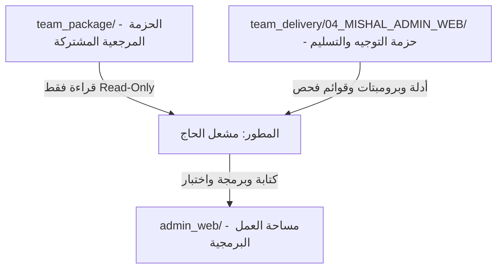
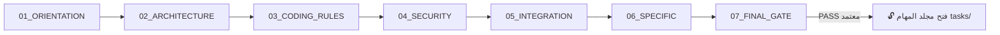
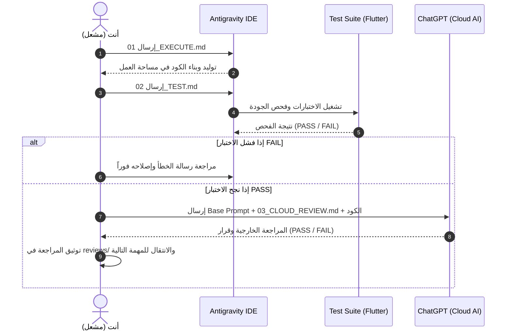

# 📘 الدليل التشغيلي الشامل والمفصل لمنصة Notion
## 👤 العضو: مشعل الحاج (Admin Web Developer (مطور لوحة التحكم المركزية للويب))
### 📦 حزمة التسليم: `04_MISHAL_ADMIN_WEB`
### 🏢 مساحة العمل البرمجية: `admin_web/`

---

> [!IMPORTANT]
> **مرحباً بك يا مشعل في الفريق الهندسي لمشروع نظام الحضور والغياب الذكي.**
> هذا الدليل تم إعداده خصيصاً لك من أجلك؛ ليشرح لك مسارك البرمجي والتشغيلي خطوة بخطوة ومن الصفر المطلق حتى تسليم عملك بنجاح.
> انسخ هذه الصفحة كاملة إلى صفحتك الخاصة في **Notion** لتكون مرجعك اليومي الدائم في كل لحظة.

---

## 📑 فهرس المحتويات
1. [المعمارية العامة والطبقات الثلاث في جهازك](#-القسم-الأول-المعمارية-العامة-والطبقات-الثلاث-في-جهازك)
2. [الملفات الـ 13 الرئيسية في حزمة تسليمك (شرح تفصيلي)](#-القسم-الثاني-الملفات-الـ-13-الرئيسية-في-حزمتك-شرح-شامل)
3. [مجلدات الحزمة المرجعية المشتركة team_package](#-القسم-الثالث-مجلدات-الحزمة-المرجعية-المشتركة-team_package)
4. [مرحلة التأسيس المشترك COMMON_FOUNDATION (الخطوات الـ 7 الإلزامية)](#-القسم-الرابع-مرحلة-التأسيس-المشترك-common_foundation-الـ-7-خطوات)
5. [دورة العمل القياسية للمهمة (3-Prompt Pipeline Loop)](#-القسم-الخامس-دورة-العمل-القياسية-لكل-مهمة-نظام-البرومبتات-الثلاثي)
6. [المهام البرمجية التنفيذية tasks (28 مهمة تفصيلية)](#-القسم-السادس-المهام-البرمجية-التنفيذية-tasks-شرح-الـ-28-مهمة)
7. [التوثيق السحابي والمراجعة وإجراءات التسليم النهائي](#-القسم-السابع-التوثيق-السحابي-والمراجعة-والتسليم-النهائي)

---

## 🏛️ القسم الأول: المعمارية العامة والطبقات الثلاث في جهازك

عندما تفتح مساحة العمل الخاصة بك على حاسوبك، ستجد ثلاثة مستويات رئيسية يجب أن تفهم الفرق بينها تماماً:

### 1. الحزمة المرجعية المشتركة (`team_package/`)
- **ما هي؟** هي الدستور والمكتبة العامة للمشروع، تحتوي على مواصفات الـ API، قاموس قاعدة البيانات، المعايير الأمنية، ونظام التصميم المشترك.
- **ماذا تفعل فيها؟** **قراءة فقط (Read-Only)**. لا تعدل ولا تحذف أي ملف بداخلها إطلاقاً.

### 2. حزمة توجيهك وتسليمك (`team_delivery/04_MISHAL_ADMIN_WEB/`)
- **ما هي؟** هي دليلك الإرشادي الخاص الذي أعده لك قائد المشروع، تحتوي على أدلة الاستخدام، برومبتات التأسيس، برومبتات المهام، ومجلدات التسليم والمراجعة.
- **ماذا تفعل فيها؟** تقرأ أدلتها، تنسخ منها البرومبتات لـ Antigravity و ChatGPT، وتوثق فيها تقارير مراجعاتك وتقارير التسليم.

### 3. مساحة عملك البرمجية الفعلية (`admin_web/`)
- **ما هي؟** المجلد الذي يحتوي على كود Dart و Flutter الحقيقي والاختبارات التابعة له.
- **ماذا تفعل فيها؟** هذا هو المكان الوحيد الذي يقوم فيه Antigravity بكتابة الأكواد، إنشاء الملفات، وبناء الواجهات والاختبارات.

### 🛡️ مصفوفة الصلاحيات وحدود المجلدات الخاصة بك:
- 🟢 **المجلدات المسموح لك العمل والتعديل فيها حصراً:**
  - `admin_web/lib/app/`
  - `admin_web/lib/core/`
  - `admin_web/lib/features/`
  - `admin_web/lib/shared/`
  - `admin_web/test/`

- 🔴 **المجلدات المحظورة والممنوع لمسها تماماً (منطقة حمراء):**
  - `mobile_app/ (ملك أواب والعواضي والعيدروس)`
  - `backend/ (ملك قائد المشروع)`
  - `team_package/ (مرجع للقراءة فقط)`

---

## 📂 القسم الثاني: الملفات الـ 13 الرئيسية في حزمتك (شرح شامل)

داخل المجلد الرئيسي لحزمتك `team_delivery/04_MISHAL_ADMIN_WEB/`، توجد 13 وثيقة أساسية مرتبة بالأولوية. فيما يلي شرح كل ملف بالتفصيل الممل:

| الرقم | اسم الملف | الاسم بالعربي | الغرض والوظيفة | متى تفتحه؟ | كيف تستخدمه؟ | الوجهة (AI أم قراءة؟) | التكرار |
|:---|:---|:---|:---|:---|:---|:---|:---|
| **01** | `README_FOR_MEMBER.md` | دليل المطور الشامل والمسار الكامل (19 خطوة) | هو خريطة الطريق الكبرى للمطور؛ يشرح كل مرحلة من لحظة استلام المشروع حتى التسليم النهائي في 19 خطوة مرتبة ومنطقية. | أول ملف يفتحه المطور في بداية عمله ويظل يرجع إليه كمرجع رئيسي طوال فترة المشروع. | يقرأه بتركيز شديد ويفهم المسار العام والترتيب المنطقي للعمل. | قراءة للمطور فقط (Read-Only) — لا يُرسل للذكاء الاصطناعي. | يُقرأ في اليوم الأول ويرجع إليه عند بدء كل مرحلة جديدة. |
| **02** | `QUICK_START.md` | دليل البدء السريع المباشر | يلخص خطوات التشغيل السريعة اليومية (فتح البيئة، اختيار المهمة، تشغيل البرومبتات الثلاثية، وتوثيق النتائج). | عند بدء يوم عمل جديد أو عند الرغبة في تذكر خطوات العمل الروتينية بسرعة ودون إطالة. | اتباع الخطوات الست اليومية المحددة فيه. | قراءة للمطور فقط (Read-Only). | يُقرأ يومياً عند بدء جلسة التطوير. |
| **03** | `WHAT_TO_READ_FIRST.md` | الترتيب الإلزامي لقراءة وثائق المشروع | يحدد للمطور بدقة أي الوثائق من `team_package` يقرأها أولاً، وأيها يقرأها ثانياً، ليمنع التشتت والضياع بين الملفات. | قبل البدء في أي عمل عملي، وأثناء مرحلة التأسيس الأولى. | فتح الروابط والملفات المذكورة فيه بالترتيب المحدد وقراءتها بعناية. | قراءة للمطور فقط (Read-Only). | يُقرأ مرة واحدة في بداية المشروع. |
| **04** | `WHAT_TO_COPY.md` | قواعد النسخ وتجهيز مساحة العمل | يوضح للعضو ما هي الملفات المسموح بنسخها إلى مساحة عمله، وما هي الملفات المحظور نسخها تماماً لمنع كسر المشروع وتلف التبعيات. | لحظة استلام الحزمة من قائد المشروع وقبل فتح أي برنامج تطوير. | مطابقة المجلدات المنسوخة مع القوائم المسموحة والممنوعة الواردة بالملف. | قراءة للمطور فقط (Read-Only). | يُقرأ ويُطبق مرة واحدة عند استلام المشروع. |
| **05** | `WORKSPACE_SETUP.md` | دليل تهيئة بيئة العمل في Antigravity IDE | يشرح كيفية فتح المجلد الصحيح داخل برنامج Antigravity وضبط إعدادات مساحة العمل وتشغيل البيئة بنجاح. | عند تثبيت وتشغيل بيئة التطوير Antigravity IDE. | تطبيق خطوات فتح مجلد المشروع وضبط المسارات وتبعيات Flutter. | قراءة للمطور وتطبيق في بيئة التطوير. | يُطبق في اليوم الأول أو عند إعادة تهيئة البيئة. |
| **06** | `FOLDER_OWNERSHIP.md` | مصفوفة ملكية المجلدات والحدود المسموحة | يحدد المجلدات التي يملكها العضو وله حق التعديل فيها باللون الأخضر، والمجلدات المحرمة عليه لمسها باللون الأحمر. | قبل تعديل أو إنشاء أي ملف في المشروع. | التأكد من أن المسار المستهدف يقع داخل حدوده المصرح بها حصراً وتجنب المسارات المشتركة أو مسارات الزملاء. | قراءة للمطور فقط (Read-Only). | مرجع دائم يُراجع باستمرار قبل أي عملية تعديل. |
| **07** | `ANTIGRAVITY_USAGE.md` | دليل استخدام وتوجيه Antigravity IDE | يشرح كيف تتعامل مع Antigravity IDE، كيف ترسل له برومبت التنفيذ وبرومبت الاختبار، وكيف تراقب مخرجات الكود. | عند تنفيذ أي مهمة برمجية أو فحص كود. | نسخ محتوى `01_EXECUTE.md` ثم `02_TEST.md` ولصقها في محادثة Antigravity ومتابعة النتائج. | دليل إرشادي للمطور لكيفية التعامل مع Antigravity. | يُستخدم مع كل مهمة برمجية. |
| **08** | `CLOUD_REVIEW_USAGE.md` | دليل المراجعة السحابية الخارجية عبر ChatGPT | يشرح بالتفصيل كيف تفتح محادثة في ChatGPT، كيف ترسل البرومبت الأساسي وبرومبت المهمة، وكيف تطلب تقييم PASS/FAIL. | بعد الانتهاء من فحص الكود واجتياز `02_TEST.md` بنجاح داخل Antigravity. | فتح نافذة ChatGPT، إرسال `TEAM_CLOUD_BASE_PROMPT.md` متبوعاً بـ `03_CLOUD_REVIEW.md` والكود المكتوب. | دليل إرشادي للمطور لكيفية استخدام ChatGPT. | يُستخدم مع كل مهمة برمجية بعد اجتياز الاختبار الداخلي. |
| **09** | `WORKFLOW.md` | دورة العمل القياسية للمهمة (4 خطوات) | يشرح دورة حياة المهمة الدائرية: (1. التنفيذ Execute ➔ 2. الاختبار Test ➔ 3. المراجعة Cloud Review ➔ 4. الانتقال/التسليم). | مرجع سريع لحفظ نظام العمل ومنع القفز العشوائي بين المهام. | الالتزام بالترتيب التسلسلي الصارم للمهام دون أي استثناء. | قراءة للمطور فقط (Read-Only). | حفظ واستيعاب دائم في الذهن. |
| **10** | `STOP_AND_FAIL_RULES.md` | قواعد التوقف ومعالجة الأخطاء (الطوارئ) | يوضح ماذا تفعل إذا فشل الاختبار (Test FAIL) أو رفضت المراجعة الكود (Review FAIL)، وكيف تعالج المشكلة جراحياً. | عند ظهور أي خطأ أو فشل في الاختبار أو المراجعة السحابية. | تطبيق قاعدة التوقف الفوري، استخراج رسالة الخطأ بدقة، وإعطائها لـ Antigravity لإصلاحها دون تخمين. | قراءة وتطبيق للمطور (دليل طوارئ). | يُفتح فور حدوث أي مشكلة أو خطأ برمجية. |
| **11** | `DELIVERY_VALIDATION.md` | معايير التحقق والجاهزية للتسليم | يحدد الشروط والمعايير الصارمة التي يجب استيفاؤها في كل مرحلة لكي تُعتبر جاهزة للتسليم لقائد المشروع. | قبل الانتقال من مرحلة لأخرى وقبل تسليم العمل النهائي. | مراجعة بنود الجاهزية والتأكد من مطابقة جميع الشروط والاختبارات. | قراءة للمطور وقائمة فحص ذاتي دقيقة. | يُراجع عند نهاية كل مرحلة وقبل إرسال أي Handoff. |
| **12** | `CHECKLIST.md` | قائمة التحقق اليومية للمطور | قائمة فحص سريعة (Checklist) يقوم المطور بالتأشير عليها يومياً للتأكد من إنجاز المهام وعدم نسيان أي خطوة. | في نهاية كل جلسة عمل أو بعد إكمال كل مهمة برمجية. | قراءة البنود ومطابقتها مع ما تم إنجازه وتوثيقه فعلياً. | أداة فحص يومية للمطور. | يُستخدم يومياً. |
| **13** | `FILE_INVENTORY.md` | الفهرس والجرد الكامل لملفات الحزمة | جدول شامل يسرد كل ملف ومجلد داخل حزمة المطور بالاسم والمسار لضمان عدم فقدان أي ملف أو برومبت. | للبحث عن أي ملف أو التأكد من سلامة اكتمال حزمة التسليم. | البحث في الجدول عن مسار الملف المطلوب ومطابقته على القرص. | فهرس مرجعي للمطور (Read-Only). | مرجع دائم عند البحث والاستفسار. |

---

## 📚 القسم الثالث: مجلدات الحزمة المرجعية المشتركة `team_package`

تتكون الحزمة المشتركة من 8 مجلدات مرجعية رئيسية. إليك بيان كل مجلد ودوره المباشر في عملك:

### 1. `team_package/docs/` (مجلد الدستور والقوانين والمعمارية)
- 🎯 **الهدف والمحتوى:** يحتوي على دستور المشروع `PROJECT_CONSTITUTION.md` وقواعد الكود ومعمارية النظام وأدوار الفريق.
- 🔒 **طبيعة الصلاحية:** قراءة فقط لجميع الأعضاء (Read-Only).
- 💡 **كيف تستفيد منه كـ (مشعل):** يُقرأ في مرحلة التأسيس الأولى لفهم القوانين العامة وحظر تعديل العقود أو تجاوز الصلاحيات.

### 2. `team_package/api_contract/` (مجلد عقود واجهات برمجة التطبيقات (API Contract))
- 🎯 **الهدف والمحتوى:** يحتوي على `API_SPECIFICATION.md` وفيه تفاصيل كل رابط Endpoint، البيانات المطلوبة (Request)، وشكل الاستجابة (Response).
- 🔒 **طبيعة الصلاحية:** قراءة فقط (Read-Only) — يمنع تعديل أي حرف فيه.
- 💡 **كيف تستفيد منه كـ (مشعل):** يرجع إليه المطور لمعرفة أسماء ونوع الحقول الدقيقة المتوقعة من الخادم المركزي.

### 3. `team_package/database/` (مجلد قاموس قاعدة البيانات والمخططات)
- 🎯 **الهدف والمحتوى:** يحتوي على `database_dictionary.md` وفيه أسماء الجداول والحقول وأنواعها والقيود والعلاقات.
- 🔒 **طبيعة الصلاحية:** قراءة فقط (Read-Only).
- 💡 **كيف تستفيد منه كـ (مشعل):** مرجع لتطابق أسماء المتغيرات والحقول (مثل snake_case في قاعدة البيانات و camelCase في Dart).

### 4. `team_package/local_protocol/` (مجلد بروتوكولات القاعة والشبكة المحلية)
- 🎯 **الهدف والمحتوى:** يحتوي على بروتوكول الخادم المحلي المدمج، بروتوكول QR الديناميكي مع Nonce، وبروتوكول التحقق الحيوي.
- 🔒 **طبيعة الصلاحية:** قراءة فقط (Read-Only).
- 💡 **كيف تستفيد منه كـ (مشعل):** المرجع الفني الدقيق لتبادل البيانات دون إنترنت عبر شبكة القاعة المحلية.

### 5. `team_package/security/` (مجلد المواصفات والمعايير الأمنية)
- 🎯 **الهدف والمحتوى:** يحتوي على قواعد تشفير التوكنات، حماية الأجهزة، تأمين القوالب الحيوية، وعزل الشبكة المحلية.
- 🔒 **طبيعة الصلاحية:** قراءة فقط (Read-Only).
- 💡 **كيف تستفيد منه كـ (مشعل):** يضمن التزام المطور بأعلى معايير الأمان وحظر تخزين التوكنات كنص عادي أو إهمال التشفير.

### 6. `team_package/integration/` (مجلد قوالب التسليم والدمج الرسمي)
- 🎯 **الهدف والمحتوى:** يحتوي على `HANDOFF_TEMPLATE.md` وهو القالب الرسمي الذي يملؤه المطور عند تسليم أي مرحلة للقائد.
- 🔒 **طبيعة الصلاحية:** قراءة ونسخ القالب (Template).
- 💡 **كيف تستفيد منه كـ (مشعل):** يستخدمه المطور عند نهاية كل مرحلة لتعبئة تقرير التسليم في مجلد `handoff/`.

### 7. `team_package/prompts/shared/` (مجلد البرومبتات ونظام التصميم المشترك)
- 🎯 **الهدف والمحتوى:** يحتوي على `UI_UX_SYSTEM.md` (نظام التصميم الموحد)، `TEAM_AI_BASE_PROMPT.md`، و `TEAM_CLOUD_BASE_PROMPT.md`.
- 🔒 **طبيعة الصلاحية:** قراءة واستخدام مع الـ AI (Read-Only Reference).
- 💡 **كيف تستفيد منه كـ (مشعل):** مرجع نظام التصميم الموحد ومصدر الـ Base Prompts التي تُرسل للـ AI في كل محادثة مراجعة.

### 8. `team_package/shared/` (مجلد الثوابت والنماذج البرمجية المشتركة)
- 🎯 **الهدف والمحتوى:** يحتوي على الرموز اللونية، الثوابت المعمارية، والموديلات المشتركة بين الأنظمة.
- 🔒 **طبيعة الصلاحية:** قراءة فقط (Read-Only).
- 💡 **كيف تستفيد منه كـ (مشعل):** مرجع لقيم التصميم والثوابت الرسمية المعتمدة في المشروع.

---

## 🧱 القسم الرابع: مرحلة التأسيس المشترك `COMMON_FOUNDATION` (الـ 7 خطوات)

> [!WARNING]
> **قانون صارم لا يقبل الاستثناء:**
> ممنوع منعاً باتاً فتح مجلد المهام التنفيذية `tasks/` أو كتابة أي كود قبل اجتياز جميع خطوات التأسيس الـ 7 بالتسلسل والحصول على اعتماد `[PASS]` في الخطوة السابعة!

تجد هذه الخطوات داخل: `team_delivery/04_MISHAL_ADMIN_WEB/COMMON_FOUNDATION/`

### تفاصيل خطوات التأسيس السبع:

---
### 🔹 الخطوة (01): `01_PROJECT_ORIENTATION` — التعريف الشامل بالنظام وأهدافه
- 🎯 **الهدف الأساسي:** فهم المشكلة الأكاديمية التي يحلها المشروع، مكونات النظام الخمسة (الباك إند، الهاتف، الويب، الخادم المحلي، والبصمة)، وتدفق الحضور الشامل.
- 🛠️ **ماذا يفعل برومبت التنفيذ `01_EXECUTE.md` في Antigravity؟** يقوم Antigravity باستعراض وثائق المشروع وشرح المعمارية العامة ومطابقة المتطلبات.
- 🧪 **ماذا يفعل برومبت الاختبار `02_TEST.md` في Antigravity؟** يقوم Antigravity باختبار استيعاب المطور لأهداف النظام والتأكد من إدراك التدفق العام.
- ☁️ **ماذا يفعل برومبت المراجعة `03_CLOUD_REVIEW.md` في ChatGPT؟** يراجع ChatGPT فهم المطور العام للنظام ويصدر قرار [PASS] للتأكد من وضوح الصورة قبل التعمق.
- 📋 **شرط العبور:** الحصول على تقييم `[PASS]` وتوثيق نتيجة المراجعة في `team_delivery/04_MISHAL_ADMIN_WEB/reviews/`.

---
### 🔹 الخطوة (02): `02_ARCHITECTURE` — المعمارية وعزل الحدود ومصفوفة الملكية
- 🎯 **الهدف الأساسي:** ترسيخ مبدأ عزل المكونات (Modularity)، فهم مصفوفة ملكية المجلدات، وحظر تعديل ملفات الزملاء أو كسر المعمارية.
- 🛠️ **ماذا يفعل برومبت التنفيذ `01_EXECUTE.md` في Antigravity؟** يقوم Antigravity بفحص هيكل المجلدات وشرح الحدود المسموحة والممنوعة للعضو بدقة.
- 🧪 **ماذا يفعل برومبت الاختبار `02_TEST.md` في Antigravity؟** يفحص Antigravity التزام مساحة العمل بمصفوفة الملكية وعدم وجود تعديلات خارج الحدود.
- ☁️ **ماذا يفعل برومبت المراجعة `03_CLOUD_REVIEW.md` في ChatGPT؟** يراجع ChatGPT الحدود المعمارية ويصدر [PASS] لضمان عدم حدوث تداخلات بين المطورين.
- 📋 **شرط العبور:** الحصول على تقييم `[PASS]` وتوثيق نتيجة المراجعة في `team_delivery/04_MISHAL_ADMIN_WEB/reviews/`.

---
### 🔹 الخطوة (03): `03_CODING_RULES` — قواعد الكود النظيف والتسميات والـ AI
- 🎯 **الهدف الأساسي:** إتقان تسميات لغة Dart و Flutter (فئات بـ UpperCamelCase، متغيرات بـ lowerCamelCase، ملفات بـ snake_case)، والتعامل مع الذكاء الاصطناعي كمنفذ منضبط.
- 🛠️ **ماذا يفعل برومبت التنفيذ `01_EXECUTE.md` في Antigravity؟** يقوم Antigravity بشرح وتطبيق معايير كتابة الكود النظيف وقواعد الـ Linter المعتمدة.
- 🧪 **ماذا يفعل برومبت الاختبار `02_TEST.md` في Antigravity؟** يشغل Antigravity فحص التحليل الساكن والتأكد من استيفاء معايير التسمية والهيكلة.
- ☁️ **ماذا يفعل برومبت المراجعة `03_CLOUD_REVIEW.md` في ChatGPT؟** يراجع ChatGPT قواعد الكود ويصدر [PASS] لضمان جودة الكود وسهولة صيانته.
- 📋 **شرط العبور:** الحصول على تقييم `[PASS]` وتوثيق نتيجة المراجعة في `team_delivery/04_MISHAL_ADMIN_WEB/reviews/`.

---
### 🔹 الخطوة (04): `04_SECURITY` — المواصفات الأمنية وحماية البيانات الحساسة
- 🎯 **الهدف الأساسي:** ترسيخ مبادئ الأمان: التخزين المشفر للتوكنات، حظر تضمين كلمات السر في الكود (No Hardcoding)، تأمين البصمة الحيوية، وحماية الشبكة المحلية.
- 🛠️ **ماذا يفعل برومبت التنفيذ `01_EXECUTE.md` في Antigravity؟** يقوم Antigravity باستعراض سياسات الأمان والتشفير وإعداد بيئة التخزين الآمن.
- 🧪 **ماذا يفعل برومبت الاختبار `02_TEST.md` في Antigravity؟** يفحص Antigravity خلو المشروع من أي تسريبات أمنية أو متغيرات حساسة مكشوفة.
- ☁️ **ماذا يفعل برومبت المراجعة `03_CLOUD_REVIEW.md` في ChatGPT؟** يراجع ChatGPT الجوانب الأمنية ويصدر [PASS] لضمان سلامة بيانات الطلاب والأساتذة.
- 📋 **شرط العبور:** الحصول على تقييم `[PASS]` وتوثيق نتيجة المراجعة في `team_delivery/04_MISHAL_ADMIN_WEB/reviews/`.

---
### 🔹 الخطوة (05): `05_INTEGRATION_RULES` — قواعد الدمج والتكامل وفحص الانحدار
- 🎯 **الهدف الأساسي:** تعلم كيفية إعداد تقارير التسليم الرسمية (Handoff)، وفهم كيف يقوم القائد بدمج الكود وإجراء فحص الانحدار (Regression Testing).
- 🛠️ **ماذا يفعل برومبت التنفيذ `01_EXECUTE.md` في Antigravity؟** يقوم Antigravity بشرح دورة حياة الدمج وكيفية تعبئة قوالب الـ Handoff بدقة.
- 🧪 **ماذا يفعل برومبت الاختبار `02_TEST.md` في Antigravity؟** يختبر Antigravity جاهزية المطور لاتباع بروتوكول التسليم وفحص سلامة التوثيق.
- ☁️ **ماذا يفعل برومبت المراجعة `03_CLOUD_REVIEW.md` في ChatGPT؟** يراجع ChatGPT استيعاب المطور لدورة التسليم ويصدر قرار [PASS].
- 📋 **شرط العبور:** الحصول على تقييم `[PASS]` وتوثيق نتيجة المراجعة في `team_delivery/04_MISHAL_ADMIN_WEB/reviews/`.

---
### 🔹 الخطوة (06): `06_MEMBER_SPECIFIC_FOUNDATION` — التأسيس التخصصي ونظام التصميم (حسب مسؤولية العضو)
- 🎯 **الهدف الأساسي:** استيعاب المتطلبات الفنية الخاصة بالعضو بالتفصيل (مثل: M3 و RTL لأواب ومشعل، أو بروتوكول البصمة للعواضي، أو الخادم المحلي للعيدروس).
- 🛠️ **ماذا يفعل برومبت التنفيذ `01_EXECUTE.md` في Antigravity؟** يقوم Antigravity بتجهيز البنية التحتية التخصصية للعضو وتطبيق القواعد التقنية الخاصة به.
- 🧪 **ماذا يفعل برومبت الاختبار `02_TEST.md` في Antigravity؟** يشغل Antigravity فحصاً متخصصاً للتأكد من مطابقة المتطلبات الخاصة للموديل.
- ☁️ **ماذا يفعل برومبت المراجعة `03_CLOUD_REVIEW.md` في ChatGPT؟** يراجع ChatGPT التأسيس التخصصي ويصدر قرار [PASS].
- 📋 **شرط العبور:** الحصول على تقييم `[PASS]` وتوثيق نتيجة المراجعة في `team_delivery/04_MISHAL_ADMIN_WEB/reviews/`.

---
### 🔹 الخطوة (07): `07_FOUNDATION_FINAL_GATE` — بوابة الاعتماد النهائي للتأسيس (Strict Gate)
- 🎯 **الهدف الأساسي:** التقييم الشامل والنهائي لكافة خطوات التأسيس الست السابقة، وإصدار إذن العبور الرسمي لفتح مجلد المهام التنفيذية `tasks/`.
- 🛠️ **ماذا يفعل برومبت التنفيذ `01_EXECUTE.md` في Antigravity؟** يقوم Antigravity بإجراء تدقيق شامل لكافة مخرجات التأسيس وإعداد التقرير النهائي.
- 🧪 **ماذا يفعل برومبت الاختبار `02_TEST.md` في Antigravity؟** يشغل Antigravity فحصاً تكاملياً شاملاً للتأسيس والتأكد من خلوه من أي ثغرات أو نواقص.
- ☁️ **ماذا يفعل برومبت المراجعة `03_CLOUD_REVIEW.md` في ChatGPT؟** يقوم ChatGPT بمراجعة صارمة ودقيقة ويصدر قرار [PASS] النهائي لفتح مهام العمل.
- 📋 **شرط العبور:** الحصول على تقييم `[PASS]` وتوثيق نتيجة المراجعة في `team_delivery/04_MISHAL_ADMIN_WEB/reviews/`.

---

## 🔄 القسم الخامس: دورة العمل القياسية لكل مهمة (نظام البرومبتات الثلاثي)

لكل مهمة برمجية داخل `tasks/`، يوجد مجلد مستقل يحتوي حصراً على 3 ملفات برومبت. هذه هي الدورة التي ستكررها مع كل مهمة:

### خطوات تشغيل البرومبتات الثلاثية بدقة:
1. **الخطوة 1 — التنفيذ (`01_EXECUTE.md`):**
   - افتح نافذة محادثة Antigravity IDE.
   - انسخ محتوى ملف `01_EXECUTE.md` الخاص بالمهمة والصقه في المحادثة.
   - يقوم Antigravity بإنشاء وتعديل الأكواد المطلوبة في مسارها الصحيح داخل `admin_web/`.
2. **الخطوة 2 — الاختبار الداخلي (`02_TEST.md`):**
   - بعد انتهاء التنفيذ، انسخ محتوى `02_TEST.md` والصقه في Antigravity.
   - يقوم Antigravity بتشغيل اختبارات الـ Unit Tests وفحص الـ Linter والتأكد من خلو الكود من أي عيوب.
   - يجب أن تحصل على نتيجة `TESTS PASSED`. إذا ظهر أي خطأ، اطلب من Antigravity إصلاحه حتى ينجح 100%.
3. **الخطوة 3 — المراجعة السحابية الخارجية (`03_CLOUD_REVIEW.md`):**
   - افتح متصفحك وادخل على **ChatGPT**.
   - أرسل أولاً ملف: `team_package/prompts/shared/TEAM_CLOUD_BASE_PROMPT.md`.
   - ثم أرسل محتوى `03_CLOUD_REVIEW.md` مرفقاً معه الكود الذي تم تنفيذه.
   - انتظر تقييم ChatGPT حتى يصدر قرار: `REVIEW STATUS: [PASS]`.
   - احفظ نص المراجعة في ملف داخل مجلد: `team_delivery/04_MISHAL_ADMIN_WEB/reviews/`.

---

## 🚀 القسم السادس: المهام البرمجية التنفيذية `tasks/` (شرح الـ 28 مهمة)

فيما يلي الجدول والمخطط التفصيلي لجميع مهامك البرمجية داخل `team_delivery/04_MISHAL_ADMIN_WEB/tasks/` بالترتيب الإلزامي:

---
### 📌 المهمة (01): `01_WEB_FOUNDATION`
#### 🏷️ البنية التحتية لتطبيق الويب ونظام التصميم
- 🎯 **الهدف البرمجي:** تأسيس مشروع Flutter Web، تطبيق Material 3، دعم اللغة العربية والاتجاه RTL بالكامل، ضبط الرموز والألوان والخطوط الرسمية وشبكة العرض المتجاوبة.
- 📂 **مسار الملف المستهدف بالكتابة:** `admin_web/lib/app/app.dart و admin_web/lib/core/theme/`
- ⚡ **أمر التنفيذ (`01_EXECUTE.md`):** بناء ثيم الويب الرسمي والألوان المتدرجة وتكوين التطبيق.
- 🧪 **أمر الفحص والاختبار (`02_TEST.md`):** التحقق من إقلاع لوحة الويب وثبات اتجاه RTL وتجاوب العرض.
- ☁️ **معايير المراجعة السحابية (`03_CLOUD_REVIEW.md`):** مراجعة الالتزام بنظام التصميم M3 وحظر الإيموجي والألوان المعتمدة.
- 🚦 **شرط النجاح والعبور:** نجاح الاختبار الداخلي 100% + اعتماد ChatGPT بعلامة `[PASS]` وتوثيق تقرير المراجعة.

---
### 📌 المهمة (02): `02_WEB_ARCHITECTURE_NAVIGATION`
#### 🏷️ المعمارية وهيكل القوائم والتوجيه للويب
- 🎯 **الهدف البرمجي:** بناء هيكل القوائم الجانبية (Navigation Rail / Sidebar)، الشريط العلوي (Top App Bar)، ونظام التوجيه GoRouter مع دعم الروابط المباشرة وتغيير العناوين.
- 📂 **مسار الملف المستهدف بالكتابة:** `admin_web/lib/core/routing/app_router.dart و admin_web/lib/shared/layout/`
- ⚡ **أمر التنفيذ (`01_EXECUTE.md`):** بناء الهيكل الرئيسي للوحة التحكم وإدارة مسارات التوجيه.
- 🧪 **أمر الفحص والاختبار (`02_TEST.md`):** اختبار التنقل السلس بين الأقسام وتحديث شريط العناوين في المتصفح.
- ☁️ **معايير المراجعة السحابية (`03_CLOUD_REVIEW.md`):** مراجعة سلاسة التنقل وتجاوب القوائم مع أحجام الشاشات المختلفة.
- 🚦 **شرط النجاح والعبور:** نجاح الاختبار الداخلي 100% + اعتماد ChatGPT بعلامة `[PASS]` وتوثيق تقرير المراجعة.

---
### 📌 المهمة (03): `03_WEB_API_CLIENT`
#### 🏷️ عميل الاتصال المركزي بالباك إند للويب
- 🎯 **الهدف البرمجي:** بناء عميل Dio للويب مع اعتراضات التوكن، معالجة CORS، التخزين المؤقت، واعتراض الأخطاء الموحد.
- 📂 **مسار الملف المستهدف بالكتابة:** `admin_web/lib/core/network/web_api_client.dart`
- ⚡ **أمر التنفيذ (`01_EXECUTE.md`):** برمجة عميل الاتصال وإعداد الترويسات ومعالجة رموز الاستجابة.
- 🧪 **أمر الفحص والاختبار (`02_TEST.md`):** اختبار إرسال الطلبات وتجديد التوكن ومعالجة انقطاع الاتصال.
- ☁️ **معايير المراجعة السحابية (`03_CLOUD_REVIEW.md`):** مراجعة كفاءة معالجة الأخطاء والتخزين الآمن للجلسة.
- 🚦 **شرط النجاح والعبور:** نجاح الاختبار الداخلي 100% + اعتماد ChatGPT بعلامة `[PASS]` وتوثيق تقرير المراجعة.

---
### 📌 المهمة (04): `04_ADMIN_AUTH_GUARD`
#### 🏷️ حارس المصادقة وصلاحيات الأدمن وشاشة الدخول
- 🎯 **الهدف البرمجي:** شاشة تسجيل دخول الأدمن، التحقق من اسم المستخدم وكلمة السر، حفظ الجلسة، وحظر الوصول للصفحات الداخلية بدون تصريح.
- 📂 **مسار الملف المستهدف بالكتابة:** `admin_web/lib/features/auth/admin_login_screen.dart`
- ⚡ **أمر التنفيذ (`01_EXECUTE.md`):** بناء شاشة الدخول مع الحالات الخمس وحماية المسارات الداخلية.
- 🧪 **أمر الفحص والاختبار (`02_TEST.md`):** فحص حظر الدخول المباشر للروابط وإعادة التوجيه لصفحة تسجيل الدخول.
- ☁️ **معايير المراجعة السحابية (`03_CLOUD_REVIEW.md`):** مراجعة أمان الجلسات الإدارية وحماية التوكن.
- 🚦 **شرط النجاح والعبور:** نجاح الاختبار الداخلي 100% + اعتماد ChatGPT بعلامة `[PASS]` وتوثيق تقرير المراجعة.

---
### 📌 المهمة (05): `05_DASHBOARD_METRICS`
#### 🏷️ لوحة المؤشرات والإحصائيات الحية (Dashboard KPIs)
- 🎯 **الهدف البرمجي:** لوحة المؤشرات الرئيسية: عدد الطلاب، الأقسام، الأساتذة، الجلسات النشطة حالياً، ورسوم بيانية لنسب الحضور الأسبوعية والشهرية.
- 📂 **مسار الملف المستهدف بالكتابة:** `admin_web/lib/features/dashboard/admin_dashboard_screen.dart`
- ⚡ **أمر التنفيذ (`01_EXECUTE.md`):** بناء بطاقات الإحصائيات (KPI Cards) والرسوم البيانية التفاعلية.
- 🧪 **أمر الفحص والاختبار (`02_TEST.md`):** فحص تحميل البيانات وعرض المؤشرات واختبار زر التحديث.
- ☁️ **معايير المراجعة السحابية (`03_CLOUD_REVIEW.md`):** مراجعة جمالية العرض واكتمال الحالات الخمس وتجربة المستخدم.
- 🚦 **شرط النجاح والعبور:** نجاح الاختبار الداخلي 100% + اعتماد ChatGPT بعلامة `[PASS]` وتوثيق تقرير المراجعة.

---
### 📌 المهمة (06): `06_DEPARTMENTS_MANAGEMENT`
#### 🏷️ إدارة الأقسام الأكاديمية (Departments CRUD)
- 🎯 **الهدف البرمجي:** جدول إدارة الأقسام الأكاديمية: عرض، إضافة قسم جديد، تعديل، تعطيل/تفعيل، والتحقق من صحة المدخلات.
- 📂 **مسار الملف المستهدف بالكتابة:** `admin_web/lib/features/departments/departments_screen.dart`
- ⚡ **أمر التنفيذ (`01_EXECUTE.md`):** بناء جدول الأقسام ونموذج الإضافة والتعديل مع التحقق من الحقول.
- 🧪 **أمر الفحص والاختبار (`02_TEST.md`):** اختبار عمليات الـ CRUD والتحقق من منع الأسماء المكررة.
- ☁️ **معايير المراجعة السحابية (`03_CLOUD_REVIEW.md`):** مراجعة الالتزام بالعقد البرمجي وجودة الواجهات.
- 🚦 **شرط النجاح والعبور:** نجاح الاختبار الداخلي 100% + اعتماد ChatGPT بعلامة `[PASS]` وتوثيق تقرير المراجعة.

---
### 📌 المهمة (07): `07_ACADEMIC_YEARS_MANAGEMENT`
#### 🏷️ إدارة الأعوام الدراسية (Academic Years CRUD)
- 🎯 **الهدف البرمجي:** جدول إدارة الأعوام الدراسية وتعيين العام الدراسي الفعال والتحكم في فترات الدراسة.
- 📂 **مسار الملف المستهدف بالكتابة:** `admin_web/lib/features/academic_years/academic_years_screen.dart`
- ⚡ **أمر التنفيذ (`01_EXECUTE.md`):** بناء واجهة الأعوام الدراسية وتحديد العام الفعال بالنظام.
- 🧪 **أمر الفحص والاختبار (`02_TEST.md`):** فحص تعيين عام فعال واحد فقط وتحديث السجلات بنجاح.
- ☁️ **معايير المراجعة السحابية (`03_CLOUD_REVIEW.md`):** مراجعة اتساق البيانات وقواعد الأعمال الأكاديمية.
- 🚦 **شرط النجاح والعبور:** نجاح الاختبار الداخلي 100% + اعتماد ChatGPT بعلامة `[PASS]` وتوثيق تقرير المراجعة.

---
### 📌 المهمة (08): `08_SEMESTERS_MANAGEMENT`
#### 🏷️ إدارة الفصول الدراسية (Semesters CRUD)
- 🎯 **الهدف البرمجي:** جدول إدارة الفصول الدراسية (فصل أول، ثانٍ، صيفي) وتواريخ البداية والنهاية وربطها بالعام الأكاديمي.
- 📂 **مسار الملف المستهدف بالكتابة:** `admin_web/lib/features/semesters/semesters_screen.dart`
- ⚡ **أمر التنفيذ (`01_EXECUTE.md`):** بناء واجهة الفصول مع منتقي التواريخ (Date Range Picker).
- 🧪 **أمر الفحص والاختبار (`02_TEST.md`):** التحقق من صحة التواريخ ومنع تداخل الفصول لنفس العام.
- ☁️ **معايير المراجعة السحابية (`03_CLOUD_REVIEW.md`):** مراجعة دقة واجهة اختيار التواريخ والتحقق.
- 🚦 **شرط النجاح والعبور:** نجاح الاختبار الداخلي 100% + اعتماد ChatGPT بعلامة `[PASS]` وتوثيق تقرير المراجعة.

---
### 📌 المهمة (09): `09_COURSES_MANAGEMENT`
#### 🏷️ إدارة المقررات الدراسية (Courses CRUD)
- 🎯 **الهدف البرمجي:** جدول المقررات: رمز المقرر، الاسم بالعربي والإنجليزي، الساعات المعتمدة، والقسم الأكاديمي التابع له.
- 📂 **مسار الملف المستهدف بالكتابة:** `admin_web/lib/features/courses/courses_screen.dart`
- ⚡ **أمر التنفيذ (`01_EXECUTE.md`):** بناء جدول المقررات مع البحث والفلترة حسب القسم.
- 🧪 **أمر الفحص والاختبار (`02_TEST.md`):** اختبار إضافة مقرر وفحص تفرد رمز المقرر (Course Code).
- ☁️ **معايير المراجعة السحابية (`03_CLOUD_REVIEW.md`):** مراجعة سلاسة البحث والفلترة ومطابقة العقود.
- 🚦 **شرط النجاح والعبور:** نجاح الاختبار الداخلي 100% + اعتماد ChatGPT بعلامة `[PASS]` وتوثيق تقرير المراجعة.

---
### 📌 المهمة (10): `10_SECTIONS_MANAGEMENT`
#### 🏷️ إدارة الشعب والمجموعات (Sections CRUD)
- 🎯 **الهدف البرمجي:** جدول إدارة الشعب: ربط الشعبة بالمقرر، تحديد نوعها (نظري/عملي)، السعة القصوى، والقاعة المخصصة.
- 📂 **مسار الملف المستهدف بالكتابة:** `admin_web/lib/features/sections/sections_screen.dart`
- ⚡ **أمر التنفيذ (`01_EXECUTE.md`):** بناء واجهة الشعب وتصنيفها حسب النوع والمقرر.
- 🧪 **أمر الفحص والاختبار (`02_TEST.md`):** اختبار إضافة الشعبة والتحقق من العلاقات مع المقررات.
- ☁️ **معايير المراجعة السحابية (`03_CLOUD_REVIEW.md`):** مراجعة دقة النماذج والتحقق من صحة المدخلات.
- 🚦 **شرط النجاح والعبور:** نجاح الاختبار الداخلي 100% + اعتماد ChatGPT بعلامة `[PASS]` وتوثيق تقرير المراجعة.

---
### 📌 المهمة (11): `11_STUDENTS_MANAGEMENT`
#### 🏷️ إدارة بيانات الطلاب (Students Master CRUD)
- 🎯 **الهدف البرمجي:** جدول إدارة الطلاب الشامل: الرقم الأكاديمي، الاسم الكامل، القسم، المستوى، الحالة الأكاديمية، والبحث المتقدم.
- 📂 **مسار الملف المستهدف بالكتابة:** `admin_web/lib/features/students/students_screen.dart`
- ⚡ **أمر التنفيذ (`01_EXECUTE.md`):** بناء جدول الطلاب مع ترقيم الصفحات (Pagination) والبحث الفوري.
- 🧪 **أمر الفحص والاختبار (`02_TEST.md`):** اختبار تعديل بيانات الطالب والتحقق من صحة الرقم الأكاديمي.
- ☁️ **معايير المراجعة السحابية (`03_CLOUD_REVIEW.md`):** مراجعة أداء الجدول مع كميات البيانات الكبيرة.
- 🚦 **شرط النجاح والعبور:** نجاح الاختبار الداخلي 100% + اعتماد ChatGPT بعلامة `[PASS]` وتوثيق تقرير المراجعة.

---
### 📌 المهمة (12): `12_BATCH_STUDENT_IMPORT`
#### 🏷️ الاستيراد الجماعي للطلاب عبر Excel/CSV
- 🎯 **الهدف البرمجي:** نافذة رفع ملفات Excel/CSV، فحص صحة البيانات قبل الاستيراد، عرض الأخطاء إن وجدت، وشريط تقدم الرفع.
- 📂 **مسار الملف المستهدف بالكتابة:** `admin_web/lib/features/students/batch_import_dialog.dart`
- ⚡ **أمر التنفيذ (`01_EXECUTE.md`):** بناء معالج تحليل الملفات ومعاينة البيانات وشريط التقدم.
- 🧪 **أمر الفحص والاختبار (`02_TEST.md`):** اختبار رفع ملف به أخطاء والتأكد من إظهار رسائل تصحيحية واضحة.
- ☁️ **معايير المراجعة السحابية (`03_CLOUD_REVIEW.md`):** مراجعة معايير فحص الملفات وتجربة المستخدم المميزة.
- 🚦 **شرط النجاح والعبور:** نجاح الاختبار الداخلي 100% + اعتماد ChatGPT بعلامة `[PASS]` وتوثيق تقرير المراجعة.

---
### 📌 المهمة (13): `13_STUDENT_IMAGES_MANAGEMENT`
#### 🏷️ إدارة الصور المرجعية للبصمة الحيوية
- 🎯 **الهدف البرمجي:** واجهة استعراض وتحديث الصور المرجعية للطلاب المستخدمة في استخراج القوالب الحيوية مع معاينة الجودة.
- 📂 **مسار الملف المستهدف بالكتابة:** `admin_web/lib/features/students/student_biometric_images_screen.dart`
- ⚡ **أمر التنفيذ (`01_EXECUTE.md`):** بناء معرض صور الطلاب المرجعية وأداة رفع الصور وتدقيق الأبعاد.
- 🧪 **أمر الفحص والاختبار (`02_TEST.md`):** اختبار رفع وتحديث الصور والتأكد من قيود الحجم والنوع.
- ☁️ **معايير المراجعة السحابية (`03_CLOUD_REVIEW.md`):** مراجعة حماية الخصوصية وعرض الصور الآمن.
- 🚦 **شرط النجاح والعبور:** نجاح الاختبار الداخلي 100% + اعتماد ChatGPT بعلامة `[PASS]` وتوثيق تقرير المراجعة.

---
### 📌 المهمة (14): `14_TEACHERS_MANAGEMENT`
#### 🏷️ إدارة أعضاء هيئة التدريس (Teachers CRUD)
- 🎯 **الهدف البرمجي:** جدول إدارة الأساتذة: الاسم، القسم، الدرجة العلمية، البريد الإلكتروني، رقم الهاتف، والحالة الأكاديمية.
- 📂 **مسار الملف المستهدف بالكتابة:** `admin_web/lib/features/teachers/teachers_screen.dart`
- ⚡ **أمر التنفيذ (`01_EXECUTE.md`):** بناء جدول الأساتذة ونماذج الإضافة والتعديل والفلترة.
- 🧪 **أمر الفحص والاختبار (`02_TEST.md`):** اختبار إضافة أستاذ والتحقق من صحة البريد الإلكتروني والبيانات.
- ☁️ **معايير المراجعة السحابية (`03_CLOUD_REVIEW.md`):** مراجعة جودة النماذج واتساق التصميم.
- 🚦 **شرط النجاح والعبور:** نجاح الاختبار الداخلي 100% + اعتماد ChatGPT بعلامة `[PASS]` وتوثيق تقرير المراجعة.

---
### 📌 المهمة (15): `15_DELEGATES_MANAGEMENT`
#### 🏷️ إدارة مناديب الدفع والشعب (Delegates CRUD)
- 🎯 **الهدف البرمجي:** جدول تعيين مناديب الشعب من بين الطلاب، وتحديد صلاحياتهم وفترة تكليفهم وتتبع نشاطهم.
- 📂 **مسار الملف المستهدف بالكتابة:** `admin_web/lib/features/delegates/delegates_screen.dart`
- ⚡ **أمر التنفيذ (`01_EXECUTE.md`):** بناء واجهة اختيار المندوب من قائمة الطلاب وربطه بالشعبة.
- 🧪 **أمر الفحص والاختبار (`02_TEST.md`):** اختبار تعيين مندوب والتحقق من قيده الأكاديمي بالشعبة.
- ☁️ **معايير المراجعة السحابية (`03_CLOUD_REVIEW.md`):** مراجعة ضوابط تعيين المناديب وأمان الصلاحيات.
- 🚦 **شرط النجاح والعبور:** نجاح الاختبار الداخلي 100% + اعتماد ChatGPT بعلامة `[PASS]` وتوثيق تقرير المراجعة.

---
### 📌 المهمة (16): `16_ACTIVATION_CODES_MANAGEMENT`
#### 🏷️ توليد وإدارة أكواد تفعيل الأجهزة
- 🎯 **الهدف البرمجي:** نظام توليد أكواد تفعيل أجهزة الهواتف (Activation Codes) للطلاب والأساتذة مع تحديد فترة الصلاحية وإلغاء التفعيل.
- 📂 **مسار الملف المستهدف بالكتابة:** `admin_web/lib/features/activation_codes/activation_codes_screen.dart`
- ⚡ **أمر التنفيذ (`01_EXECUTE.md`):** بناء مولد الأكواد وجدول الأكواد الفعالة والمستخدمة والملغاة.
- 🧪 **أمر الفحص والاختبار (`02_TEST.md`):** اختبار توليد كود جديد وفحص انتهاء الصلاحية وإلغاء الكود.
- ☁️ **معايير المراجعة السحابية (`03_CLOUD_REVIEW.md`):** مراجعة أمان الأكواد ومنع التكرار وسهولة النسخ.
- 🚦 **شرط النجاح والعبور:** نجاح الاختبار الداخلي 100% + اعتماد ChatGPT بعلامة `[PASS]` وتوثيق تقرير المراجعة.

---
### 📌 المهمة (17): `17_ENROLLMENTS_MANAGEMENT`
#### 🏷️ إدارة تسجيل وقيد الطلاب بالشعب (Enrollments Matrix)
- 🎯 **الهدف البرمجي:** مصفوفة تسجيل الطلاب في الشعب الدراسية: إضافة طالب لشعبة، حذف، والتسجيل الجماعي للشعب.
- 📂 **مسار الملف المستهدف بالكتابة:** `admin_web/lib/features/enrollments/enrollments_screen.dart`
- ⚡ **أمر التنفيذ (`01_EXECUTE.md`):** بناء مصفوفة القيد مع أدوات النقل السريع والبحث متعدد المعايير.
- 🧪 **أمر الفحص والاختبار (`02_TEST.md`):** اختبار قيد طالب في شعبة والتحقق من عدم تجاوز السعة القصوى.
- ☁️ **معايير المراجعة السحابية (`03_CLOUD_REVIEW.md`):** مراجعة سهولة الاستخدام للمسؤول الأكاديمي.
- 🚦 **شرط النجاح والعبور:** نجاح الاختبار الداخلي 100% + اعتماد ChatGPT بعلامة `[PASS]` وتوثيق تقرير المراجعة.

---
### 📌 المهمة (18): `18_TEACHER_ASSIGNMENTS`
#### 🏷️ تكليفات الأساتذة بالمقررات والشعب
- 🎯 **الهدف البرمجي:** واجهة ربط الأساتذة بالمقررات والشعب المخصصة لهم سواء كانت محاضرات نظرية أو معامل تطبيقية.
- 📂 **مسار الملف المستهدف بالكتابة:** `admin_web/lib/features/assignments/teacher_assignments_screen.dart`
- ⚡ **أمر التنفيذ (`01_EXECUTE.md`):** بناء واجهة التكليفات مع جدول المواعيد وتفادي التعارض.
- 🧪 **أمر الفحص والاختبار (`02_TEST.md`):** اختبار تكليف أستاذ والتأكد من ظهور المقرر في حسابه.
- ☁️ **معايير المراجعة السحابية (`03_CLOUD_REVIEW.md`):** مراجعة اتساق التكليفات الأكاديمية والواجهات.
- 🚦 **شرط النجاح والعبور:** نجاح الاختبار الداخلي 100% + اعتماد ChatGPT بعلامة `[PASS]` وتوثيق تقرير المراجعة.

---
### 📌 المهمة (19): `19_DELEGATE_SECTION_ASSIGNMENTS`
#### 🏷️ تعيين المناديب على الشعب الميدانية
- 🎯 **الهدف البرمجي:** لوحة تخصيص المناديب على الشعب الدراسية وإدارة فترة التفويض وتجديد الصلاحيات.
- 📂 **مسار الملف المستهدف بالكتابة:** `admin_web/lib/features/assignments/delegate_assignments_screen.dart`
- ⚡ **أمر التنفيذ (`01_EXECUTE.md`):** بناء واجهة تعيين وتفويض المناديب الميدانيين.
- 🧪 **أمر الفحص والاختبار (`02_TEST.md`):** التحقق من ربط المندوب بالشعبة الصحيحة وتحديث حالته.
- ☁️ **معايير المراجعة السحابية (`03_CLOUD_REVIEW.md`):** مراجعة الأمان ودقة الربط الأكاديمي.
- 🚦 **شرط النجاح والعبور:** نجاح الاختبار الداخلي 100% + اعتماد ChatGPT بعلامة `[PASS]` وتوثيق تقرير المراجعة.

---
### 📌 المهمة (20): `20_SESSIONS_MONITOR_VIEW`
#### 🏷️ مراقبة جلسات الحضور الحية (Live Sessions Monitor)
- 🎯 **الهدف البرمجي:** شاشة المراقبة اللحظية: عرض الجلسات النشطة حالياً في القاعات، أسماء الأساتذة والمناديب، وعدد الطلاب الحاضرين لحظة بلحظة.
- 📂 **مسار الملف المستهدف بالكتابة:** `admin_web/lib/features/sessions/live_sessions_monitor_screen.dart`
- ⚡ **أمر التنفيذ (`01_EXECUTE.md`):** بناء لوحة المراقبة الحية مع التحديث التلقائي وشارات الحالة الملونة.
- 🧪 **أمر الفحص والاختبار (`02_TEST.md`):** اختبار استلام تحديثات الجلسات وعرض الحالات فورياً.
- ☁️ **معايير المراجعة السحابية (`03_CLOUD_REVIEW.md`):** مراجعة سرعة الاستجابة وتصميم شاشة المراقبة الممتعة.
- 🚦 **شرط النجاح والعبور:** نجاح الاختبار الداخلي 100% + اعتماد ChatGPT بعلامة `[PASS]` وتوثيق تقرير المراجعة.

---
### 📌 المهمة (21): `21_ATTENDANCE_RECORDS_VIEW`
#### 🏷️ استعراض وتدقيق سجلات الحضور الشاملة
- 🎯 **الهدف البرمجي:** سجل الحضور التاريخي العام: استعراض كافة حركات الحضور مع فلاتر التاريخ، المادة، الشعبة، الطالب، وطريقة التحضير (بصمة/يدوي).
- 📂 **مسار الملف المستهدف بالكتابة:** `admin_web/lib/features/attendance_records/attendance_records_screen.dart`
- ⚡ **أمر التنفيذ (`01_EXECUTE.md`):** بناء جدول السجلات المتقدم مع البحث والفلترة المتعددة والتصدير.
- 🧪 **أمر الفحص والاختبار (`02_TEST.md`):** اختبار فلترة السجلات ومطابقة الأرقام الإجمالية.
- ☁️ **معايير المراجعة السحابية (`03_CLOUD_REVIEW.md`):** مراجعة دقة البيانات وسلاسة التصفح والفرز.
- 🚦 **شرط النجاح والعبور:** نجاح الاختبار الداخلي 100% + اعتماد ChatGPT بعلامة `[PASS]` وتوثيق تقرير المراجعة.

---
### 📌 المهمة (22): `22_MANUAL_ATTENDANCE_APPROVALS`
#### 🏷️ اعتماد تعديلات الحضور والأعذار الطبية
- 🎯 **الهدف البرمجي:** لوحة مراجعة طلبات تعديل الحضور الاستثنائية والأعذار الطبية المرفوعة من الطلاب مع معاينة التقارير واتخاذ قرار الاعتماد.
- 📂 **مسار الملف المستهدف بالكتابة:** `admin_web/lib/features/approvals/attendance_approvals_screen.dart`
- ⚡ **أمر التنفيذ (`01_EXECUTE.md`):** بناء واجهة فحص الأعذار ومعاينة المرفقات وأزرار القبول/الرفض.
- 🧪 **أمر الفحص والاختبار (`02_TEST.md`):** اختبار اعتماد عذر والتأكد من تحديث سجل حضور الطالب فورياً.
- ☁️ **معايير المراجعة السحابية (`03_CLOUD_REVIEW.md`):** مراجعة تدفق الاعتماد الأكاديمي وضوابط التوثيق.
- 🚦 **شرط النجاح والعبور:** نجاح الاختبار الداخلي 100% + اعتماد ChatGPT بعلامة `[PASS]` وتوثيق تقرير المراجعة.

---
### 📌 المهمة (23): `23_REPORTS_EXPORT_VIEW`
#### 🏷️ توليد وتصدير التقارير الإحصائية (PDF / Excel)
- 🎯 **الهدف البرمجي:** مركز تصدير التقارير: تقارير الحضور والغياب، كشوفات الحرمان، ونسب الحضور للمقررات بتنسيقات PDF منسقة و Excel جاهزة للطباعة.
- 📂 **مسار الملف المستهدف بالكتابة:** `admin_web/lib/features/reports/reports_export_screen.dart`
- ⚡ **أمر التنفيذ (`01_EXECUTE.md`):** برمجة مولد التقارير وتصدير ملفات Excel و PDF باللغة العربية المنسقة.
- 🧪 **أمر الفحص والاختبار (`02_TEST.md`):** اختبار تحميل ملف التقرير والتحقق من صحة التنسيق والبيانات.
- ☁️ **معايير المراجعة السحابية (`03_CLOUD_REVIEW.md`):** مراجعة دقة التقرير ومظهره المهني الأنيق.
- 🚦 **شرط النجاح والعبور:** نجاح الاختبار الداخلي 100% + اعتماد ChatGPT بعلامة `[PASS]` وتوثيق تقرير المراجعة.

---
### 📌 المهمة (24): `24_AUDIT_LOG_VIEW`
#### 🏷️ سجل تدقيق عمليات النظام (System Audit Trail)
- 🎯 **الهدف البرمجي:** شاشة استعراض سجل التدقيق الأمني: توثيق كل عملية تمت على النظام (إضافة، تعديل، حذف، تسجيل دخول) مع هوية الفاعل والتوقيت والـ IP.
- 📂 **مسار الملف المستهدف بالكتابة:** `admin_web/lib/features/audit_logs/audit_logs_screen.dart`
- ⚡ **أمر التنفيذ (`01_EXECUTE.md`):** بناء جدول سجل التدقيق مع أدوات البحث والفلترة حسب نوع الحدث.
- 🧪 **أمر الفحص والاختبار (`02_TEST.md`):** التحقق من تسجيل وتوثيق الأحداث بدقة وعدم إمكانية تعديل السجل.
- ☁️ **معايير المراجعة السحابية (`03_CLOUD_REVIEW.md`):** مراجعة الامتثال لمعايير التدقيق الأمني والحوكمة.
- 🚦 **شرط النجاح والعبور:** نجاح الاختبار الداخلي 100% + اعتماد ChatGPT بعلامة `[PASS]` وتوثيق تقرير المراجعة.

---
### 📌 المهمة (25): `25_PERMISSIONS_ROLES_UI`
#### 🏷️ إدارة الصلاحيات والأدوار الإدارية (RBAC Matrix)
- 🎯 **الهدف البرمجي:** واجهة إدارة الصلاحيات والأدوار (مدير نظام، مسجل عام، عميد، رئيس قسم) وتخصيص صلاحيات الوصول لكل دور.
- 📂 **مسار الملف المستهدف بالكتابة:** `admin_web/lib/features/roles/roles_permissions_screen.dart`
- ⚡ **أمر التنفيذ (`01_EXECUTE.md`):** بناء مصفوفة الصلاحيات مع مربعات الاختيار التفاعلية.
- 🧪 **أمر الفحص والاختبار (`02_TEST.md`):** اختبار تعديل صلاحيات دور والتحقق من انعكاسها على القوائم فورياً.
- ☁️ **معايير المراجعة السحابية (`03_CLOUD_REVIEW.md`):** مراجعة أمان الصلاحيات وحماية الأدوار الحساسة.
- 🚦 **شرط النجاح والعبور:** نجاح الاختبار الداخلي 100% + اعتماد ChatGPT بعلامة `[PASS]` وتوثيق تقرير المراجعة.

---
### 📌 المهمة (26): `26_PERFORMANCE_SECURITY_AUDIT`
#### 🏷️ فحص الأداء والأمان الشامل للوحة الويب
- 🎯 **الهدف البرمجي:** تحسين حجم حزمة الويب (Bundle Optimization)، فحص استهلاك الذاكرة، والتأكد من الحماية ضد ثغرات XSS و CSRF وحماية الروابط.
- 📂 **مسار الملف المستهدف بالكتابة:** `admin_web/test/performance_security_audit_test.dart`
- ⚡ **أمر التنفيذ (`01_EXECUTE.md`):** تشغيل أدوات تدقيق الأداء وفحص الترويسات الأمنية للويب.
- 🧪 **أمر الفحص والاختبار (`02_TEST.md`):** التأكد من سرعة تحميل اللوحة < 1.5 ثانية وخلوها من الثغرات.
- ☁️ **معايير المراجعة السحابية (`03_CLOUD_REVIEW.md`):** مراجعة معايير الأمان والأداء وإصدار تقرير الفحص.
- 🚦 **شرط النجاح والعبور:** نجاح الاختبار الداخلي 100% + اعتماد ChatGPT بعلامة `[PASS]` وتوثيق تقرير المراجعة.

---
### 📌 المهمة (27): `27_UI_UX_FINAL_AUDIT`
#### 🏷️ التدقيق النهائي لتجربة وواجهات المستخدم (UI/UX Audit)
- 🎯 **الهدف البرمجي:** تدقيق شامل لكافة شاشات اللوحة: الالتزام الصارم بـ Material 3، دعم RTL التام، تباين الألوان، الحالات الخمس لكل شاشة، وخلو النظام من أي إيموجي.
- 📂 **مسار الملف المستهدف بالكتابة:** `admin_web/test/ui_ux_final_audit_test.dart`
- ⚡ **أمر التنفيذ (`01_EXECUTE.md`):** مراجعة كافة الشاشات وضبط الحواشي والخطوط وتناسق المظهر.
- 🧪 **أمر الفحص والاختبار (`02_TEST.md`):** تشغيل اختبارات فحص واجهة المستخدم والتأكد من الجمالية الفائقة.
- ☁️ **معايير المراجعة السحابية (`03_CLOUD_REVIEW.md`):** مراجعة جمالية وإصدار شهادة المطابقة لنظام التصميم.
- 🚦 **شرط النجاح والعبور:** نجاح الاختبار الداخلي 100% + اعتماد ChatGPT بعلامة `[PASS]` وتوثيق تقرير المراجعة.

---
### 📌 المهمة (28): `28_HANDOFF`
#### 🏷️ المراجعة الشاملة والتسليم النهائي للوحة الويب
- 🎯 **الهدف البرمجي:** إجراء اختبار انحدار شامل لكافة وحدات وشاشات لوحة الويب، ملء تقرير التسليم، وتسليمه لقائد المشروع.
- 📂 **مسار الملف المستهدف بالكتابة:** `team_delivery/04_MISHAL_ADMIN_WEB/handoff/HANDOFF_REPORT.md`
- ⚡ **أمر التنفيذ (`01_EXECUTE.md`):** تشغيل الفحص الشامل لجميع المكونات وإعداد حزمة التسليم الرسمية.
- 🧪 **أمر الفحص والاختبار (`02_TEST.md`):** تشغيل كافة اختبارات لوحة الويب وضمان نجاحها بنسبة 100%.
- ☁️ **معايير المراجعة السحابية (`03_CLOUD_REVIEW.md`):** مراجعة سحابية نهائية وحصول الحزمة على الاعتماد [PASS].
- 🚦 **شرط النجاح والعبور:** نجاح الاختبار الداخلي 100% + اعتماد ChatGPT بعلامة `[PASS]` وتوثيق تقرير المراجعة.

---

## 📦 القسم السابع: التوثيق السحابي والمراجعة والتسليم النهائي

### 📝 1. توثيق المراجعات في مجلد `reviews/`
لكل مهمة من مهام التأسيس والمهام التنفيذية، أنشئ ملف توثيق داخل مجلد `team_delivery/04_MISHAL_ADMIN_WEB/reviews/` بالاسم:
`REVIEW_<TASK_NAME>.md`
وضع فيه:
- اسم المهمة والتاريخ.
- كود المخرجات.
- تقييم ChatGPT الكامل مع علامة `[PASS]`.

### 📋 2. تعبئة تقرير التسليم النهائي في `handoff/`
عند إكمال جميع المهام الـ 28 واجتياز كافة الاختبارات:
1. افتح الملف: `team_delivery/04_MISHAL_ADMIN_WEB/handoff/HANDOFF_REPORT.md` (أو انسخ قالب `team_package/integration/HANDOFF_TEMPLATE.md`).
2. املأ جميع الحقول بالبيانات الحقيقية:
   - قائمة الملفات التي تم إنشاؤها وتعديلها.
   - نتائج أوامر الاختبارات (Test Runs).
   - توثيق خلو الكود من أي Linter Errors أو Warnings.
   - روابط أو نصوص اعتمادات المراجعة السحابية.
3. وقع التقرير باسمك وتاريخ اليوم.

### 🤝 3. ماذا تسلم لقائد المشروع؟
عندما تنتهي وتصبح جاهزاً، تسلم القائد:
1. **مجلد الكود الخاص بك:** `admin_web/` كاملاً ومختبراً.
2. **مجلد المراجعات:** `team_delivery/04_MISHAL_ADMIN_WEB/reviews/` محتوياً على كافة اعتمادات الـ PASS.
3. **تقرير التسليم النهائي:** `team_delivery/04_MISHAL_ADMIN_WEB/handoff/HANDOFF_REPORT.md` مكتملاً وموقعاً.

يقوم قائد المشروع بفحص الكود، تشغيل فحص الانحدار الشامل (Regression Test)، ودمجه في الفرع الرئيسي للمشروع!

---

> [!TIP]
> **نصيحة ذهبية:**
> حافظ على هدوئك، ولا تستعجل بالقفز بين المهام. اتبع خطوة بخطوة، وعندما تواجه أي مشكلة غير واضحة، راجع ملف `10. STOP_AND_FAIL_RULES.md` واستعن بقائد فريقك فوراً. بالتوفيق يا بطل! 🌟
