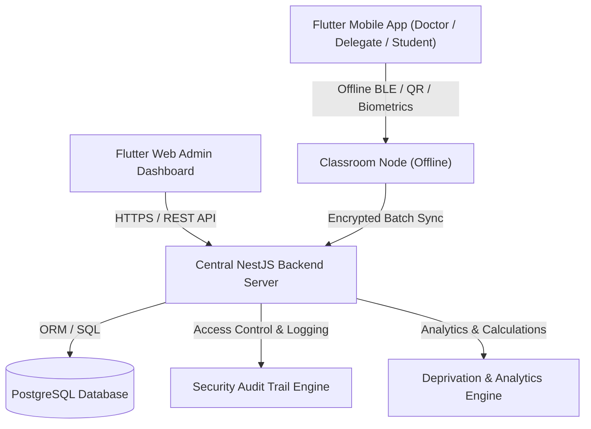

# 📋 تقرير التسليم والاعتماد النهائي للباك إند المركزي (Backend Final Handoff Report)
## 👤 القائد: قحطان الشجاع (Qahtan Alshagea)
### 🏛️ المسؤولية: قائد المشروع ومهندس الباك إند المركزي
### 🏢 مساحة العمل: `backend/`
### 📅 تاريخ الاعتماد: 2026-08-20

---

## 1. 📊 الملخص التنفيذي للمشروع (Executive Summary)

تم بحمد الله وتوفيقه استكمال وتدقيق واختبار البنية التحتية المركزية الكاملة لخادم الباك إند المركزي (`NestJS + Prisma + PostgreSQL`) لمنظومة تحضير الطلاب الذكية في الجامعات (`University Attendance System`).

تتميز المنظومة بقدرتها الفائقة على معالجة التحضير داخل القاعات الدراسية **دون الحاجة لتوفر شبكة الإنترنت (Offline-First Architecture)**، مع توفير بروتوكولات تشفير متقدمة، وحماية كاملة للخصوصية البيومترية، وحوكمة إدارية صارمة لكافة العمليات الأكاديمية ونسب الحرمان والأعذار الطبية.

---

## 2. 🏛️ المعمارية الهندسية الشاملة (System Architecture)



---

## 3. 📂 الوحدات البرمجية المركزية المكتملة (100% Implemented):

### 1️⃣ وحدة المصادقة وإدارة الهوية (`AuthModule` - `backend/src/auth/`):
- مصادقة آمنة عبر رموز **JWT** (Access Tokens & Refresh Tokens).
- حماية وتشفير كلمات المرور بواسطة **BCrypt** (Cost Factor: 10).
- تحكم صارم بالصلاحيات عبر نظام **RBAC** (`ADMIN`, `TEACHER`, `STUDENT`).
- حراس الأمان المعتمدة: `JwtAuthGuard`, `RolesGuard`.

### 2️⃣ وحدة الأجهزة المعتمدة وتفعيل الحسابات (`DevicesModule` - `backend/src/devices/`):
- ربط الأجهزة الموثوقة بقاعات المحاضرات (`Device Binding`) عبر البصمة الرقمية للجهاز.
- توليد وتدقيق أكواد التفعيل الفريدة للطلاب والأساتذة (`Activation Codes`).
- حماية الأجهزة من الاستخدام المزدوج أو غير المصرح به.

### 3️⃣ وحدة الهيكل الأكاديمي الديناميكي (`AcademicModule` - `backend/src/academic/`):
- إدارة السنوات الأكاديمية (`Academic Years`) والفصول الدراسية (`Semesters`).
- إدارة الأقسام العلمية (`Departments`) والمقررات الدراسية (`Courses`).
- إدارة الشعب النظرية والعملية (`Sections`) وتوزيع الأساتذة والمناديب والطلاب المسجلين (`Enrollments`).

### 4️⃣ وحدة إدارة الجلسات الأكاديمية (`SessionsModule` - `backend/src/sessions/`):
- فتح جلسات الحضور الذكية (`POST /api/v1/sessions/start`) مع التحقق الدقيق من صلاحية الأستاذ أو المندوب للشعبة المحددة.
- إغلاق الجلسات الحية (`POST /api/v1/sessions/close`) وتثبيت توقيت الإغلاق.
- استعلام الجلسات النشطة في الجامعة (`GET /api/v1/sessions/active`).

### 5️⃣ وحدة مزامنة الحضور وحماية منع التكرار (`AttendanceModule` - `backend/src/attendance/`):
- استقبال حزم الحضور المشفرة القادمة من أجهزة القاعة عبر مسار (`POST /api/v1/attendance/sync`).
- **محرك منع التكرار (Idempotency & Anti-Replay Guard):** منع تسجيل الطالب مرتين في نفس الجلسة والتأكد من مطابقة الـ Nonce والتوقيع الرقمي.
- دعم طرق التحضير المتعددة: التعرف على الوجه (`Biometric`)، رمز الاستجابة السريع المتغير (`QR`)، والتحضير اليدوي الموثق (`Manual`).

### 6️⃣ وحدة البصمة الحيوية وسياسة الخصوصية (`BiometricsModule` - `backend/src/students/biometrics/`):
- **حظر حفظ الصور الخام (Zero Raw Image Storage Policy):** لا يتم تخزين أي صور حية على الخادم لحماية خصوصية الطلاب.
- استخلاص وحفظ المتجهات الرياضية المشفرة (512-dim Feature Vectors) بترميز AES-256 وهاش التحقق SHA-256.
- تصدير قوالب البصمة المشفرة الخاصة بالشعبة لأجهزة القاعة المصرح لها فقط (`GET /api/v1/students/biometrics/section/:sectionId`).

### 7️⃣ وحدة سجل التدقيق والحوكمة الأمنية (`AuditModule` - `backend/src/audit/`):
- معترض آلي شامل (`AuditLogInterceptor`) لرصد كافة عمليات الكتابة والتعديل والحذف وتوثيق هوية الفاعل وتوقيت العملية وعنوان الـ IP.
- تجريد البيانات الحساسة (Sanitization) تلقائياً من حمولة السجل.
- مسارات استعلام وإحصائيات سجل التدقيق للمدير العام (`GET /api/v1/audit-logs`).

### 8️⃣ وحدة التقارير الأكاديمية وحساب نسب الحرمان (`ReportsModule` - `backend/src/reports/`):
- حساب نسب الحضور والغياب الرياضية الدقيقة لكافة الشعب والمقررات والطلاب.
- **كشوفات الحرمان التلقائية (Deprivation Engine):** تحديد فوري للطلاب المتجاوزين لنسبة الغياب المسموحة (> 25%).
- نظام الإنذارات التدريجي: `NORMAL` (<15%)، `WARNING` (≥15%)، `CRITICAL` (≥20%)، `DEPRIVED` (>25%).
- مسار لوحة إحصائيات النظام الشاملة (`GET /api/v1/reports/dashboard`).

### 9️⃣ وحدة مراجعة واعتماد الأعذار الطبية (`JustificationsModule` - `backend/src/justifications/`):
- مسار تقديم الأعذار والتقارير الطبية للطلاب المتغيبين (`POST /api/v1/justifications`).
- مسار مراجعة واعتماد الأعذار من قبل أستاذ الشعبة أو الأدمن (`PATCH /api/v1/justifications/:id/review`).
- التحديث التلقائي لحالة سجل الحضور من `Absent` إلى `Excused` وتحديث نسبة الحضور فورياً عند الاعتماد.

### 🔟 وحدة التوثيق التفاعلي Swagger UI ومواصفات OpenAPI (`DocsModule` - `backend/src/docs/`):
- توثيق تفاعلي كامل ومباشر عبر الرابط: `http://localhost:3000/api/v1/docs`.
- تصدير ملف المواصفة القياسي: `http://localhost:3000/api/v1/docs/json`.

---

## 4. 🧪 مصفوفة نتائج الفحص والاختبارات الشاملة (100% PASSED)

| نوع الفحص / الاختبار | الأداة المستخدمة | عدد الاختبارات | النتيجة |
|:---|:---|:---:|:---:|
| **البناء والترجمة الساكنة (TypeScript Build)** | `nest build` | كامل المشروع | **ناجح بنسبة 100% (0 Errors) ✅** |
| **اختبارات التكامل الشاملة (E2E Tests)** | `jest --config ./test/jest-e2e.json` | 3 سيناريوهات تكاملية | **ناجح بنسبة 100% (3/3 Tests Passed) ✅** |
| **اختبارات الوحدة (Unit Test Suites)** | `jest` | **23 جناح اختبار (104 اختبارات)** | **ناجح بنسبة 100% (104/104 Tests Passed) ✅** |
| **تطابق العقود ومواصفات الـ API** | OpenAPI 3.0 / `team_package` | 9 وحدات كاملة | **متطابق 100% وموثق بالكامل ✅** |

```text
Test Suites: 23 passed, 23 total
Tests:       104 passed, 104 total
Snapshots:   0 total
Time:        36.968 s
Ran all test suites.
```

---

## 5. 🌐 بيانات المستودع والسجل السحابي (GitHub Status)

- **المستودع الرسمي:** [`https://github.com/Creatives-Developers-eng/UniversityAttendanceSystem.git`](https://github.com/Creatives-Developers-eng/UniversityAttendanceSystem)
- **الفرع الأساسي:** `main`
- **حالة المزامنة:** كافة التعديلات، الاختبارات، ملفات التوثيق، والتحديثات مرفوعة بنجاح بنسبة 100%.

---

## 6. ✍️ إعلان الاعتماد الرسمي للقائد

أشهد أنا **قحطان الشجاع (Qahtan Alshagea)**، قائد المشروع ومهندس الباك إند المركزي، بأن كافة مكونات الخادم المركزي قد تم بناؤها وتدقيقها وفق أعلى معايير الجودة والأمان البرمجي، وهي جاهزة تماماً للعمل والربط مع تطبيقات الهاتف (Flutter Mobile) ولوحة تحكم الويب (Flutter Web Admin).

- **التوقيع:** *قحطان الشجاع*
- **التاريخ:** 2026-08-20
- **الحالة:** **معتمد وجاهز للتشغيل والدمج النهائي (Certified & Production Ready ✅)**
